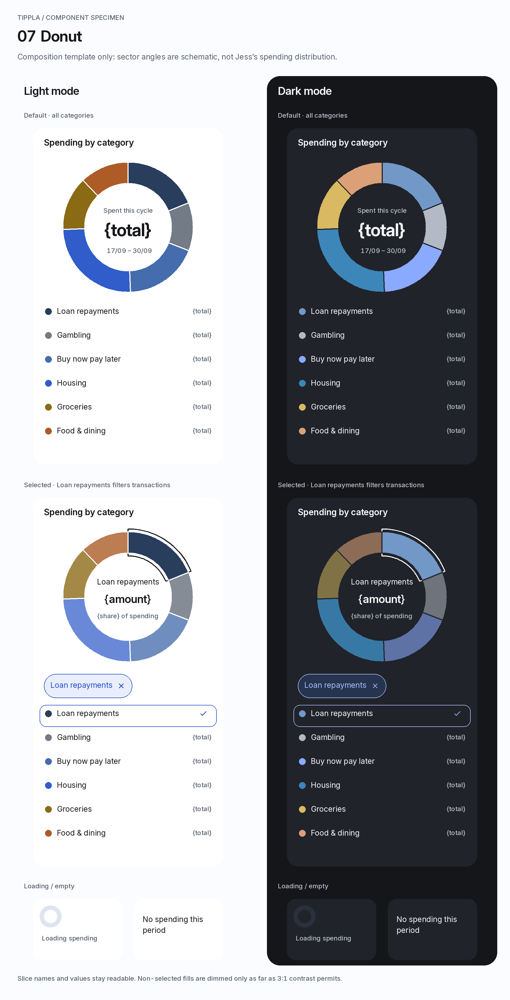

# Tippla component specifications — 05–10

Direction: **Banking Clarity**. Source of truth: `tokens.json` version `1.0.2` and `icons.md`. These specifications continue components 01–04 without changing the token schema.

The seven PNG state sheets use Inter and native Lucide SVGs, rendered at 2×. Light is left; dark is right. Sheet labels are documentation, not app UI. Mobile screens are 390 × 844 CSS px; full-width inset components are 350 px with `layout.gutter` on each side. Desktop examples in frame 09 are 1,024 × 768, displayed at approximately 82% scale.

**Data discipline:** the supplied Beforepay insight is reproduced verbatim. Category totals, merchant aggregates, transaction records and budgets were not supplied, so braces denote bindings. Donut sector angles are explicitly schematic styling geometry, not Jess's financial distribution. Do not convert them into fixture percentages. The predicted Telstra bill is not relabelled as a posted transaction.

## Shared contract

| Concern | Implementation |
| --- | --- |
| Theme notation | `C = color[theme]`; `K = color.category[theme]`; `CH = color.chart[theme]`. These are local aliases for existing tokens, resolved separately for light and dark. |
| Spacing | Zero-based indices: `space[1]=4`, `[2]=8`, `[3]=12`, `[4]=16`, `[5]=20`, `[6]=24`, `[7]=32`, `[8]=48`. All dimensions below are CSS px. |
| Typography | Apply the complete `type.*` record. Headings use `font.display`, prose `font.body`, and amounts/counts/dates `font.numeric` with `font.numeric.features = tnum`. All use the specified Inter/system fallback stack. |
| Icons | Use the exports in `icons.md`. Standard icon size `icons.sizes[2]` = 24; chevrons `icons.sizes[1]` = 20; chip/edit indicators `icons.sizes[0]` = 16; `icons.strokeWidth` = 2. No emoji or mixed icon sets. |
| Targets | Native buttons/links have at least `layout.minTap` = 44 × 44. A 16 px X is not a 16 px button. Static metadata has no button styling or interaction role. |
| Focus | `focusRing.width` = 2; `focusRing.offset` = 3; `C.focus`. Parent containers must not clip the outline. Keep focus when data refreshes; never move it merely because a chart selection changes. |
| Press / hover | Neutral buttons: `C.surface2`. Accent-soft controls: retain `C.accentSoft`, add 2 px inset `C.accent` outline. Filled-accent buttons: retain `C.accent`/`C.onAccent`, add 2 px inset `C.onAccent` outline. These are additive states, not new palette tokens. |
| Disabled | Keep text/icons legible using `C.textMuted`, background `C.neutralSoft` where needed, and native disabled semantics. No global opacity fade. Preserve the selected state and provide an adjacent explanation when availability is not obvious. Disabled is never a financial assessment. |
| Motion | `motion.fast` for colour; `motion.base` for paging/expansion; `motion.slow` with `motion.easing` for modal transitions. Respect reduced motion; omit nonessential movement. No auto-rotating insights, flashing, confetti or score-like rewards. |
| Responsive layout | Grow rows/cards with wrapped text; heights are reference/minimum values. At 200% text scaling, move amounts below names if necessary. Never truncate essential amounts, status labels, insight advice or actions. |
| Formats | AUD with `$`; production dates DD/MM/YYYY when the full date exists. Preserve the supplied short-date fixture strings. Historical fixture periods are based on the supplied snapshot, not the current device date. |
| Financial semantics | No destructive/red token in these components. Spending increases, pending payments, borrowing and budget overages are not success or danger signals. Gambling remains an ordinary slate category; income and Centrelink share size, icon and hierarchy. |

## 05. InsightCard with pager and InsightSheet

| Element / state | Anatomy, dimensions and spacing | Typography | Colours by state | Interaction |
| --- | --- | --- | --- | --- |
| InsightCard shell | 350 wide; reference height 316 for this copy; padding `space[5]`; radius `radius.lg`; no shadow. Header, title, factual explanation, CTA. | — | Ready: `C.accentSoft`. Loading/empty: `C.surface`. | Use an article/section with separate controls, not a button containing pager buttons. “See how” opens this insight's sheet. |
| Context label | Left of pager; allow it to move to a separate row on narrow layouts. | “Current borrowing”: `type.caption`. | `C.textMuted`. | Describes the insight's attachment; never a warning label. |
| Pager | 132 × 44: previous button 44, count area 44, next button 44; `radius.sm`; sits in header. | “1 of 3”: `type.caption`. | Pager surface `C.surface`; count `C.text`; enabled arrows `C.accent`; disabled arrow `C.textMuted` on `C.surface2`. | Previous/next are named buttons. First disables previous; last disables next; middle enables both. No wrapping or autoplay. |
| Title | `space[5]` after header; available inner width 310; no ellipsis. | `type.h2`. | `C.text`. | “Skip the next pay advance if you can”. Keep the qualification “if you can”. |
| Card explanation | `space[4]` after heading; wrap freely. | `type.small`. | `C.textMuted`. | “You've taken a $300 Beforepay advance every fortnight since 27/08. Each costs $15 and comes out the day before payday.” |
| Card CTA | Full inner width; 44 high; `radius.sm`; at least `space[5]` after explanation. | “See how”: `type.bodyStrong`. | `C.accent` background / `C.onAccent` label. | Opens InsightSheet by stable insight ID. Does not make a financial commitment. |
| Loading | Static skeleton using `radius.xs`; reserve a useful card area; omit unknown pager count. | “Finding your next useful step”: `type.small`. | Skeleton `C.surface2`; text `C.textMuted`; shell `C.surface`. | `aria-busy=true`; no fake insight, amount or recommendation. |
| Empty | Plain neutral panel; reference height 88, padding `space[5]`. | “No insights to show right now.”: `type.small`. | `C.text` on `C.surface`. | No pager or dead CTA. Home may omit the entire empty insight section; a dedicated insights view can show this state. No congratulatory interpretation. |
| Dismissed | Inline 64 px confirmation; padding `space[5]`; `radius.sm`; Undo target ≥44. | “Insight hidden” and “Undo”: `type.small`. | Panel `C.neutralSoft`; message `C.text`; Undo `C.accent`. | Show after “Not relevant to me”. Undo restores the insight and its attachment chip. No timer-only access to Undo. |
| InsightSheet shell | Uses component 09. Reference mobile detent 780 on the 390 × 844 example; width 390; inner padding `space[5]`. | Sheet title `type.h2`. | `C.surface`, title `C.text`, scrim `C.scrim`. | Focus sheet heading on open. Long content scrolls within the body; footer remains reachable. |
| What's happening | Heading, then `space[2]` to factual paragraph. | Heading `type.h3`; paragraph `type.body`. | Heading `C.text`; paragraph `C.textMuted`. | Uses the full supplied Beforepay explanation above. Do not add inferred dates, fees or loan counts. |
| What it would change | `space[6]` after prior block; heading-to-copy gap `space[2]`. | Heading `type.h3`; copy `type.body`. | `C.text` / `C.textMuted`. | “Fewer pay advances is one of the ways to lift Current borrowing.” Never invent a point increase, approval probability or guaranteed outcome. |
| If you want them | Same block spacing. | Heading `type.h3`; copy `type.body`. | `C.text` / `C.textMuted`. | “See what's due before payday, or explore support if money's tight.” Actions are optional and directly related to the insight. |
| Sheet action group | Top separator 1 px `C.line`; top gap `space[3]`; three 44 px targets separated by `space[2]`; bottom safe-area padding. | Primary `type.bodyStrong`; secondary/dismissal `type.small`. | Primary `C.accent` / `C.onAccent`; support link `C.accent`; dismissal `C.textMuted` on `C.surface`. | “See what's due” opens the due-items view; “Options if money's tight” opens Hardship support; “Not relevant to me” hides only this suggestion. Do not turn support into an offer route. |

Pager behaviour: maintain a stable ordered insight-ID list. Announce the new “n of total” once after manual paging; retain focus on the activated arrow. When dismissal removes an item, choose the next surviving item at that index, otherwise the previous one, and recalculate the count. Hide the pager when fewer than two items remain. Counts in the sheet are UI state examples, not additional customer insights.

Dismissal updates the user's relevance preference only. Close the sheet, remove matching cards/chips, and provide Undo. If the trigger disappears, focus the next insight heading or the containing section heading. A failed preference save restores the insight and displays a neutral “Couldn't hide this insight. Try again.” message. Do not change a score, delete bank data, cancel an advance, or mark an action complete.

Following an action from one sheet to another should replace its body or navigate with a Back affordance; do not pile multiple scrims on top of each other.

## 06. CategoryRow

| Element / state | Anatomy, dimensions and spacing | Typography | Colours by state | Interaction |
| --- | --- | --- | --- | --- |
| Container / summary | 350 wide; collapsed minimum 88 high; padding `space[4]`; `radius.md`. Optional slots follow the summary. | — | Rest `C.surface`; pressed summary `C.surface2`; focus `C.focus`. | Root is a section. Summary is one button controlling merchant expansion with `aria-expanded` and `aria-controls`. Other actions are siblings, never nested buttons. |
| Category icon | 24 px in 40 × 40 container, `radius.sm`; `space[3]` to the name. | — | Icon `K[categoryId]`; container `C.surface2`, full opacity. | Use `icons.md`. Gambling is Lucide `Layers` in `K.gambling`, with identical size and weight. |
| Name / count | Flexible text column. Name and metadata separated by `space[1]`; allow wrapping. | Name `type.h3`; “{count} transactions” `type.caption`. | Name `C.text`; count `C.textMuted`. | Counts are for the currently applied period/filter scope. |
| Total / disclosure | Amount right aligned; `space[2]` to 20 px chevron; reserve amount width, wrap name first. | Amount `type.small`, `font.numeric`. | Amount `C.text`; chevron `C.textMuted`. | `ChevronDown` collapsed; `ChevronUp` expanded. Amount is part of summary's target, not a separate hidden action. |
| Expanded merchants | Reference 248 high with two illustrative merchant bindings. Merchant content aligns to the name column, 68 px from row left; 52 px merchant targets; 1 px divider `C.line`. | Merchant name/total `type.small`. | Both `C.text`; dividers decorative. | Each merchant opens transactions filtered by category, merchant and the existing period. “View transactions” opens all transactions in this category. Do not truncate the merchant list to the two rows shown in the specimen. |
| Budget slot | Reference total row height 188. Align at name column; 8 px bar with `radius.pill`; label-to-bar gap `space[2]`; action target ≥44. | “{spent} of {budget}”: `type.small`; numeric remainder/progress `type.caption`; action `type.small`. | Fill `C.accent`; track `CH.ringTrack`; description `C.textMuted`; “Edit budget” `C.accent`. | Opens budget editing. Specimen has no fill percentage because no budget or category amount was supplied. |
| Budget under / at / over | Bar fraction `min(spent / budget, 1)` when budget is positive. Exact amount text carries the result. | Same tokens. | Same blue fill in all cases. Over-budget annotation uses `C.neutral`, with optional neutral `CH.hatch` at the full bar's trailing edge. Never red/green. | Under: “{amount} left”; exact: “Budget reached”; over: “{amount} over budget”. Use the user's chosen budget; do not invent a recommended limit. At zero/missing budget, do not divide by zero or show a fabricated progress value. |
| Insight chip | 44 high; padding `space[3]`; `radius.pill`; `Info` 16 px; icon/text gap `space[2]`. Align with name column; reference row height 152. | “See insight”: `type.small`. | `C.accent` icon/text on `C.accentSoft`; pressed inset `C.accent`; focus `C.focus`. | Opens the insight actually attached to this category. Hiding that insight also removes its chip. Never manufacture a gambling warning chip. |
| Lifestyle tag | 24 high; horizontal padding `space[2]`; radius `radius.xs`; reference row height 128. | “Lifestyle”: `type.caption`. | Text `C.neutral` on `C.neutralSoft`. | Non-interactive taxonomy metadata. Display only when supplied by the category model/user; it is not a badge, affordability judgement or warning. |
| Composed variants | Slot order: summary → lifestyle tag → budget → insight chip → expanded merchants. Gaps `space[3]`; height grows. | As above. | As above. | Expanded, budget, insight and tag are independent properties. These must work together, not be mutually exclusive enum values. |

Keep category labels and icon strokes visible when the donut has a selection; do not fade category rows to chart opacity. Income and Centrelink retain the same icon, typography, tap targets and layout. Missing totals display an em dash with explanatory text; an empty settled total may be zero only when the data actually says zero.

Budget progress is supplementary to its numeric label. If exposed as a meter, clamp its numeric meter value at the budget while its accessible value text announces the exact spend and overage. A null budget shows “Set a budget” rather than a zero budget. An explicitly configured zero budget gets an exact text explanation and no ratio bar.

## 07. Donut

The diagram deliberately places loan repayments, gambling and BNPL next to each other to test distinction. The six illustrated sectors are styling examples, not a complete six-category dataset or real proportions. Render production arcs from all supplied non-zero category totals; do not force gambling to a privileged position or minimum angle.

| Element / state | Anatomy, dimensions and spacing | Typography | Colours by state | Interaction |
| --- | --- | --- | --- | --- |
| Host / heading | 350 wide; padding `space[5]`; `radius.lg`; content height grows with legend. | “Spending by category”: `type.h3`. | Host `C.surface`; heading `C.text`. | Chart title identifies the metric and scope; income must not be mixed into a chart labelled Spending. |
| Geometry | Default outer diameter 240, inner diameter 160: ring thickness 40. Keep a 5 px halo allowance, so graphic layout box is 250 × 250. Start at 12 o'clock, clockwise. | — | Each default sector `K[categoryId]`; 2 px `C.surface` separators. | Angle = eligible category amount / reconciled total × 360. Preserve category order while selecting. No exploded slices, artificial minimum angles or ranking animations. |
| Default centre | Centre content max-width 144; label, amount, period; gaps `space[2]`. | “Spent this cycle” `type.caption`; amount `type.figureL`; period `type.caption`. | Amount `C.text`; labels `C.textMuted`. | Production centre uses the reconciled total. The image uses `{total}` because the supplied $1,832 total has no accompanying category breakdown. |
| Selected sector | Retain the exact angle and radius. Add a 2 px `C.text` selection outline separated from the fill by a 3 px `C.surface` halo. | — | Selected fill remains `K[categoryId]`. Other fills use the contrast-safe dimming recipe below. | A tap selects the category and immediately filters the associated transaction list. Tapping it again clears selection. Selection is not a new route or a credit assessment. |
| Selected centre | Category name, category amount, “{share} of spending”. Allow two-line names; grow host instead of squeezing text. | Category `type.small`; amount `type.figureL` in production; share `type.caption`. Placeholder `{amount}` uses `type.h2` in the sheet to fit the annotation. | Name/amount `C.text`; share `C.textMuted`. | Percent is derived from the same unfiltered period denominator, not 100% of an already-filtered single-category dataset. |
| Selection chip | Component 10, between graphic and legend; ≥44 high; gap `space[4]`. | `type.small`. | `C.accent` on `C.accentSoft`. | “Loan repayments ×” removes only that category selection and restores the period's full composition. |
| Legend | One ≥44 px row per category; 12 px colour dot; gap `space[4]` to label; amount right aligned. | Name `type.small`; amount `type.caption`. | Dots always original `K[categoryId]`; names `C.text`; values `C.textMuted`. Selected row gets `C.accent` outline and `Check` 16 px. | Legend buttons provide full-sized alternatives to tiny slices. Use `aria-pressed` for selection. Never create overlapping invisible slice hitboxes. |
| Loading | Static neutral ring/skeleton, no sectors or amount; preserve useful graphic space. | “Loading spending”: `type.small`. | Track `CH.ringTrack`; text `C.textMuted`. | `aria-busy=true`; do not flash a zero total or previous period's data as current. |
| Empty | Replace chart with plain text. | “No spending this period”: `type.small`. | `C.text` on `C.surface`. | No circle suggesting a completed goal. Empty, unavailable and loading are distinct. Unavailable data gets a neutral retry treatment, not a zero. |

### Contrast-safe dimming recipe

For each non-selected category, derive an opaque display colour by blending its token towards `C.surface` in sRGB. Begin with category alpha 0.50 and increase in 0.005 steps until the rounded result reaches at least **3.05:1 against both `C.surface` and `C.surface2`**. Use the original colour if necessary. This provides a small rounding margin above the required 3:1. Do not apply opacity to the entire SVG, centre text, legend or controls. The derived colour is a component-state recipe, not a new token or an edit to `tokens.json`.

Selection must remain evident through outline, centre name, checked legend row and filter chip even when a particular category can only be dimmed slightly. Gambling receives exactly the same treatment and algorithm as any other category.

### Data and selection rules

- Category amounts must be non-negative and reconcile to the displayed total under the same period and accounting basis. Do not silently clamp negative net categories, manufacture an “Other” balance, or add pending amounts to reconcile a mismatch. Refund/netting policy belongs to the data contract; show unavailable data rather than a fabricated composition when the contract fails.
- Spending composition excludes income, Centrelink credits and internal transfers. Pending entries are separate from posted spending by default. If the product explicitly supports another basis, label it and apply it consistently to centre totals, legend, category rows and transactions.
- Compute all sector fractions from the complete current-period dataset. Keep those angles when a category is selected; filter the transaction list, not the donut's denominator.
- Period changes clear category selection only if that category is absent in the new period. Preserve remaining search/merchant filters unless the user explicitly removes them. Explain an empty intersection; do not silently broaden it.
- Click/touch by sector is a shortcut. The labelled 44 px legend buttons provide keyboard and precise-touch access to every category, including very small slices. The centre is not a hidden button.

## 08. TransactionRow

| Element / state | Anatomy, dimensions and spacing | Typography | Colours by state | Interaction |
| --- | --- | --- | --- | --- |
| Row | 350 wide; minimum 88 high posted, 112 with a status/edit line; padding `space[4]`; optional `radius.md` in a standalone surface, otherwise flat list rows. | — | Rest `C.surface`; pressed `C.surface2`; focus `C.focus`. | One native button opens TransactionSheet. No nested pencil button inside the row. |
| Category icon | 24 px in 40 × 40 `radius.sm` container; gap `space[3]` to text. | — | Icon `K[currentCategoryId]`; container `C.surface2`. | Uses current category in every settlement state. Gambling remains `Layers`; no warning icon. |
| Merchant | Flexible column; wrap long names, retaining the amount column. | `type.bodyStrong`. | `C.text`. | Show a recognisable merchant name; retain the unmodified bank description in the detail sheet. |
| Amount | Right aligned; `space[2]` to trailing chevron. Move beneath merchant at large text sizes. | `type.bodyStrong`, `font.numeric`. | `C.text` for outgoing and incoming money, including Centrelink. | Display direction with a minus/plus and accessible “money out”/“money in”, not red/green. Do not infer direction from a category name. |
| Category/date metadata | `space[2]` below merchant line. | `type.caption`. | `C.textMuted`. | “Food & dining · {date}” in the specimen. Format supplied complete dates DD/MM/YYYY. No invented transaction date. |
| Posted | Base row; settled value supplied by bank. | Base tokens. | Base palette; no success tick or green amount. | Opens settled transaction details. “Posted” can be explicit in the detail sheet without adding a badge to every row. |
| Pending | Additional status line, `space[2]` below metadata. | “Pending”: `type.caption`. | `C.textMuted`; amount remains `C.text`. | A visible text state, not reduced-opacity data. Pending is not overdue or failed. Do not expose “posted” merely because categorisation is possible. |
| Recategorised | Additional line with decorative `Pencil` 16 px; text gap `space[2]`. Icon above updates to the new category. | “Category edited”: `type.caption`. | `C.textMuted`; no success colour. | Means category was edited, not that amount/date/settlement changed. Detail sheet offers Edit category and Undo when applicable. |
| Pending + recategorised | Same additional line may read “Pending · Category edited”; height grows if it wraps. | `type.caption`. | `C.textMuted`. | Settlement and category edits are orthogonal fields, not a three-value status enum. Preserve both. |
| Chevron / focus | `ChevronRight` 20 px; focus 2 px at 3 px offset. | — | Chevron `C.textMuted`; outline `C.focus`. | Entire row is the target. Enter/Space opens details; focus returns to the row or nearest surviving row after closing. |

TransactionSheet shows merchant, original bank description, exact amount/direction, date, settlement status, current category and a named “Edit category” action. That action opens a searchable category selector using the same icon mapping and category tokens. Editing affects the category only. Do not imply that a merchant was contacted or a bank record was corrected.

After a successful category save, update affected CategoryRows, merchant aggregates and donut totals for the same record and period. Offer Undo. If the row no longer matches an active category filter, remove it from that filtered result with a polite explanation and keep Undo reachable. A failed save restores the previous category and shows neutral retry copy. Reconcile pending→posted using the service's stable identity/linkage so one transaction does not appear twice; do not match solely by amount/date.

## 09. BottomSheet and desktop drawer

| Element / state | Anatomy, dimensions and spacing | Typography | Colours by state | Interaction |
| --- | --- | --- | --- | --- |
| Mobile panel | Width `min(100vw, layout.drawerWidth)`; full width at 390. Top corners `radius.xl`; bottom edge flush; `elevation[theme][3]`. Padding `space[5]`. | — | `C.surface`. | Below `layout.breakpoints.desktop` = 1,024, anchored bottom; tablet sheets may be centred at the 420 px cap. Overlay covers navigation too. |
| Standard / expanded | Reference detents 480 and 780 px on the illustrated 390 × 844 screen. Actual expanded maximum `100dvh − safeAreaTop − space[5]`; content may use a shorter initial detent. | — | Same palette in both detents. | Expansion changes available reading space, not content or data. Use dynamic viewport height and safe-area insets, not fixed screenshot heights in production. |
| Scrim | Fixed to viewport, beneath sheet and above the full app; not limited to a scrolling parent. | — | Exactly `C.scrim`, including its alpha. | Outside app becomes inert. Tap scrim closes a read-only sheet; no click-through to the underlying tab or row. |
| Handle | Width `space[8]` = 48; height `space[1]` = 4; `radius.pill`; centred in a 44 px high drag/toggle target. | — | `C.neutral`. | Drag only from the handle region. Tap or Enter/Space toggles standard/expanded; its accessible name describes the next action. Never require a drag to read or close. |
| Header | Title flexes; 44 × 44 close target; title/close gap `space[3]`; header padding `space[5]`. | Title `type.h2`; optional subtitle `type.small`. | Title `C.text`; subtitle and 24 px `X` `C.textMuted`. | Visible close button labelled “Close [title]”. Heading is the initial focus target for long structured content. |
| Body | `min-height: 0`, vertical overflow auto; block gaps `space[6]`; enough bottom padding to clear footer. | Component-specific `type.body` / `type.small`. | `C.text` / `C.textMuted`. | Body scrolling must not drag the panel. Keep search inputs and focused fields visible when the keyboard opens. |
| Footer | Optional sticky region; padding `space[5]` plus bottom safe-area inset; action gaps `space[2]`; top separator `C.line`. | Primary `type.bodyStrong`; secondary `type.small`. | Surface `C.surface`; buttons follow shared states. | Actions remain reachable at 200% text. If content/actions cannot fit, allow the action region to participate in scrolling rather than cover the body. |
| Dragging / settling | Start gesture after vertical movement exceeds `space[2]`. On release snap to nearest detent; downward dismissal requires travel ≥max(`space[8]`, 25% of current height) or velocity ≥0.8 px/ms. | Unchanged. | Same surface/scrim; no financial-state colour change. | Cancelled gestures restore the prior detent. Use `motion.slow`/`motion.easing`; reduced motion settles immediately. Handle-only `touch-action:none`. |
| Desktop drawer | At ≥1,024 px, right aligned; `layout.drawerWidth` = 420; height 100dvh; left corners `radius.xl`; header padding `space[5]`; same content/scroll/footer. | Same type tokens. | Same `C.surface`, `C.scrim`, `elevation[theme][3]`. | No drag handle or detents. Keep the same close, Escape, focus and inert-background behaviour. State changes across breakpoints must preserve content and focus. |
| Closed | No panel, scrim, focus trap or hidden tabbable controls. | — | App returns to its normal theme. | Restore document scroll position and focus to the trigger, or a logical neighbour if the trigger was removed. |

Use `role="dialog"`, `aria-modal="true"`, and a visible title referenced by `aria-labelledby`. Move focus inside, contain Tab/Shift+Tab, support Escape, and restore focus on close. For long structured content, focus a heading with `tabindex="-1"` and avoid flattening all paragraphs into `aria-describedby`. These rules follow the [WAI-ARIA modal dialog pattern](https://www.w3.org/WAI/ARIA/apg/patterns/dialog-modal/).

Mount overlays outside clipped page containers. Lock background scrolling without a layout jump. Avoid stacked modals for insight→calendar→transaction detail; replace the active sheet's content with a Back control where needed. Read-only sheets close without confirmation. Closing a sheet does not implicitly apply draft edits or reverse an already saved change; editors own explicit Save/Cancel semantics.

## 10. SegmentedControl, period Chip and dismissible FilterChip

### SegmentedControl

| Element / state | Anatomy, dimensions and spacing | Typography | Colours by state | Interaction |
| --- | --- | --- | --- | --- |
| Track | 350 wide reference; height 52; padding `space[1]`; gap `space[1]`; radius `radius.md`. Equal-width segments, each ≥44 high/wide. | — | `C.surface2`. | Use for one mutually exclusive value, not independent toggles. At insufficient width, stack or replace with a labelled selector; never squeeze below 44. |
| Labels | Centred within each segment; horizontal padding `space[2]` minimum. Example “All”, “Money out”, “Money in”. | `type.small`. | Unselected `C.textMuted`. | This example is the Transactions direction filter. It does not mix income into a Spending donut. |
| Selected | Segment radius `radius.sm`; fixed geometry when changing labels. | `type.small`. | Background `C.accent`; label `C.onAccent`. | Exactly one selected value. Selection updates the existing transaction view rather than navigating to a different screen. |
| Pressed / hover | Keep geometry. | Unchanged. | Selected adds 2 px inset `C.onAccent` outline; unselected uses `C.neutralSoft` behind `C.textMuted`. | Apply `motion.fast`; no spring movement. |
| Focused | Standard 2 px outline, 3 px offset around the focused segment. Allow overflow beyond track. | Unchanged. | `C.focus`; selected fill stays visible. | Focus is not a second selected value. |
| Disabled | Preserve current selected segment with a 2 px `C.neutral` outline; selected background `C.neutralSoft`. | `type.small`. | All labels `C.textMuted`, full opacity. | Disable only for a real unavailable function, with context. A low score or a shortfall never disables navigation/filtering. |

For this filter use a labelled radio group, preferably native radio inputs styled as segments. Tab enters/leaves the group; arrow keys move/check the next or previous enabled option; Space selects. Expose `checked`/`aria-checked`. If reused to switch actual tab panels, implement the tab pattern instead; do not mix radio and tab roles. See the [WAI-ARIA radio group pattern](https://www.w3.org/WAI/ARIA/apg/patterns/radio/).

### Chip — period selection

| Element / state | Anatomy, dimensions and spacing | Typography | Colours by state | Interaction |
| --- | --- | --- | --- | --- |
| Base | Height 44; minimum width 44; horizontal padding `space[3]`; icon/text gap `space[2]`; radius `radius.pill`. Group gap `space[2]`, wrapping as needed. | `type.small`. | Default background `C.surface`; 1 px border `C.neutral`; label `C.text`. | Examples: “Pay cycle”, “Month”, “6 months”, “Custom”. Period choices are mutually exclusive. |
| Selected | Same height; reserve 16 px `Check` plus `space[2]` when selected. Do not shrink label text. | `type.small`. | `C.accentSoft` background; `C.accent` border, text and check. | Check is the non-colour state cue. Date boundaries are visible elsewhere in the associated view. |
| Pressed / hover | No scaling. | Unchanged. | Selected retains accent-soft treatment with 2 px inset `C.accent`; unselected gets `C.surface2`. | Trigger on release; do not change period on pointer-down during a scroll gesture. |
| Focused | Shared focus geometry. | Unchanged. | `C.focus`. | Keyboard focus remains visible if the group wraps. |
| Disabled | Preserve selected check if applicable. | `type.small`. | `C.neutralSoft`, `C.neutral` border, `C.textMuted` label/icon. | Native disabled or fully enforced `aria-disabled`; include an explanation when necessary. Do not use disabled as a selected-looking style. |
| Custom range | Same chip; opens a date-range sheet with explicit Apply/Cancel. | `type.small`. | Selection state changes only after Apply. | Cancellation preserves the prior range. Validate start ≤ end and available history; show form errors next to fields, never as a financial-state warning. |

Period changes update the donut, category aggregates and transaction list from the same resolved date range and snapshot. Abort or ignore stale responses so an earlier period cannot overwrite a newer selection. Keep a loading state for the chosen range; do not flash the old totals as if current. “6 months” must respect the available snapshot end, including a partial current month.

### FilterChip — removable active constraint

| Element / state | Anatomy, dimensions and spacing | Typography | Colours by state | Interaction |
| --- | --- | --- | --- | --- |
| Active | Height 44; horizontal padding `space[3]`; trailing X 16 px; gap `space[2]`; radius `radius.pill`. Width fits the full name, or wraps at large text sizes. | Label `type.small`. | `C.accentSoft` background; 1 px `C.accent` border; text/X `C.accent`. | One native button for the entire chip. Accessible name “Remove Food & dining filter”. The X is decorative inside this 44 px target, not a nested 16 px button. |
| Pressed / hover | Same geometry. | Unchanged. | Retain fill, add 2 px inset `C.accent` outline. | Remove on release. Clicking the label has the same remove action as clicking X. |
| Focused | Shared focus outline/offset. | Unchanged. | `C.focus`. | Keyboard Enter/Space removes. |
| Disabled | Only while removal is genuinely unavailable; don't disable just because filtering data is loading. | `type.small`. | `C.neutralSoft`, border `C.neutral`, text/X `C.textMuted`. | Suppress activation and describe the reason. Keep the label readable. |
| Removed | Chip is absent; optional quiet status “No category filter” when the last category filter is removed. | Status `type.small`. | `C.textMuted` on the current surface. | Announce removal once. Focus next chip, previous chip, or the filter trigger if none remain. Restore all categories within the existing period/direction/search, not the application's default filters. |

Filter chips represent active constraints. Period chips represent one selected time range. Lifestyle tags are non-interactive metadata. These three roles must not share ambiguous click behaviour.

## Integration and acceptance checks

| Check | Expected result |
| --- | --- |
| All requested variants | Frames 05a/05b cover the pager and sheet blocks/actions; 06 covers five CategoryRow variants; 07 covers default/selected and empty/loading; 08 covers posted/pending/edited including their combination; 09 covers mobile detents and desktop; 10 covers all selection, press, focus, disabled and removal treatments. |
| Token consistency | All named colour/type/radius/spacing tokens resolve in `tokens.json`. Dimming is explicitly derived; no replacement palette or token schema changes. |
| No invented financial records | Braces remain specification annotations only. Runtime components require data or a defined missing-data state. Donut angles and merchant placeholders are not seed data. |
| Connected state | One resolved period feeds totals, rows and transactions. Donut category selection filters transactions while retaining the original composition denominator. Recategorisation updates all affected aggregates. Insight dismissal removes the matching attachment chip. |
| Reversible interactions | Filtering changes no bank data. Recategorisation changes only category. Insight dismissal changes relevance preference only. Closing a read-only sheet commits nothing. |
| Colour and readability | Text target ≥4.5:1; essential non-text target ≥3:1. Chart dimming verified for all 19 category tokens against both surfaces in both themes. Legend/row text is never dimmed with sectors. |
| Accessibility | Test pointer, keyboard and screen-reader flows; 44 px targets; 200% text; focus restoration when a removed insight/chip/row no longer exists. No hidden focus targets in a closed overlay. |

Native icon references: [Lucide Utensils](https://lucide.dev/icons/utensils) and [Lucide Layers](https://lucide.dev/icons/layers); the complete mapping is in `icons.md`. State sheets are static implementation references, not evidence that app interactions have already been built.
