# Tippla — component specifications 01–17

**Direction: Banking Clarity.** Implementation source of truth: `tokens.json` v1.0.1 and `icons.md`. This consolidated handoff retains components 01–10 and adds 11–17. It does not change the token schema or palette. Component 17 is reconciled with the final screen designs: a plain mobile support row and a grouped 260 px desktop rail.

Twenty-three PNG state sheets are in `components/`, rendered at 2× with Inter and Lucide. Every sheet explicitly labels light and dark themes (light left, dark right). These are exact static component references, not evidence of a built or accessibility-tested app. Mobile geometry is based on 390 × 844; inset components are 350 wide. Wider state boards compare multiple component fragments at their stated CSS sizes.

Braces denote required runtime data bindings, never customer-facing placeholder copy. Generic component boards use bindings for customer facts that were not yet supplied when those boards were drawn. The later exact loan, offer, category and calendar fixtures are in `screens.md`; they supersede the earlier absence-of-data notes. No posted transaction records or confirmed negative balances were supplied for Jess. Illustrative dots and chart geometry are labelled as schematic; do not turn them into seed financial data. Known Jess values and short-date fixture strings are preserved. New production dates use DD/MM/YYYY when the year exists in source data.

Token shorthand used throughout: `C = color[theme]`, `K = color.category[theme]`, `S = color.stage[theme]`, `CH = color.chart[theme]`. Resolve separately for each theme. Spacing is zero-indexed: `space[4]` is 16, `space[5]` is 20. All dimensions are CSS px. The fixed hero gradient uses `color.stage.light.*` in either theme; the token readme now uses this same valid path. Do not create a new token hierarchy.

The financial colour rule applies throughout: no red financial states, no success green for increased spending, ordinary slate Gambling, and equal Income/Centrelink treatment. The destructive colour appears only for destructive controls and form-validation errors in component 15.

## Shared implementation contract

| Concern | Specification |
| --- | --- |
| Theme aliases used below | `C = color[theme]`; `S = color.stage[theme]`; `CH = color.chart[theme]`. Each alias resolves separately for `light` and `dark`. These are documentation aliases, not new JSON keys. |
| Brand surface, both themes | `linear-gradient(118deg in srgb, color.stage.light.steadying, color.stage.light.thriving)`. All content on this fixed gradient uses `color.light.onAccent`. Do not substitute dark-mode `onAccent` here. Correct schema order is `color.stage.light.*`. |
| Mobile sizing | `layout.mobileWidth` = 390; `layout.gutter` = 20. Full-width components are 350 wide at that viewport. Use fluid width with no horizontal clipping. |
| Spacing | `space[1]` = 4, `[2]` = 8, `[3]` = 12, `[4]` = 16, `[5]` = 20, `[6]` = 24, `[7]` = 32, `[8]` = 48. Zero-based indexing. |
| Font | Display headings use `font.display`; prose uses `font.body`; scores, amounts and factor values use `font.numeric` with `font.numeric.features` = `tnum`. All resolve to Inter plus the supplied system fallbacks. Apply the complete `type.*` record, including line height, weight and letter spacing. |
| Targets and focus | Every button/link has at least `layout.minTap` = 44 × 44. Use `focusRing.width` = 2, `focusRing.offset` = 3, `C.focus`. Keep focus visible and unobscured. Brand-surface controls use a `color.light.onAccent` focus outline instead. |
| Icons | Lucide; `icons.strokeWidth` = 2. Inline chevrons use `icons.sizes[1]` = 20; status icons use `icons.sizes[2]` = 24. Preserve round caps/joins and no fill. Decorative SVGs are `aria-hidden`. |
| Text scaling | Heights in the tables are default-size references or minimums. At 200% text scaling, wrap and grow vertically. Never shrink fonts, truncate essential amounts, or overlap the trailing chevron. Factor value may move below the title; StageScale may become a labelled vertical list. |
| Press / hover | Neutral surface targets use `C.surface2`; accent-soft targets retain `C.accentSoft` and gain a 2 px `C.accent` inset outline. Filled accent buttons retain their colours and gain a 2 px `C.onAccent` inset outline. No opacity reduction of text/icons. |
| Motion | Colour transitions: `motion.fast`; sheet transitions: `motion.slow`, using `motion.easing`. No score count-up, overshoot, bouncing, pulsing warnings or celebratory animation. Reduced motion removes nonessential movement. |
| Sheets | Open a bottom sheet on mobile; `radius.xl` at its top corners, `C.surface`, `C.scrim` behind it, `elevation[theme][3]`. Trap focus, support Escape and an explicit close button, and restore focus to the triggering control. |
| Status semantics | Colour never carries the sole meaning. No red for scores, borrowing, spending or shortfalls. `positive` is not used in these components. `line` and empty tracks are decorative; essential state information has visible text. |

## 1. ScoreRing

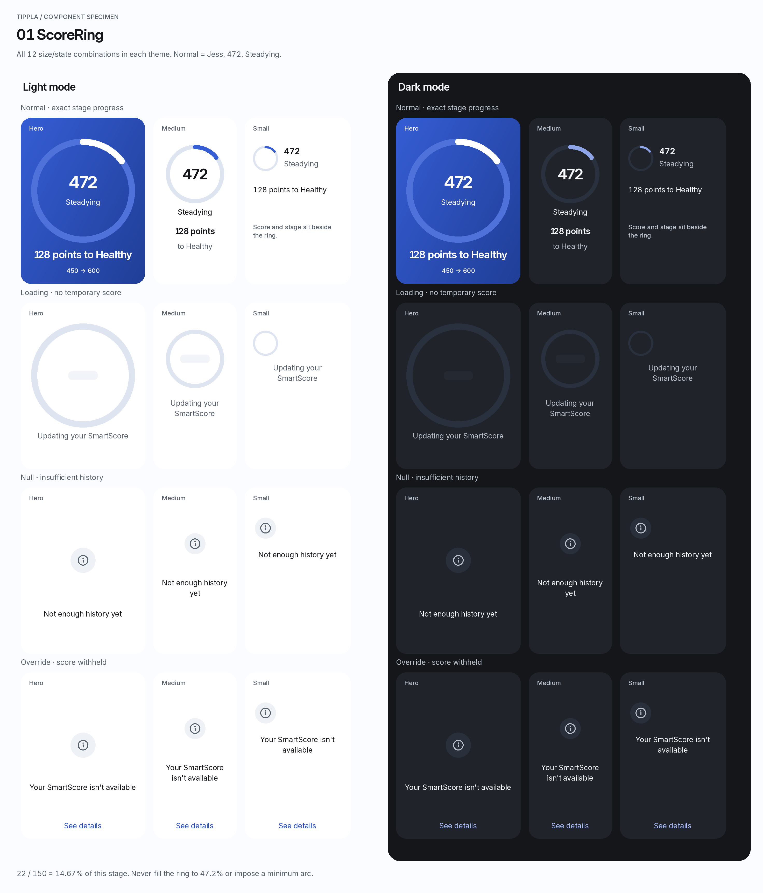

### Anatomy, dimensions and typography

| Element | Size / padding / gap | Typography | Colour and state behaviour | Interaction / semantics |
| --- | --- | --- | --- | --- |
| Host | No mandatory card. Neutral host `C.surface`; a focused hero may use the brand surface. Host padding `space[5]`, radius `radius.lg` when a card is used. | — | Brand treatment is available for normal only in this handoff; loading/null/override use neutral surfaces. | The inspection-sheet frames are not fixed app component dimensions. The ring itself is not an invisible button. |
| Hero ring | 200 × 200; stroke `space[3]` = 12; centre radius 94. | Number `type.figureL`; stage `type.small`. | Normal brand: arc `color.light.onAccent`; track `color.stage.light.building`; both centre labels `color.light.onAccent`. Normal neutral: arc `S[currentStage]`, track `CH.ringTrack`, labels `C.text`. | Keep the path prominent; do not use `type.figureXL` for the score here. |
| Hero next-stage block | `space[4]` below the ring; `space[2]` between distance and endpoints; centred. | Distance `type.h2`; endpoints `type.caption`. | Brand: both `color.light.onAccent`. Neutral: distance `C.text`, endpoints `C.textMuted`. | Jess: “128 points to Healthy”; endpoints “450 → 600”. |
| Medium ring | 112 × 112; stroke `space[2]` = 8; centre radius 52. | Number `type.h1`; stage `type.small`; distance `type.h3`; “to Healthy” `type.small`. | Arc `S[currentStage]`; track `CH.ringTrack`; number/stage/distance `C.text`; supporting text `C.textMuted`. | Put stage and distance below the circle with `space[3]` and `space[4]` gaps, or beside it in a fluid dashboard row. |
| Small ring | 48 × 48; stroke `space[1]` = 4; centre radius 22. No text inside. | Adjacent number `type.bodyStrong`; stage and distance `type.small`. | Arc `S[currentStage]`; track `CH.ringTrack`; number/distance `C.text`; stage `C.textMuted`. | Text sits beside the ring, separated by `space[3]`; stage follows number by `space[1]`. Distance sits `space[3]` below that row. |
| Loading graphic | Reserve the requested diameter to avoid layout shift. Keep the neutral empty track; hero/medium may show a 56 × 16, `radius.xs` centre skeleton. | “Updating your SmartScore”: `type.small`. | Track `CH.ringTrack`; skeleton `C.surface2`; message `C.textMuted`. No stage, score or filled arc. | `aria-busy=true`, polite status text. Static skeleton is the default; never animate a numerical arc as a loader. |
| Null graphic/message | Reserve ring area; remove the ring. Centre Lucide `Info` at 24 px in a 48 px hero or 40 px medium/small neutral disc. | “Not enough history yet”: `type.small`. | Disc `C.neutralSoft`; icon `C.neutral`; message `C.text`. | No numeric meter, stage, distance or zero. Null means insufficient history, not a poor result. |
| Override graphic/message | Same reserved area and neutral icon treatment as null. | “Your SmartScore isn't available”: `type.small`; “See details”: `type.small`. | Disc `C.neutralSoft`; icon `C.neutral`; message `C.text`; action `C.accent`. | No score/stage/arc. “See details” is an explicit ≥44 px target opening the score-availability sheet, using approved explanatory copy from the scoring service. |
| Terminal stage | Retain score and the supplied Thriving progress; omit next-stage distance/endpoints. | “Thriving” `type.small`. | Normal current-stage palette. | No invented fifth stage or “0 points to go”. Upper bound is 1,000; stage start must come from configuration. |

### State and calculation rules

- Precedence: override → loading → insufficient history → normal. Test null explicitly: a valid score of 0 is not missing data.
- Valid normal data includes score, current stage, stage start and the next-stage threshold. For Jess, `score = 472`, `stageStart = 450`, `nextStageStart = 600`.
- Stage progress is `(472 − 450) / (600 − 450) = 22 / 150 = 0.146666…`; distance is `600 − 472 = 128`. Do not divide by 599, use the overall score percentage, round the rendered fraction to 15%, or impose a minimum arc.
- Render clockwise from 12 o'clock. For diameter `d` and stroke `s`, `r = (d − s) / 2`, circumference `2πr`, dash length `circumference × progress`. Round caps are stroke geometry; do not add them to the data percentage. At exact zero progress, hide the arc entirely so a rounded zero-length dash does not appear as earned progress.
- At a stage threshold, update the stage, range and distance atomically. At 600, Jess enters Healthy; never leave the old Steadying ring full while showing the Healthy label.
- Normal accessible meter: `aria-valuemin=stageStart`, `aria-valuemax=nextStageStart`, `aria-valuenow=score`, and value text “SmartScore 472. Steadying. 128 points to Healthy.” The graphic is hidden from assistive technology; announce the value once. Null/override are text groups, not meters.
- Invalid or inconsistent service data must not be repaired into a plausible score. Use the neutral unavailable presentation and record the validation failure outside customer UI.

## 2. StageScale

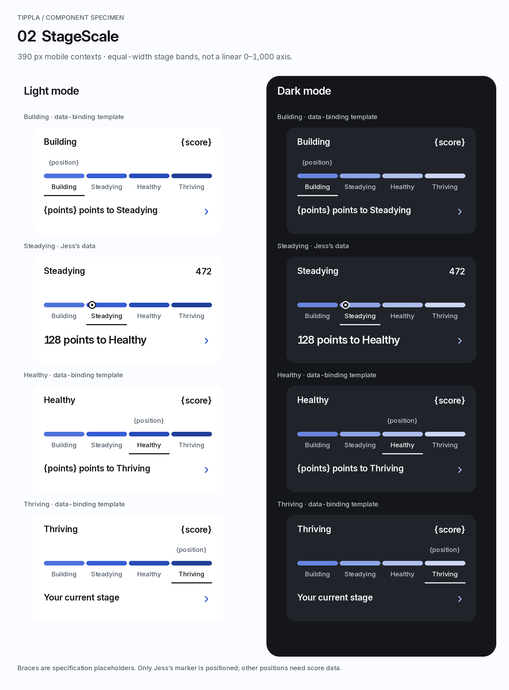

| Element / state | Size / padding / gap | Typography | Colour token, light and dark | Interaction / semantics |
| --- | --- | --- | --- | --- |
| Container | 350 wide at the reference viewport; min-height 196; padding `space[5]`; radius `radius.md`; no shadow. | — | `C.surface`. | Render only when a valid score and stage configuration are available. ScoreRing owns loading/null/override messaging; do not show a guessed scale underneath it. |
| Current stage + score | One row with `space[3]` minimum separation; wrap score beneath stage at large text sizes. | Both `type.h3`; score uses `font.numeric`. | Both `C.text` in every stage. | Current stage is explicit text; selecting another stage for information does not change this row. |
| Four stage segments | Four equal widths, 8 px high (`space[2]`), `space[1]` gap, `radius.pill`. On a 310 px inner width: `(310 − 3 × 4) / 4 = 74.5` px each. | — | Building `S.building`; Steadying `S.steadying`; Healthy `S.healthy`; Thriving `S.thriving`. No opacity fading. | This is an ordinal path through stages, not a proportional 0–1,000 axis. Keep all four named stages visible. |
| Marker | 14 px outer diameter; 2 px border; 4 px centre dot. Centre on the segment's midline. Allow overflow at segment endpoints. | — | Fill `C.surface`, border and centre `C.text`. | Set from score-derived progress. Non-draggable; never use slider semantics. Marker and current label together identify position. |
| Stage labels | `space[3]` below the strip; each label centred in its segment width. Each segment+label has a ≥44 px tall target. | `type.caption`. | Current label `C.text`; other labels `C.textMuted`. Current underline: 2 px `C.text`, `space[2]` below the text line. | Four named buttons open “About [stage]” sheets. Apply `aria-current="step"` only to the actual current stage; retain it while an information sheet is open. |
| Next-stage distance | `space[5]` after the label/underline group; target height ≥44; Lucide `ChevronRight` 20 px at the trailing edge; text/icon gap `space[3]`. | `type.h2`; long content wraps. Template bindings in the image use smaller `type.h3` for annotation readability only. | Text `C.text`; chevron `C.accent`. | Jess: “128 points to Healthy”. Opens the Healthy-stage sheet explaining the next threshold and factors with room to move. |
| Building current | Same geometry; current label and marker within Building. | Same tokens. | Marker `C.text`/`C.surface`; segment `S.building`; other segments retain their own colours. | Next stage is Steadying. Values and position come from score configuration; no invented fixture. |
| Steadying current | Same geometry; Jess's position is 22/150 through the second segment. | Same tokens. | Current segment `S.steadying`; all labels use text tokens. | Next stage Healthy at 600; distance 128. |
| Healthy current | Same geometry; marker within Healthy when valid data is supplied. | Same tokens. | Current segment `S.healthy`. | Next stage Thriving at 750 in the later supplied fixture. Marcus is 612, Healthy, with 138 points to go; progress is 12/150. Production thresholds still come from configuration. |
| Thriving current | Same geometry; terminal row says “Your current stage”; no next-distance value. | Terminal row `type.h3`. | Current segment `S.thriving`; row `C.text`, chevron `C.accent`. | Row opens “About Thriving”. Marker uses the configured Thriving start and score maximum 1,000. |
| Focus / press | Stage targets keep their segment colours. Focus follows the shared contract; press adds a `C.surface2` target background behind the label. | Unchanged. | `C.focus`; label foreground unchanged. | No colour-only selection, drag gesture or horizontal scroll needed. At large text sizes, use four labelled vertical rows with the same targets and current-stage indication. |

Marker x-position is `segmentStart + clamp(progress, 0, 1) × segmentWidth`, accounting for the gaps between segments. Jess's marker is 89.4267 px from the inner left edge: one segment and one gap, plus `74.5 × 22/150`. The image uses this exact placement.

## 3. FactorTile

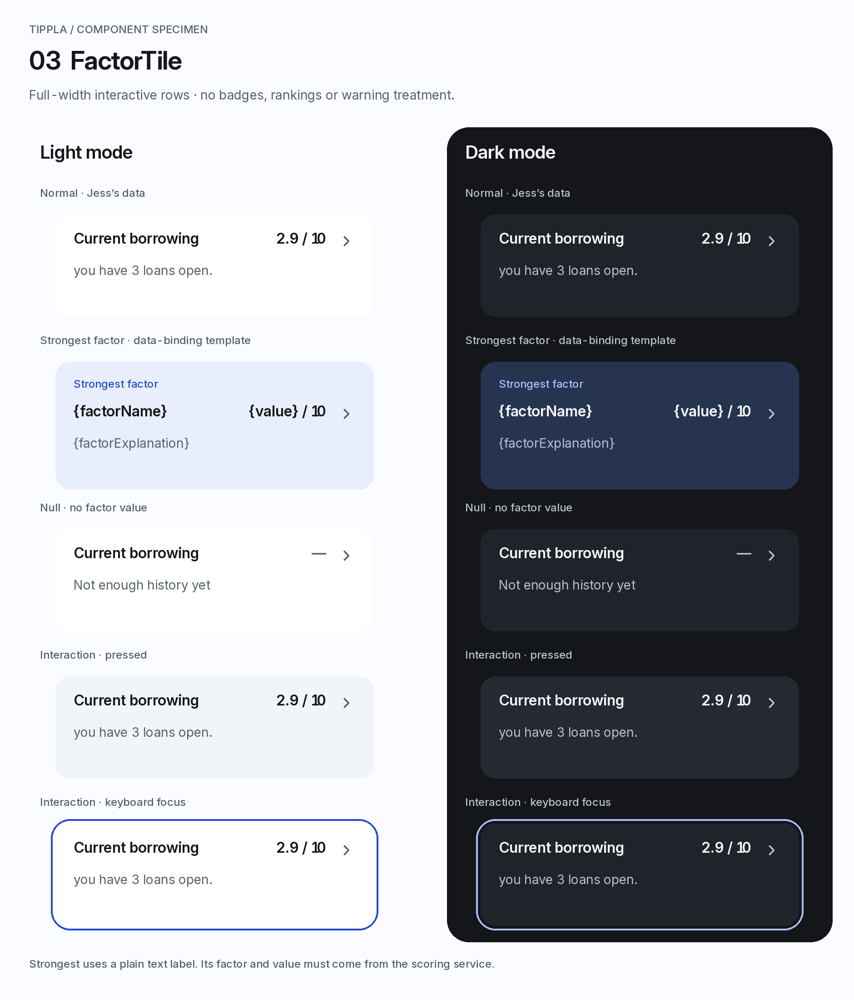

| Element / state | Size / padding / gap | Typography | Colour token, light and dark | Interaction / semantics |
| --- | --- | --- | --- | --- |
| Whole tile | 350 wide; min-height 112 normal/null, 140 strongest; padding `space[5]`; radius `radius.md`; no shadow. Tile-to-tile gap `space[3]`. | — | Normal/null `C.surface`; strongest `C.accentSoft`. | One native button wrapping non-interactive contents. Entire tile opens the matching factor sheet; no nested links. |
| Title/value row | CSS grid `minmax(0, 1fr) auto 20px`; gap `space[3]`. Allow title wrapping. | Title `type.h3`; value `type.h3` with `font.numeric`. | Title/value `C.text`, except null value `C.textMuted`. | Normal title “Current borrowing”; value “2.9 / 10”. At large text sizes move the value below the title, keeping the chevron separate. |
| Explanation | `space[4]` below the title row; no truncation. | `type.small`. | `C.textMuted` in all states. | Normal: “you have 3 loans open.” Full detail and the first relevant action are one tap down. |
| Trailing chevron | `icons.sizes[1]` = 20; decorative, aligned to the first title line. | — | `C.textMuted`. | Not a separate 20 px tap target; the entire tile is the control. |
| Strongest label | Plain text above title; `space[3]` between label and title. No pill, medal, star or badge. | “Strongest factor”: `type.caption`. | `C.accent` on `C.accentSoft`. Title/value remain `C.text`; explanation `C.textMuted`. | Service identifies the strongest available factor. Do not label Current borrowing 2.9/10 as strongest; its fixture was supplied as the biggest factor with room to move. |
| Null | Same title, em dash instead of value; omit “/ 10”; explanation “Not enough history yet”. | Title/value `type.h3`; explanation `type.small`. | Title `C.text`; dash, explanation and chevron `C.textMuted`; background `C.surface`. | Remains actionable; sheet explains data availability for that factor. Never render “0 / 10”. |
| Pressed / hover | Same geometry, no translation. | Unchanged. | Normal/null background `C.surface2`. Strongest background `C.accentSoft` plus 2 px inset `C.accent` outline. Other foregrounds unchanged. | Apply for `motion.fast`. Press does not change the score. |
| Focused | 2 px outline, 3 px offset per `focusRing`; never clip at a parent overflow boundary. | Unchanged. | `C.focus`; underlying state's fill/foregrounds unchanged. | Visible keyboard focus, with Enter/Space activation. |
| Accessible name | Include name, available value, explanation and “Strongest factor” only when applicable. | — | — | Use the actual factor identifier for the destination. Null label describes missing history; do not announce an absent value as zero. |

No value bar is used: the number is precise, the explanation is readable, and missing strongest-factor data does not require a fabricated visual proportion. The nine factors remain ordinary, equally interactive rows.

## 4. PayCycleHero

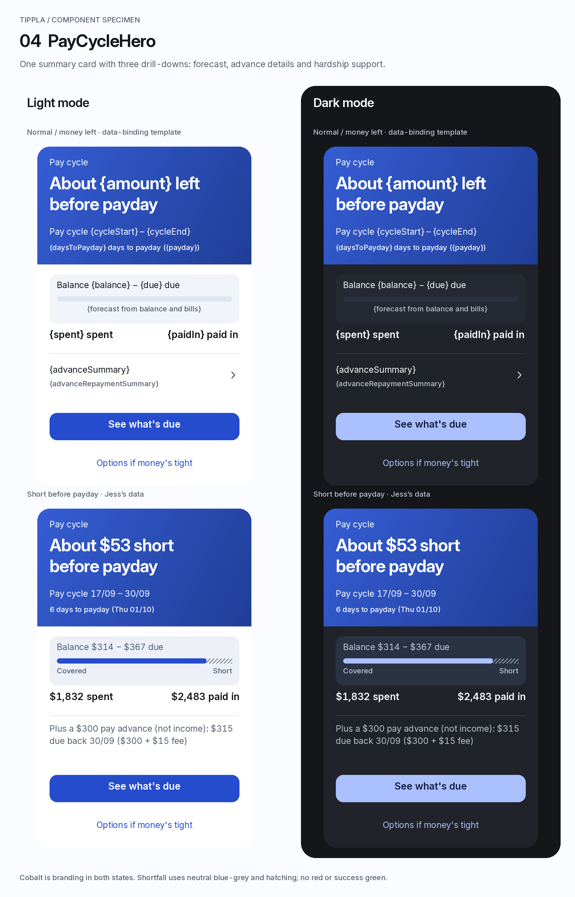

| Element / state | Size / padding / gap | Typography | Colour token, light and dark | Interaction / semantics |
| --- | --- | --- | --- | --- |
| Card shell | 350 wide; radius `radius.lg`; padding `space[5]` within each section. Reference height 524 with two-line headline and advance disclosure; height is content-driven. No shadow. | — | Body `C.surface`; upper summary uses the fixed brand gradient in both states/themes. | A section with separate controls, not a button containing buttons. The normal amount is a binding in the sheet because no normal-state data was supplied. |
| Summary heading | Label, then `space[3]` gap to the headline. Headline wraps without truncation. Reference upper panel 192 high. | “Pay cycle” `type.small`; headline `type.h1`. | All summary text `color.light.onAccent`, including dark mode. | Normal: “About {amount} left before payday”. Short: “About $53 short before payday”. No urgency icon or red styling. |
| Cycle dates / payday | `space[5]` after headline; date and payday rows separated by `space[2]`. | Date `type.small`; payday `type.caption`. | `color.light.onAccent`. | Jess: “Pay cycle 17/09 – 30/09” and “6 days to payday (Thu 01/10)”. Derive production timing from the data snapshot and account timezone, not this document's render date. |
| Forecast control | Full inner width 310; inset padding `space[3]`; radius `radius.sm`; 80 high at default type. Top separation `space[4]`. | Balance/due summary `type.small`; chart labels `type.caption`. | Normal panel `C.surface2`, text `C.text`, labels `C.textMuted`. Short panel `C.cautionSoft`, text/labels `C.caution`. | Entire panel is a named ≥44 px button opening the pay-cycle forecast sheet. Visible Jess summary: “Balance $314 − $367 due”. |
| Coverage strip | 8 px high (`space[2]`), `radius.pill`; `space[1]` above, `space[2]` below before legend. | Legend `type.caption`. | Covered portion `C.accent`. Context track `CH.ringTrack`. Short remainder uses `C.cautionSoft` plus 1 px diagonal `CH.hatch` lines spaced 6 px; do not use a black fill. | Jess: coverage `314/367`, remainder `53/367`; legend “Covered” / “Short”. This describes bill coverage, not a spending-success meter. Graphic is decorative to the fully labelled forecast button. |
| Historical totals | Two columns with `space[3]` minimum gap; `space[3]` after forecast. Wrap to separate rows if needed. | Both `type.bodyStrong`; amounts use `font.numeric`. | Both `C.text`, regardless of spending direction or income source. | “$1,832 spent” and “$2,483 paid in”. Spent opens transactions filtered to this cycle; paid in opens income transactions including the advance. Use separate ≥44 px controls. |
| Divider | 1 px; vertical separation `space[3]` minimum from interactive contents. | — | `C.line`. | Decorative only. |
| Advance disclosure | Full-width row; min-height 64; text/chevron gap `space[3]`; Lucide `ChevronRight` 20. Omit the whole row when no advance is included. | First line `type.small`; repayment line `type.caption`. | First line `C.text`; repayment line and chevron `C.textMuted`. | Jess: “Includes a $300 pay advance,” then “$315 due back 30/09 ($300 + $15 fee)”. Opens the advance detail sheet. |
| Primary due action | Full inner width; height `layout.minTap` = 44; radius `radius.sm`; horizontal padding `space[4]`. | “See what's due”: `type.bodyStrong`. | Background `C.accent`; label `C.onAccent`. | Opens calendar/due-items sheet for the remaining days before payday, with the entries listed below. |
| Hardship action | Full inner-width target; min-height 44; `space[2]` after primary action. | “Options if money's tight”: `type.small`. | Label `C.accent`; transparent background over `C.surface`. | Opens Hardship support. Available in both states. No lender-offer routing. |
| Normal / money left | `balance − due > 0`. Same structure and brand treatment as short state. | Same tokens. | Forecast `C.surface2` / `C.text`; no positive green. | With real data, strip shows the bills-covered share and remaining-money share; labels “Bills covered” / “Left”. Template graphics carry no invented ratios. |
| Short before payday | `balance − due < 0`. Same structure and spacing. | Same tokens; no larger warning typography. | Forecast `C.cautionSoft` / `C.caution`; short portion `CH.hatch`. Other elements retain normal colours. | Use the absolute shortfall in the headline. Preserve “About”; do not represent it as a declined application or overdue bill. |
| Exact zero / missing data | Zero uses the same neutral forecast treatment; unavailable inputs suppress the estimate/strip. | Zero: “About $0 left before payday”. Missing: “Pay-cycle estimate unavailable”, `type.h1`. | Normal brand heading; neutral body. Never destructive or positive. | Edge rules, not extra sample scenarios. Do not map unknown balance or unknown due total to zero. Keep any independently valid transaction links available. |
| Press / focus | Target-specific, using the shared contract. Do not dim the entire card. | Unchanged. | Forecast retains caution colours when short and gains 2 px inset `C.caution` outline on press; normal forecast uses `C.neutral` inset outline. Other controls follow the shared rules. | Keyboard focus stays visible; no nested or overlapping button targets. |

### Data and destination contract

- Store amounts in integer cents. Jess: balance 31,400 cents; due 36,700 cents; derived remaining −5,300 cents. Display the supplied whole-dollar amounts exactly. Do not subtract the $315 repayment twice: it is already inside the $367 due total.
- Paid in ($2,483) and spent ($1,832) are historical cycle totals. They are not the forecast balance and do not get added to the current $314 again. The paid-in total includes the $300 advance; it is not all wages or benefit income.
- Forecast denominator is `max(max(balance, 0), due)`. Covered amount is `min(max(balance, 0), due)`. In normal state, the remaining width is money left; in short state, it is uncovered bills. Guard zero denominators. Negative current balances keep the numeric explanation and neutral hatch treatment; do not draw negative widths.
- The forecast sheet explains that the estimate uses current balance and bills due before payday and does not include future discretionary spending. It includes the exact breakdown: **$367 due before payday: Telstra $52 (Sat 26/09), Beforepay $315 (Wed 30/09)**.
- “See what's due” opens the calendar view of the same two items. Telstra is labelled “predicted”; its item outline uses a 1 px dashed `CH.predicted` stroke and the visible word “predicted” in `C.textMuted`. Do not mark Beforepay predicted without source data.
- The advance sheet shows Beforepay, principal $300, fee $15, total repayment $315 and due date 30/09. Keep the fee explicit; never call the advance income without the borrowing explanation.
- Parent dashboard owns “Updated Fri 25/09, 9:14am”. The fixture's six-day countdown is tied to this snapshot; do not silently replace it using today's date. Preserve supplied short dates in these fixtures. When a full year is available for production transaction details, format DD/MM/YYYY; all money uses AUD with `$`.

## Additional shared rules for components 05–10

| Concern | Implementation |
| --- | --- |
| Theme notation | `C = color[theme]`; `K = color.category[theme]`; `CH = color.chart[theme]`. These are local aliases for existing tokens, resolved separately for light and dark. |
| Spacing | Zero-based indices: `space[1]=4`, `[2]=8`, `[3]=12`, `[4]=16`, `[5]=20`, `[6]=24`, `[7]=32`, `[8]=48`. All dimensions below are CSS px. |
| Typography | Apply the complete `type.*` record. Headings use `font.display`, prose `font.body`, and amounts/counts/dates `font.numeric` with `font.numeric.features = tnum`. All use the specified Inter/system fallback stack. |
| Icons | Use the exports in `icons.md`. Standard icon size `icons.sizes[2]` = 24; chevrons `icons.sizes[1]` = 20; chip/edit indicators `icons.sizes[0]` = 16; `icons.strokeWidth` = 2. No emoji or mixed icon sets. |
| Targets | Native buttons/links have at least `layout.minTap` = 44 × 44. A 16 px X is not a 16 px button. Static metadata has no button styling or interaction role. |
| Focus | `focusRing.width` = 2; `focusRing.offset` = 3; `C.focus`. Parent containers must not clip the outline. Keep focus when data refreshes; never move it merely because a chart selection changes. |
| Press / hover | Neutral buttons: `C.surface2`. Accent-soft controls: retain `C.accentSoft`, add 2 px inset `C.accent` outline. Filled-accent buttons: retain `C.accent`/`C.onAccent`, add 2 px inset `C.onAccent` outline. These are additive states, not new palette tokens. |
| Disabled | Keep text/icons legible using `C.textMuted`, background `C.neutralSoft` where needed, and native disabled semantics. No global opacity fade. Preserve the selected state and provide an adjacent explanation when availability is not obvious. Disabled is never a financial assessment. |
| Motion | `motion.fast` for colour; `motion.base` for paging/expansion; `motion.slow` with `motion.easing` for modal transitions. Respect reduced motion; omit nonessential movement. No auto-rotating insights, flashing, confetti or score-like rewards. |
| Responsive layout | Grow rows/cards with wrapped text; heights are reference/minimum values. At 200% text scaling, move amounts below names if necessary. Never truncate essential amounts, status labels, insight advice or actions. |
| Formats | AUD with `$`; production dates DD/MM/YYYY when the full date exists. Preserve the supplied short-date fixture strings. Historical fixture periods are based on the supplied snapshot, not the current device date. |
| Financial semantics | No destructive/red token in these components. Spending increases, pending payments, borrowing and budget overages are not success or danger signals. Gambling remains an ordinary slate category; income and Centrelink share size, icon and hierarchy. |

## 05. InsightCard with pager and InsightSheet

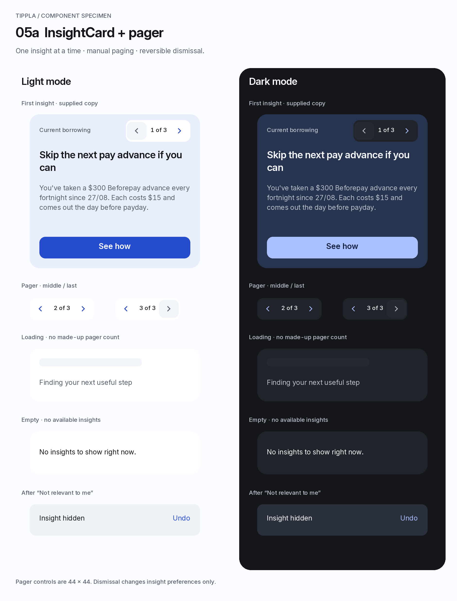

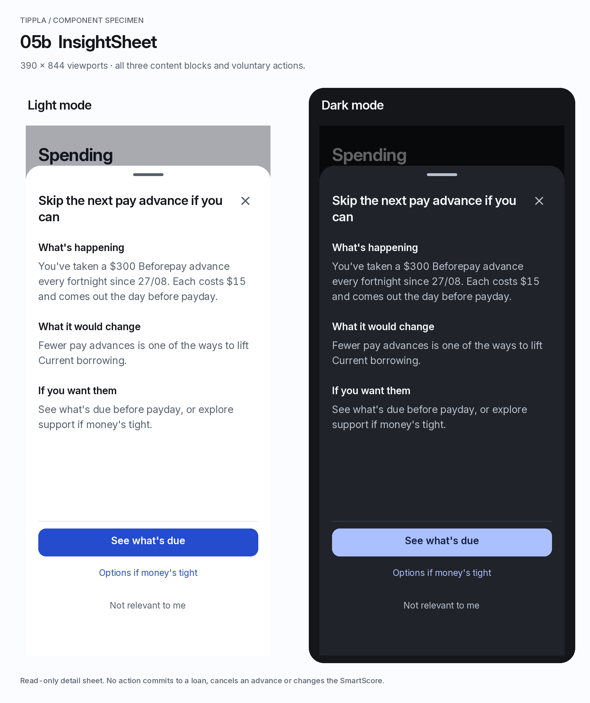

| Element / state | Anatomy, dimensions and spacing | Typography | Colours by state | Interaction |
| --- | --- | --- | --- | --- |
| InsightCard shell | 350 wide; reference height 316 for this copy; padding `space[5]`; radius `radius.lg`; no shadow. Header, title, factual explanation, CTA. | — | Ready: `C.accentSoft`. Loading/empty: `C.surface`. | Use an article/section with separate controls, not a button containing pager buttons. “See how” opens this insight's sheet. |
| Context label | Left of pager; allow it to move to a separate row on narrow layouts. | “Current borrowing”: `type.caption`. | `C.textMuted`. | Describes the insight's attachment; never a warning label. |
| Pager | 132 × 44: previous button 44, count area 44, next button 44; `radius.sm`; sits in header. | “1 of 3”: `type.caption`. | Pager surface `C.surface`; count `C.text`; enabled arrows `C.accent`; disabled arrow `C.textMuted` on `C.surface2`. | Previous/next are named buttons. First disables previous; last disables next; middle enables both. No wrapping or autoplay. |
| Title | `space[5]` after header; available inner width 310; no ellipsis. | `type.h2`. | `C.text`. | “Skip the next pay advance if you can”. Keep the qualification “if you can”. |
| Card explanation | `space[4]` after heading; wrap freely. | `type.small`. | `C.textMuted`. | “You've taken a $300 Beforepay advance every fortnight since 27/08. Each costs $15 and comes out the day before payday.” |
| Card CTA | Full inner width; 44 high; `radius.sm`; at least `space[5]` after explanation. | “See how”: `type.bodyStrong`. | `C.accent` background / `C.onAccent` label. | Opens InsightSheet by stable insight ID. Does not make a financial commitment. |
| Loading | Static skeleton using `radius.xs`; reserve a useful card area; omit unknown pager count. | “Finding your next useful step”: `type.small`. | Skeleton `C.surface2`; text `C.textMuted`; shell `C.surface`. | `aria-busy=true`; no fake insight, amount or recommendation. |
| Empty | Plain neutral panel; reference height 88, padding `space[5]`. | “No insights to show right now.”: `type.small`. | `C.text` on `C.surface`. | No pager or dead CTA. Home may omit the entire empty insight section; a dedicated insights view can show this state. No congratulatory interpretation. |
| Dismissed | Inline 64 px confirmation; padding `space[5]`; `radius.sm`; Undo target ≥44. | “Insight hidden” and “Undo”: `type.small`. | Panel `C.neutralSoft`; message `C.text`; Undo `C.accent`. | Show after “Not relevant to me”. Undo restores the insight and its attachment chip. No timer-only access to Undo. |
| InsightSheet shell | Uses component 09. Reference mobile detent 780 on the 390 × 844 example; width 390; inner padding `space[5]`. | Sheet title `type.h2`. | `C.surface`, title `C.text`, scrim `C.scrim`. | Focus sheet heading on open. Long content scrolls within the body; footer remains reachable. |
| What's happening | Heading, then `space[2]` to factual paragraph. | Heading `type.h3`; paragraph `type.body`. | Heading `C.text`; paragraph `C.textMuted`. | Uses the full supplied Beforepay explanation above. Do not add inferred dates, fees or loan counts. |
| What it would change | `space[6]` after prior block; heading-to-copy gap `space[2]`. | Heading `type.h3`; copy `type.body`. | `C.text` / `C.textMuted`. | “Fewer pay advances is one of the ways to lift Current borrowing.” Never invent a point increase, approval probability or guaranteed outcome. |
| If you want them | Same block spacing. | Heading `type.h3`; copy `type.body`. | `C.text` / `C.textMuted`. | “See what's due before payday, or explore support if money's tight.” Actions are optional and directly related to the insight. |
| Sheet action group | Top separator 1 px `C.line`; top gap `space[3]`; three 44 px targets separated by `space[2]`; bottom safe-area padding. | Primary `type.bodyStrong`; secondary/dismissal `type.small`. | Primary `C.accent` / `C.onAccent`; support link `C.accent`; dismissal `C.textMuted` on `C.surface`. | “See what's due” opens the due-items view; “Options if money's tight” opens Hardship support; “Not relevant to me” hides only this suggestion. Do not turn support into an offer route. |

Pager behaviour: maintain a stable ordered insight-ID list. Announce the new “n of total” once after manual paging; retain focus on the activated arrow. When dismissal removes an item, choose the next surviving item at that index, otherwise the previous one, and recalculate the count. Hide the pager when fewer than two items remain. Counts in the sheet are UI state examples, not additional customer insights.

Dismissal updates the user's relevance preference only. Close the sheet, remove matching cards/chips, and provide Undo. If the trigger disappears, focus the next insight heading or the containing section heading. A failed preference save restores the insight and displays a neutral “Couldn't hide this insight. Try again.” message. Do not change a score, delete bank data, cancel an advance, or mark an action complete.

Following an action from one sheet to another should replace its body or navigate with a Back affordance; do not pile multiple scrims on top of each other.

## 06. CategoryRow

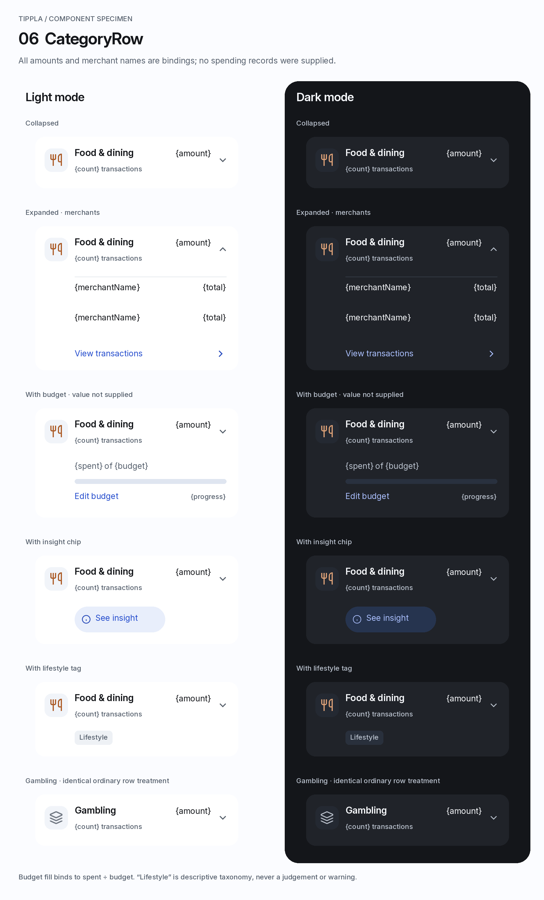

| Element / state | Anatomy, dimensions and spacing | Typography | Colours by state | Interaction |
| --- | --- | --- | --- | --- |
| Container / summary | 350 wide; collapsed minimum 88 high; padding `space[4]`; `radius.md`. Optional slots follow the summary. | — | Rest `C.surface`; pressed summary `C.surface2`; focus `C.focus`. | Root is a section. Summary is one button controlling merchant expansion with `aria-expanded` and `aria-controls`. Other actions are siblings, never nested buttons. |
| Category icon | 24 px in 40 × 40 container, `radius.sm`; `space[3]` to the name. | — | Icon `K[categoryId]`; container `C.surface2`, full opacity. | Use `icons.md`. Gambling is Lucide `Layers` in `K.gambling`, with identical size and weight. |
| Name / count | Flexible text column. Name and metadata separated by `space[1]`; allow wrapping. | Name `type.h3`; “{count} transactions” `type.caption`. | Name `C.text`; count `C.textMuted`. | Counts are for the currently applied period/filter scope. |
| Total / disclosure | Amount right aligned; `space[2]` to 20 px chevron; reserve amount width, wrap name first. | Amount `type.small`, `font.numeric`. | Amount `C.text`; chevron `C.textMuted`. | `ChevronDown` collapsed; `ChevronUp` expanded. Amount is part of summary's target, not a separate hidden action. |
| Expanded merchants | Reference 248 high with two illustrative merchant bindings. Merchant content aligns to the name column, 68 px from row left; 52 px merchant targets; 1 px divider `C.line`. | Merchant name/total `type.small`. | Both `C.text`; dividers decorative. | Each merchant opens transactions filtered by category, merchant and the existing period. “View transactions” opens all transactions in this category. Do not truncate the merchant list to the two rows shown in the specimen. |
| Budget slot | Reference total row height 188. Align at name column; 8 px bar with `radius.pill`; label-to-bar gap `space[2]`; action target ≥44. | “{spent} of {budget}”: `type.small`; numeric remainder/progress `type.caption`; action `type.small`. | Fill `C.accent`; track `CH.ringTrack`; description `C.textMuted`; “Edit budget” `C.accent`. | Opens budget editing. Specimen has no fill percentage because no budget or category amount was supplied. |
| Budget under / at / over | Bar fraction `min(spent / budget, 1)` when budget is positive. Exact amount text carries the result. | Same tokens. | Same blue fill in all cases. Over-budget annotation uses `C.neutral`, with optional neutral `CH.hatch` at the full bar's trailing edge. Never red/green. | Under: “{amount} left”; exact: “Budget reached”; over: “{amount} over budget”. Use the user's chosen budget; do not invent a recommended limit. At zero/missing budget, do not divide by zero or show a fabricated progress value. |
| Insight chip | 44 high; padding `space[3]`; `radius.pill`; `Info` 16 px; icon/text gap `space[2]`. Align with name column; reference row height 152. | “See insight”: `type.small`. | `C.accent` icon/text on `C.accentSoft`; pressed inset `C.accent`; focus `C.focus`. | Opens the insight actually attached to this category. Hiding that insight also removes its chip. Never manufacture a gambling warning chip. |
| Lifestyle tag | 24 high; horizontal padding `space[2]`; radius `radius.xs`; reference row height 128. | “Lifestyle”: `type.caption`. | Text `C.neutral` on `C.neutralSoft`. | Non-interactive taxonomy metadata. Display only when supplied by the category model/user; it is not a badge, affordability judgement or warning. |
| Composed variants | Slot order: summary → lifestyle tag → budget → insight chip → expanded merchants. Gaps `space[3]`; height grows. | As above. | As above. | Expanded, budget, insight and tag are independent properties. These must work together, not be mutually exclusive enum values. |

Keep category labels and icon strokes visible when the donut has a selection; do not fade category rows to chart opacity. Income and Centrelink retain the same icon, typography, tap targets and layout. Missing totals display an em dash with explanatory text; an empty settled total may be zero only when the data actually says zero.

Budget progress is supplementary to its numeric label. If exposed as a meter, clamp its numeric meter value at the budget while its accessible value text announces the exact spend and overage. A null budget shows “Set a budget” rather than a zero budget. An explicitly configured zero budget gets an exact text explanation and no ratio bar.

## 07. Donut

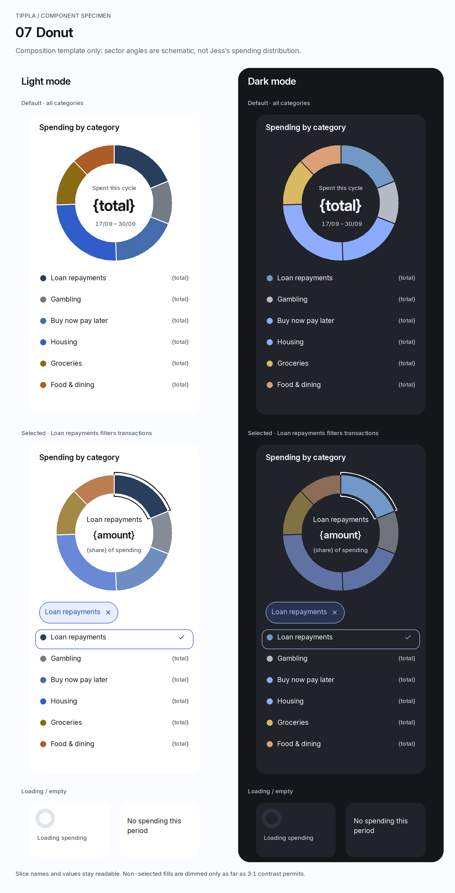

The diagram deliberately places loan repayments, gambling and BNPL next to each other to test distinction. The six illustrated sectors are styling examples, not a complete six-category dataset or real proportions. Render production arcs from all supplied non-zero category totals; do not force gambling to a privileged position or minimum angle.

| Element / state | Anatomy, dimensions and spacing | Typography | Colours by state | Interaction |
| --- | --- | --- | --- | --- |
| Host / heading | 350 wide; padding `space[5]`; `radius.lg`; content height grows with legend. | “Spending by category”: `type.h3`. | Host `C.surface`; heading `C.text`. | Chart title identifies the metric and scope; income must not be mixed into a chart labelled Spending. |
| Geometry | Default outer diameter 240, inner diameter 160: ring thickness 40. Keep a 5 px halo allowance, so graphic layout box is 250 × 250. Start at 12 o'clock, clockwise. | — | Each default sector `K[categoryId]`; 2 px `C.surface` separators. | Angle = eligible category amount / reconciled total × 360. Preserve category order while selecting. No exploded slices, artificial minimum angles or ranking animations. |
| Default centre | Centre content max-width 144; label, amount, period; gaps `space[2]`. | “Spent this cycle” `type.caption`; amount `type.figureL`; period `type.caption`. | Amount `C.text`; labels `C.textMuted`. | Production centre uses the reconciled total. The image uses `{total}` because the supplied $1,832 total has no accompanying category breakdown. |
| Selected sector | Retain the exact angle and radius. Add a 2 px `C.text` selection outline separated from the fill by a 3 px `C.surface` halo. | — | Selected fill remains `K[categoryId]`. Other fills use the contrast-safe dimming recipe below. | A tap selects the category and immediately filters the associated transaction list. Tapping it again clears selection. Selection is not a new route or a credit assessment. |
| Selected centre | Category name, category amount, “{share} of spending”. Allow two-line names; grow host instead of squeezing text. | Category `type.small`; amount `type.figureL` in production; share `type.caption`. Placeholder `{amount}` uses `type.h2` in the sheet to fit the annotation. | Name/amount `C.text`; share `C.textMuted`. | Percent is derived from the same unfiltered period denominator, not 100% of an already-filtered single-category dataset. |
| Selection chip | Component 10, between graphic and legend; ≥44 high; gap `space[4]`. | `type.small`. | `C.accent` on `C.accentSoft`. | “Loan repayments ×” removes only that category selection and restores the period's full composition. |
| Legend | One ≥44 px row per category; 12 px colour dot; gap `space[4]` to label; amount right aligned. | Name `type.small`; amount `type.caption`. | Dots always original `K[categoryId]`; names `C.text`; values `C.textMuted`. Selected row gets `C.accent` outline and `Check` 16 px. | Legend buttons provide full-sized alternatives to tiny slices. Use `aria-pressed` for selection. Never create overlapping invisible slice hitboxes. |
| Loading | Static neutral ring/skeleton, no sectors or amount; preserve useful graphic space. | “Loading spending”: `type.small`. | Track `CH.ringTrack`; text `C.textMuted`. | `aria-busy=true`; do not flash a zero total or previous period's data as current. |
| Empty | Replace chart with plain text. | “No spending this period”: `type.small`. | `C.text` on `C.surface`. | No circle suggesting a completed goal. Empty, unavailable and loading are distinct. Unavailable data gets a neutral retry treatment, not a zero. |

### Contrast-safe dimming recipe

For each non-selected category, derive an opaque display colour by blending its token towards `C.surface` in sRGB. Begin with category alpha 0.50 and increase in 0.005 steps until the rounded result reaches at least **3.05:1 against both `C.surface` and `C.surface2`**. Use the original colour if necessary. This provides a small rounding margin above the required 3:1. Do not apply opacity to the entire SVG, centre text, legend or controls. The derived colour is a component-state recipe, not a new token or an edit to `tokens.json`.

Selection must remain evident through outline, centre name, checked legend row and filter chip even when a particular category can only be dimmed slightly. Gambling receives exactly the same treatment and algorithm as any other category.

### Data and selection rules

- Category amounts must be non-negative and reconcile to the displayed total under the same period and accounting basis. Do not silently clamp negative net categories, manufacture an “Other” balance, or add pending amounts to reconcile a mismatch. Refund/netting policy belongs to the data contract; show unavailable data rather than a fabricated composition when the contract fails.
- Spending composition excludes income, Centrelink credits and internal transfers. Pending entries are separate from posted spending by default. If the product explicitly supports another basis, label it and apply it consistently to centre totals, legend, category rows and transactions.
- Compute all sector fractions from the complete current-period dataset. Keep those angles when a category is selected; filter the transaction list, not the donut's denominator.
- Period changes clear category selection only if that category is absent in the new period. Preserve remaining search/merchant filters unless the user explicitly removes them. Explain an empty intersection; do not silently broaden it.
- Click/touch by sector is a shortcut. The labelled 44 px legend buttons provide keyboard and precise-touch access to every category, including very small slices. The centre is not a hidden button.

## 08. TransactionRow

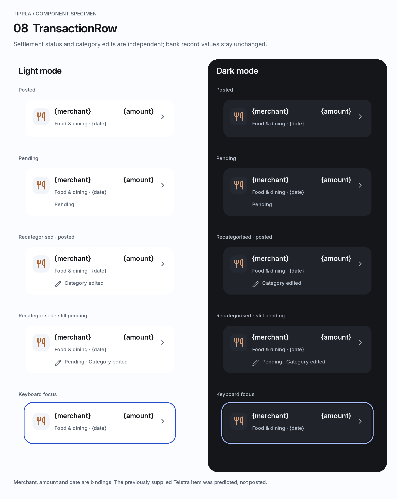

| Element / state | Anatomy, dimensions and spacing | Typography | Colours by state | Interaction |
| --- | --- | --- | --- | --- |
| Row | 350 wide; minimum 88 high posted, 112 with a status/edit line; padding `space[4]`; optional `radius.md` in a standalone surface, otherwise flat list rows. | — | Rest `C.surface`; pressed `C.surface2`; focus `C.focus`. | One native button opens TransactionSheet. No nested pencil button inside the row. |
| Category icon | 24 px in 40 × 40 `radius.sm` container; gap `space[3]` to text. | — | Icon `K[currentCategoryId]`; container `C.surface2`. | Uses current category in every settlement state. Gambling remains `Layers`; no warning icon. |
| Merchant | Flexible column; wrap long names, retaining the amount column. | `type.bodyStrong`. | `C.text`. | Show a recognisable merchant name; retain the unmodified bank description in the detail sheet. |
| Amount | Right aligned; `space[2]` to trailing chevron. Move beneath merchant at large text sizes. | `type.bodyStrong`, `font.numeric`. | `C.text` for outgoing and incoming money, including Centrelink. | Display direction with a minus/plus and accessible “money out”/“money in”, not red/green. Do not infer direction from a category name. |
| Category/date metadata | `space[2]` below merchant line. | `type.caption`. | `C.textMuted`. | “Food & dining · {date}” in the specimen. Format supplied complete dates DD/MM/YYYY. No invented transaction date. |
| Posted | Base row; settled value supplied by bank. | Base tokens. | Base palette; no success tick or green amount. | Opens settled transaction details. “Posted” can be explicit in the detail sheet without adding a badge to every row. |
| Pending | Additional status line, `space[2]` below metadata. | “Pending”: `type.caption`. | `C.textMuted`; amount remains `C.text`. | A visible text state, not reduced-opacity data. Pending is not overdue or failed. Do not expose “posted” merely because categorisation is possible. |
| Recategorised | Additional line with decorative `Pencil` 16 px; text gap `space[2]`. Icon above updates to the new category. | “Category edited”: `type.caption`. | `C.textMuted`; no success colour. | Means category was edited, not that amount/date/settlement changed. Detail sheet offers Edit category and Undo when applicable. |
| Pending + recategorised | Same additional line may read “Pending · Category edited”; height grows if it wraps. | `type.caption`. | `C.textMuted`. | Settlement and category edits are orthogonal fields, not a three-value status enum. Preserve both. |
| Chevron / focus | `ChevronRight` 20 px; focus 2 px at 3 px offset. | — | Chevron `C.textMuted`; outline `C.focus`. | Entire row is the target. Enter/Space opens details; focus returns to the row or nearest surviving row after closing. |

TransactionSheet shows merchant, original bank description, exact amount/direction, date, settlement status, current category and a named “Edit category” action. That action opens a searchable category selector using the same icon mapping and category tokens. Editing affects the category only. Do not imply that a merchant was contacted or a bank record was corrected.

After a successful category save, update affected CategoryRows, merchant aggregates and donut totals for the same record and period. Offer Undo. If the row no longer matches an active category filter, remove it from that filtered result with a polite explanation and keep Undo reachable. A failed save restores the previous category and shows neutral retry copy. Reconcile pending→posted using the service's stable identity/linkage so one transaction does not appear twice; do not match solely by amount/date.

## 09. BottomSheet and desktop drawer

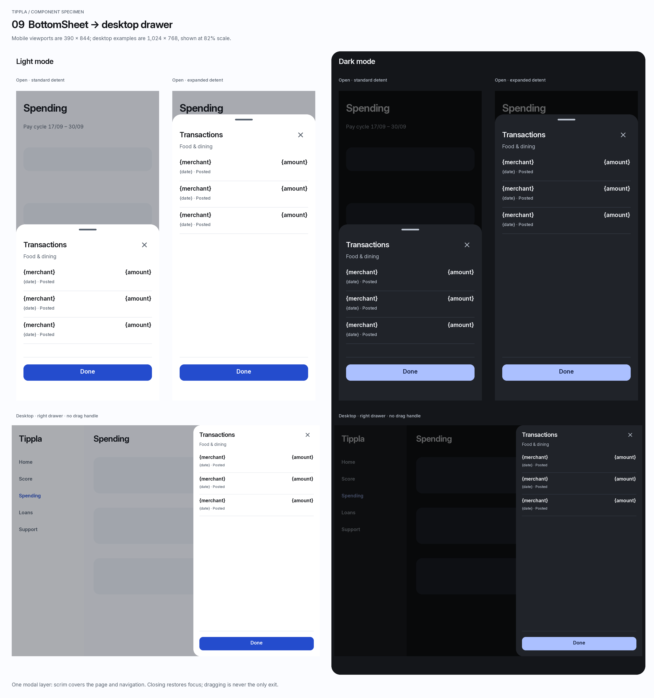

| Element / state | Anatomy, dimensions and spacing | Typography | Colours by state | Interaction |
| --- | --- | --- | --- | --- |
| Mobile panel | Width `min(100vw, layout.drawerWidth)`; full width at 390. Top corners `radius.xl`; bottom edge flush; `elevation[theme][3]`. Padding `space[5]`. | — | `C.surface`. | Below `layout.breakpoints.desktop` = 1,024, anchored bottom; tablet sheets may be centred at the 420 px cap. Overlay covers navigation too. |
| Standard / expanded | Reference detents 480 and 780 px on the illustrated 390 × 844 screen. Actual expanded maximum `100dvh − safeAreaTop − space[5]`; content may use a shorter initial detent. | — | Same palette in both detents. | Expansion changes available reading space, not content or data. Use dynamic viewport height and safe-area insets, not fixed screenshot heights in production. |
| Scrim | Fixed to viewport, beneath sheet and above the full app; not limited to a scrolling parent. | — | Exactly `C.scrim`, including its alpha. | Outside app becomes inert. Tap scrim closes a read-only sheet; no click-through to the underlying tab or row. |
| Handle | Width `space[8]` = 48; height `space[1]` = 4; `radius.pill`; centred in a 44 px high drag/toggle target. | — | `C.neutral`. | Drag only from the handle region. Tap or Enter/Space toggles standard/expanded; its accessible name describes the next action. Never require a drag to read or close. |
| Header | Title flexes; 44 × 44 close target; title/close gap `space[3]`; header padding `space[5]`. | Title `type.h2`; optional subtitle `type.small`. | Title `C.text`; subtitle and 24 px `X` `C.textMuted`. | Visible close button labelled “Close [title]”. Heading is the initial focus target for long structured content. |
| Body | `min-height: 0`, vertical overflow auto; block gaps `space[6]`; enough bottom padding to clear footer. | Component-specific `type.body` / `type.small`. | `C.text` / `C.textMuted`. | Body scrolling must not drag the panel. Keep search inputs and focused fields visible when the keyboard opens. |
| Footer | Optional sticky region; padding `space[5]` plus bottom safe-area inset; action gaps `space[2]`; top separator `C.line`. | Primary `type.bodyStrong`; secondary `type.small`. | Surface `C.surface`; buttons follow shared states. | Actions remain reachable at 200% text. If content/actions cannot fit, allow the action region to participate in scrolling rather than cover the body. |
| Dragging / settling | Start gesture after vertical movement exceeds `space[2]`. On release snap to nearest detent; downward dismissal requires travel ≥max(`space[8]`, 25% of current height) or velocity ≥0.8 px/ms. | Unchanged. | Same surface/scrim; no financial-state colour change. | Cancelled gestures restore the prior detent. Use `motion.slow`/`motion.easing`; reduced motion settles immediately. Handle-only `touch-action:none`. |
| Desktop drawer | At ≥1,024 px, right aligned; `layout.drawerWidth` = 420; height 100dvh; left corners `radius.xl`; header padding `space[5]`; same content/scroll/footer. | Same type tokens. | Same `C.surface`, `C.scrim`, `elevation[theme][3]`. | No drag handle or detents. Keep the same close, Escape, focus and inert-background behaviour. State changes across breakpoints must preserve content and focus. |
| Closed | No panel, scrim, focus trap or hidden tabbable controls. | — | App returns to its normal theme. | Restore document scroll position and focus to the trigger, or a logical neighbour if the trigger was removed. |

Use `role="dialog"`, `aria-modal="true"`, and a visible title referenced by `aria-labelledby`. Move focus inside, contain Tab/Shift+Tab, support Escape, and restore focus on close. For long structured content, focus a heading with `tabindex="-1"` and avoid flattening all paragraphs into `aria-describedby`. These rules follow the [WAI-ARIA modal dialog pattern](https://www.w3.org/WAI/ARIA/apg/patterns/dialog-modal/).

Mount overlays outside clipped page containers. Lock background scrolling without a layout jump. Avoid stacked modals for insight→calendar→transaction detail; replace the active sheet's content with a Back control where needed. Read-only sheets close without confirmation. Closing a sheet does not implicitly apply draft edits or reverse an already saved change; editors own explicit Save/Cancel semantics.

## 10. SegmentedControl, period Chip and dismissible FilterChip

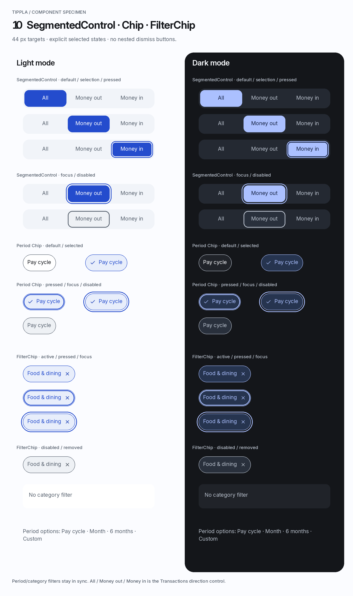

### SegmentedControl

| Element / state | Anatomy, dimensions and spacing | Typography | Colours by state | Interaction |
| --- | --- | --- | --- | --- |
| Track | 350 wide reference; height 52; padding `space[1]`; gap `space[1]`; radius `radius.md`. Equal-width segments, each ≥44 high/wide. | — | `C.surface2`. | Use for one mutually exclusive value, not independent toggles. At insufficient width, stack or replace with a labelled selector; never squeeze below 44. |
| Labels | Centred within each segment; horizontal padding `space[2]` minimum. Example “All”, “Money out”, “Money in”. | `type.small`. | Unselected `C.textMuted`. | This example is the Transactions direction filter. It does not mix income into a Spending donut. |
| Selected | Segment radius `radius.sm`; fixed geometry when changing labels. | `type.small`. | Background `C.accent`; label `C.onAccent`. | Exactly one selected value. Selection updates the existing transaction view rather than navigating to a different screen. |
| Pressed / hover | Keep geometry. | Unchanged. | Selected adds 2 px inset `C.onAccent` outline; unselected uses `C.neutralSoft` behind `C.textMuted`. | Apply `motion.fast`; no spring movement. |
| Focused | Standard 2 px outline, 3 px offset around the focused segment. Allow overflow beyond track. | Unchanged. | `C.focus`; selected fill stays visible. | Focus is not a second selected value. |
| Disabled | Preserve current selected segment with a 2 px `C.neutral` outline; selected background `C.neutralSoft`. | `type.small`. | All labels `C.textMuted`, full opacity. | Disable only for a real unavailable function, with context. A low score or a shortfall never disables navigation/filtering. |

For this filter use a labelled radio group, preferably native radio inputs styled as segments. Tab enters/leaves the group; arrow keys move/check the next or previous enabled option; Space selects. Expose `checked`/`aria-checked`. If reused to switch actual tab panels, implement the tab pattern instead; do not mix radio and tab roles. See the [WAI-ARIA radio group pattern](https://www.w3.org/WAI/ARIA/apg/patterns/radio/).

### Chip — period selection

| Element / state | Anatomy, dimensions and spacing | Typography | Colours by state | Interaction |
| --- | --- | --- | --- | --- |
| Base | Height 44; minimum width 44; horizontal padding `space[3]`; icon/text gap `space[2]`; radius `radius.pill`. Group gap `space[2]`, wrapping as needed. | `type.small`. | Default background `C.surface`; 1 px border `C.neutral`; label `C.text`. | Examples: “Pay cycle”, “Month”, “6 months”, “Custom”. Period choices are mutually exclusive. |
| Selected | Same height; reserve 16 px `Check` plus `space[2]` when selected. Do not shrink label text. | `type.small`. | `C.accentSoft` background; `C.accent` border, text and check. | Check is the non-colour state cue. Date boundaries are visible elsewhere in the associated view. |
| Pressed / hover | No scaling. | Unchanged. | Selected retains accent-soft treatment with 2 px inset `C.accent`; unselected gets `C.surface2`. | Trigger on release; do not change period on pointer-down during a scroll gesture. |
| Focused | Shared focus geometry. | Unchanged. | `C.focus`. | Keyboard focus remains visible if the group wraps. |
| Disabled | Preserve selected check if applicable. | `type.small`. | `C.neutralSoft`, `C.neutral` border, `C.textMuted` label/icon. | Native disabled or fully enforced `aria-disabled`; include an explanation when necessary. Do not use disabled as a selected-looking style. |
| Custom range | Same chip; opens a date-range sheet with explicit Apply/Cancel. | `type.small`. | Selection state changes only after Apply. | Cancellation preserves the prior range. Validate start ≤ end and available history; show form errors next to fields, never as a financial-state warning. |

Period changes update the donut, category aggregates and transaction list from the same resolved date range and snapshot. Abort or ignore stale responses so an earlier period cannot overwrite a newer selection. Keep a loading state for the chosen range; do not flash the old totals as if current. “6 months” must respect the available snapshot end, including a partial current month.

### FilterChip — removable active constraint

| Element / state | Anatomy, dimensions and spacing | Typography | Colours by state | Interaction |
| --- | --- | --- | --- | --- |
| Active | Height 44; horizontal padding `space[3]`; trailing X 16 px; gap `space[2]`; radius `radius.pill`. Width fits the full name, or wraps at large text sizes. | Label `type.small`. | `C.accentSoft` background; 1 px `C.accent` border; text/X `C.accent`. | One native button for the entire chip. Accessible name “Remove Food & dining filter”. The X is decorative inside this 44 px target, not a nested 16 px button. |
| Pressed / hover | Same geometry. | Unchanged. | Retain fill, add 2 px inset `C.accent` outline. | Remove on release. Clicking the label has the same remove action as clicking X. |
| Focused | Shared focus outline/offset. | Unchanged. | `C.focus`. | Keyboard Enter/Space removes. |
| Disabled | Only while removal is genuinely unavailable; don't disable just because filtering data is loading. | `type.small`. | `C.neutralSoft`, border `C.neutral`, text/X `C.textMuted`. | Suppress activation and describe the reason. Keep the label readable. |
| Removed | Chip is absent; optional quiet status “No category filter” when the last category filter is removed. | Status `type.small`. | `C.textMuted` on the current surface. | Announce removal once. Focus next chip, previous chip, or the filter trigger if none remain. Restore all categories within the existing period/direction/search, not the application's default filters. |

Filter chips represent active constraints. Period chips represent one selected time range. Lifestyle tags are non-interactive metadata. These three roles must not share ambiguous click behaviour.

## 11. CalendarCell

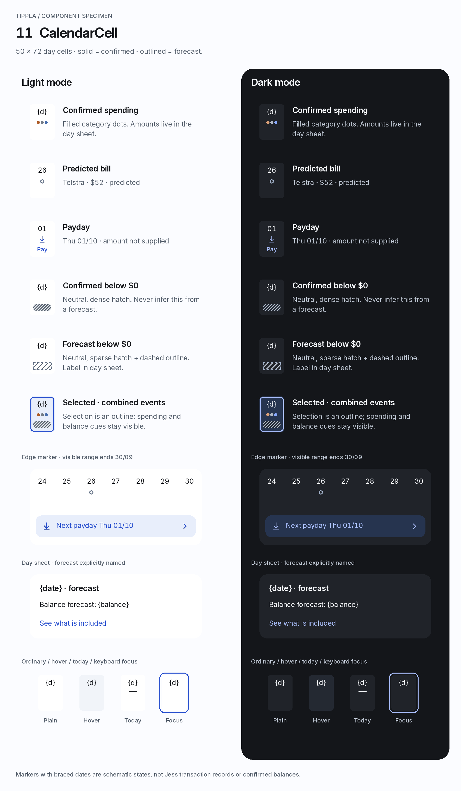

A date is one control. Event markers and end-of-day balance are independent layers. A predicted debit must not become a confirmed spending dot merely because its date has arrived.

| Element / state | Anatomy, size and spacing | Typography | Colour — resolve in both themes | Interaction and data rules |
| --- | --- | --- | --- | --- |
| Calendar grid / cell | Seven equal columns in 350 px: 50 px each. Minimum cell height 72, `radius.xs`; date area at top, event lane in middle, balance strip at bottom. No horizontal cell gap. Container may have `radius.md`; do not consume the 350 px grid width with extra horizontal padding. | Date `type.small`, numeric font. Weekday headings `type.caption`. | Base `C.surface`; date `C.text`; weekday label `C.textMuted`. | Whole cell is one ≥44 px target opening the day sheet. The outer calendar owns period controls and its visible range heading. No separate 6 px dot buttons. |
| Confirmed spend | Up to three filled 6 px dots with 2 px gaps, centred in the event lane. More than three events: two dots plus a `+{remaining}` count; grow the row/cell if needed. | Overflow `type.caption`. | Each dot uses `K[category]`; count `C.textMuted`. No success/danger overlay. | Only posted debits from connected data. Category identity is supplementary; accessible name and day sheet name events and amounts. Gambling uses its ordinary slate dot. |
| Predicted bill | Hollow 8 px circle, 2 px outline; no fill except `C.surface`. Uses the same event lane as confirmed dots. Reserve a separate second lane if more markers would obscure meaning. | Day sheet suffix “predicted”: `type.caption`. | Outline `CH.predicted`; label `C.textMuted`. | Telstra `$52`, Sat `26/09` remains predicted. Present date and amount uncertainty in the day sheet. Confirmed scheduled dues may use a solid neutral calendar icon in detail; they are not posted spend. |
| Payday | Lucide `ArrowDownToLine` 16 px plus visible “Pay” beneath it. Put in its own lane when bills also occur that day; grow the cell. | “Pay” `type.caption`; day sheet label `type.h3`. | Icon/short label `C.accent`; no green or celebratory treatment. | Expected payday is an expected event, not evidence income has arrived. Day sheet explicitly says “Expected payday” until a posted income record confirms it. Wages and Centrelink use this same treatment. |
| Confirmed balance below $0 | Bottom 36 × 14 strip, 7 px horizontal inset; corner radius 4 px. 45° hatch: 2 px lines, 6 px pitch. Hatch remains away from date text. | Sheet: “Confirmed closing balance” `type.small`; signed amount `type.bodyStrong`. | Hatch `CH.hatch` over `C.neutralSoft`. No coloured warning border. | Show only when a reliable observed closing balance is below zero. Unknown closing balance is not zero and not a negative balance. Historical date alone does not establish confirmation. |
| Predicted balance below $0 | Same 36 × 14 strip. 2 px hatch, 10 px pitch, `C.surface` background; 2 px dashed outline, 4 px dash / 4 px gap. More open pattern makes it visually lighter without lowering stroke opacity. | Sheet: “Balance forecast” `type.small`; signed amount `type.bodyStrong`; “forecast” `type.caption`. | Hatch `CH.hatch`; outline `CH.predicted`; text `C.text` / `C.textMuted`. | Use only for an actual below-zero forecast from the projection service. Label assumptions and data timestamp in the sheet. Jess's `$53` shortfall does not establish an observed negative balance. No fabricated negative amount in the specimen. |
| Combined states | Preserve date, event and balance lanes. Row height follows the tallest cell in that week. If payday adds a lane, add `space[5]` to that row. | Same tokens. | No state replaces another's markers. | A day can contain posted spending, predicted bills and a forecast closing balance. Each is separately named in the sheet. Never convert an entire cell to “confirmed” because one event is confirmed. |
| Selected / today / keyboard focus | Selected: 2 px inset outline; today: underline under date, with accessible current-date semantics. Focus: shared 2 px external ring at 3 px offset, painted above neighbours, never clipped. | Date remains `type.small`. | Selected `C.accentSoft` fill / `C.accent` outline; today underline `C.text`; focus `C.focus`. Markers retain original colours. | Selected date and today can differ. Selection is not a payment state. Hover adds `C.surface2` only to an unselected cell. Focus and selection persist independently. |
| Next-payday edge marker | Separate full-width 44 px row below the grid, gap `space[3]`, `radius.sm`; horizontal padding `space[3]`, icon gap `space[2]`. Icon 20 and trailing chevron 20. | `type.small`. | `C.accentSoft`, label/icons `C.accent`. | Fixture: “Next payday Thu 01/10” when visible range ends `30/09`. Opens the period containing payday and selects that date. It does not insert `01/10` into the current period or count it in current-period totals. Only show when a known next payday is later than the visible end; never guess a missing date. |
| Day sheet / missing data | Use component 09; title, date, observed events, predicted events, balance source, link “See what is included”. Separate confirmed and forecast balances if both exist. | Title `type.h3`; rows `type.small`; amount `type.bodyStrong`; status `type.caption`. | `C.surface`, `C.text`, `C.textMuted`; links `C.accent`. | No invented balance or year. On fetch failure use inline info + Retry, not an empty ledger. Missing balance: “Balance not available”; keep known events. |

The calendar uses a labelled grid with roving focus. Left/right move one day; up/down move one week; Home/End move to week edges; Page Up/Down move the visible period while retaining the closest valid date. Enter/Space opens the selected day's sheet. Close restores focus to the date. Edge-marker activation is a separate button, announces the new range, and focuses the newly visible payday. Provide a date-sorted list alternative at 200% text scaling or narrow widths where seven ≥44 px columns cannot fit. Its rows carry the same event/status text; no horizontal scrolling needed to reveal amounts. Full accessible dates include the year only when available in the data.

## 12. LoanCard

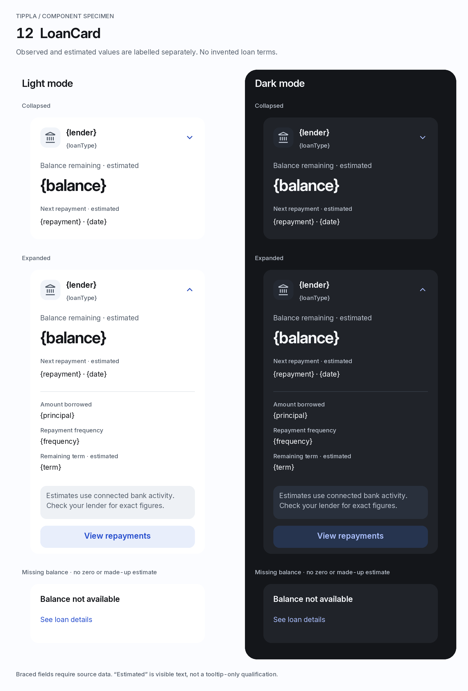

| Element / state | Anatomy, size and spacing | Typography | Colour — resolve in both themes | Interaction and data rules |
| --- | --- | --- | --- | --- |
| Container | Width 350; `radius.md`; padding `space[5]`. Reference collapsed height 244, expanded 570; content grows. Stack gap `space[3]`. | — | `C.surface`; optional decorative border `C.line`. | Cards are not whole-card links containing nested buttons. A single labelled header button owns expansion. |
| Header | Lucide `Landmark` 24 in 40 × 40 `radius.sm` tile; gap `space[3]`; trailing chevron 20 in a 44 px hit region. Entire header row min 64 high. | Lender `type.h3`; loan type `type.caption`. | Tile `C.surface2`, icon `C.neutral`; lender `C.text`, type `C.textMuted`; chevron `C.accent`. | `aria-expanded` + `aria-controls`. Enter/Space toggles; chevron rotates with `motion.base`. No animation under reduced motion. Mask account identifiers; do not expose a full account number as the card title. |
| Balance | Gap `space[6]` after header; label-to-value gap `space[2]`. | “Balance remaining · estimated” `type.small`; value `type.figureL` + numeric font. | Label `C.textMuted`; value `C.text`. | “Estimated” is attached to this value when estimated. Do not silently use original principal, credit limit, or sum of observed repayments as current balance. True supplied zero displays `$0`; missing data does not. |
| Next repayment | Gap `space[5]`; separate source qualification. | “Next repayment · estimated” `type.caption`; `{repayment} · {date}` `type.small`, numeric font. | Label `C.textMuted`; amount/date `C.text`. | Label estimated amount and/or date precisely when only one is uncertain. Use “Amount estimated” / “Date estimated” as appropriate. A scheduled due is not posted repayment. |
| Expanded facts | Decorative divider `C.line`; gap `space[5]`; stacked fields at least 52 high. Amount borrowed, repayment frequency, remaining term. | Field labels `type.caption`; values `type.small`. | Labels `C.textMuted`; values `C.text`. | Each field carries independent provenance. Exact facts omit “estimated”; inferred terms include it beside the field. No global estimated badge that leaves individual fields ambiguous. |
| Estimate explanation | `C.neutralSoft` block; `radius.sm`; padding `space[3]`; gap `space[4]`. | `type.small`. | `C.textMuted` on `C.neutralSoft`. | “Estimates use connected bank activity. Check your lender for exact figures.” Include `{source}` and last-updated date when available. This is explanation, not a warning or confidence score. |
| Expanded action | Compact secondary button, height 44; top gap `space[3]`; full inner width 310. | `type.bodyStrong`. | `C.accent` on `C.accentSoft`. | “View repayments” opens a transaction list filtered to this loan, with the active filter visible and removable. It does not start an application or authorise a payment. |
| Missing / stale / loading | Missing balance text replaces the figure. Stale known values remain explicitly dated; refreshing does not blank known data. Initial load uses component 16 skeleton. | Missing “Balance not available” `type.h3`; “See loan details” `type.small`. | `C.text`; link `C.accent`. | Missing card retains header and any independently known facts; the frame shows the affected balance region. Show an inline info retry when the failure prevents loading. Do not change stale/inferred data to red. |

No individual loan terms were supplied. The frames intentionally use bindings. Jess's “3 loans open” is a separate count, not permission to manufacture three records. The known Beforepay advance is `$300` plus a `$15` fee with `$315` due `30/09`; do not infer a remaining term, comparison rate or ongoing balance from those facts.

## 13. OfferCard

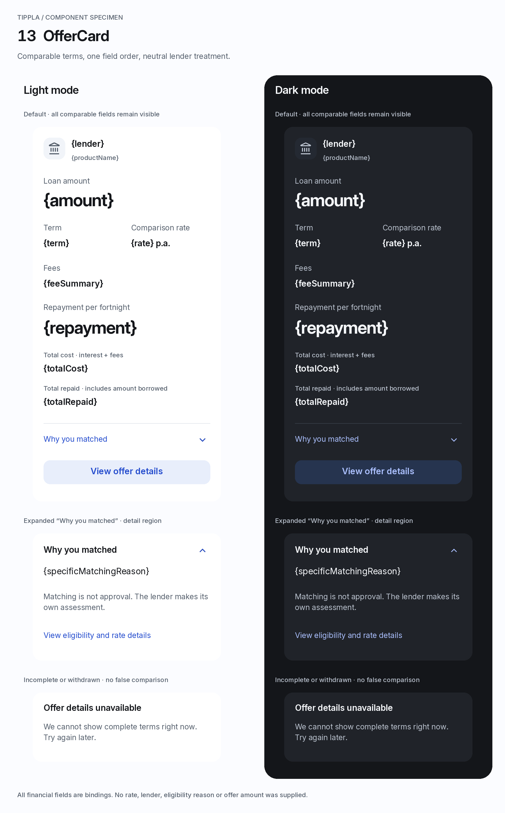

| Element / state | Anatomy, size and spacing | Typography | Colour — resolve in both themes | Interaction and data rules |
| --- | --- | --- | --- | --- |
| Card / hierarchy | Width 350; `radius.md`; padding `space[5]`; gap between cards `space[4]`. Default reference height 696; grow for fees and disclosures. Fixed field order across lenders. | — | `C.surface`; ordinary `C.line` separators. | No countdown, scarcity, flashing, “approved” stamp, preselected lender, best-match badge, or automatically selected offer. Do not use accent-gradient hero styling to rank one lender. |
| Lender / product | 40 px icon tile, Lucide `Landmark` 24; gap `space[3]`. Use lender text even when a verified logo is supplied. | Lender `type.h3`; product `type.caption`. | Tile `C.surface2`; icon `C.neutral`; text `C.text` / `C.textMuted`. | Lender identity must be actual partner data. Logos receive the same size and neutral container. |
| Amount | Gap `space[6]` after header; label/value gap `space[2]`. | Label `type.small`; `{amount}` `type.figureL`, numeric font. | Label `C.textMuted`; value `C.text`. | Requested/available amount is distinct from total repaid. Never replace the missing offer amount with Jess's desired loan or historic advance. |
| Term + comparison rate | Two equal columns with `space[4]` gap; stack at large text. | Labels `type.small`; values `type.h3`; visible “p.a.” with rate. | Labels `C.textMuted`; values `C.text`. | Use lender-supplied term units, rate, calculation basis and associated disclosure. A comparison rate is not the nominal interest rate. Link its basis in the details sheet; never compute it from incomplete inputs. |
| Fees | Full-width row; gap `space[4]`. Allow multiline amounts, frequency and fee names. | Label `type.small`; summary `type.bodyStrong`; itemisation `type.small` in details. | Label `C.textMuted`; values `C.text`. | Show upfront and recurring mandatory fees. Distinguish conditional fees in details. Only say “No fees” when explicitly established. Missing fee information is not `$0`. |
| Repayment per fortnight | Full width; label/value gap `space[2]`. | Label `type.small`; repayment `type.figureL`. | Label `C.textMuted`; value `C.text`. | Use a real lender fortnightly schedule. Do not multiply monthly repayments by a rough conversion and label it an actual fortnightly repayment. If fortnightly terms are unavailable, show “Fortnightly schedule unavailable” and the actual frequency in details. |
| Total cost + total repaid | Two separate stacked rows, gap `space[4]`. Labels remain attached to figures. | “Total cost · interest + fees” / “Total repaid · includes amount borrowed” `type.caption`; values `type.bodyStrong`. | Labels `C.textMuted`; values `C.text`. | `totalCost` excludes principal; `totalRepaid` includes principal. Display source-provided totals for the displayed schedule, including a different final repayment if applicable. Reconcile `totalRepaid = amount + totalCost` only when definitions and cashflows align; otherwise do not present a seemingly complete comparison. |
| Why you matched — collapsed | Divider then a ≥44 px disclosure row; trailing chevron 20. | `type.small`. | Label/chevron `C.accent`; divider `C.line`. | Native button with expanded/controls semantics. Only this region toggles; card remains static. |
| Why you matched — expanded | Insert region before footer, gap `space[4]`; height auto. Frame shows the inserted region rather than repeating every unchanged field. | Heading `type.h3`; reason `type.body`; qualification/link `type.small`. | Heading/reason `C.text`; qualification `C.textMuted`; link `C.accent`. | Render the actual explainable matching reason. Follow with “Matching is not approval. The lender makes its own assessment.” No guaranteed approval, guaranteed saving, or inferred sensitive reason. Missing reason: “Matching details are not available” with eligibility details still accessible. |
| View offer details | Secondary button, compact 44, full inner width. | `type.bodyStrong`. | `C.accent` on `C.accentSoft`. | Opens a Tippla detail sheet containing the full terms, rate basis, fees, source timestamp, eligibility explanation and any partner-relationship disclosure. A separate “Continue to {lender}” action names the destination before leaving Tippla. Opening details never submits an application. |
| Missing / withdrawn / stale | Replace comparison with neutral unavailable treatment when material terms cannot be trusted. Frame: “Offer details unavailable” and explanatory copy. | Heading `type.h3`; copy `type.small`. | `C.text` / `C.textMuted` on `C.surface`. | Do not leave an enabled application handoff for withdrawn terms. Refresh or revalidate before handoff. No fake zero fees/rate and no urgency substitute. No offers in a successful response uses EmptyState 16. |

No live offers, lender names, rates or financial terms were supplied. Braces are binding annotations only. Consistent presentation makes comparisons possible; it does not assert that products with different amounts, terms or fee structures are equivalent.

## 14. RecommendationCard

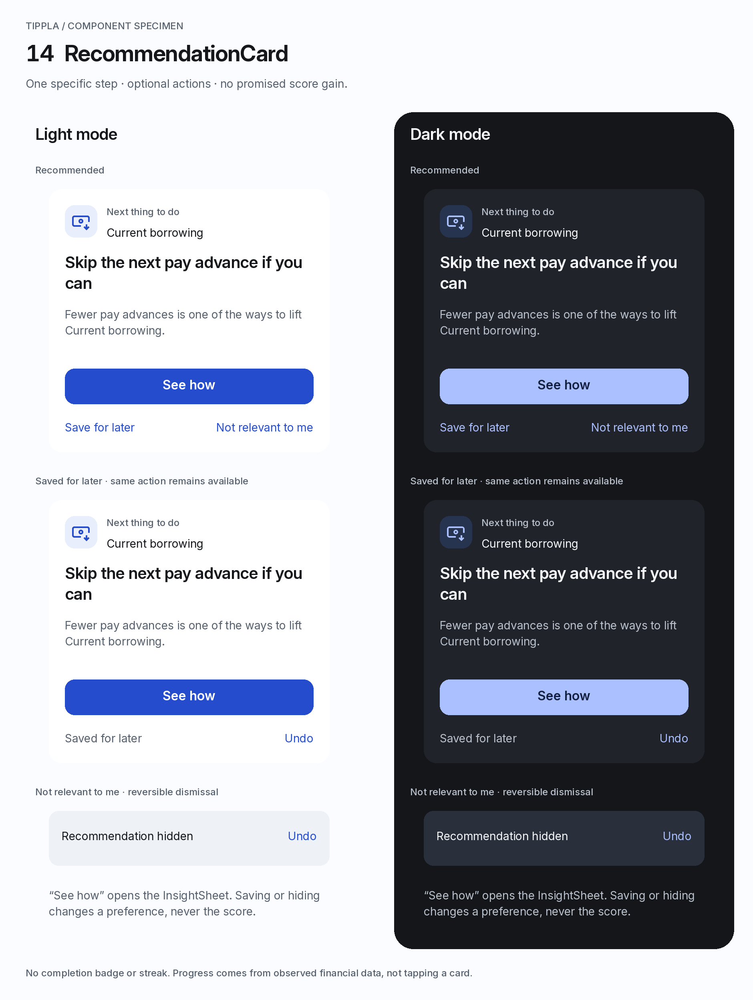

| Element / state | Anatomy, size and spacing | Typography | Colour — resolve in both themes | Interaction and data rules |
| --- | --- | --- | --- | --- |
| Card | Width 350; reference height 328; `radius.md`; padding `space[5]`. | — | `C.surface`. | One specific step attached to a factor. Not a generic carousel of advice or a lender promotion. |
| Context | 40 px `radius.sm` icon tile; Lucide `BanknoteArrowDown` 24 for supplied pay-advance recommendation; text gap `space[3]`. | “Next thing to do” `type.caption`; “Current borrowing” `type.small`. | Tile `C.accentSoft`, icon `C.accent`; label `C.textMuted`; factor `C.text`. | Icon describes subject, not risk. Other recommendations use the relevant mapped Lucide icon. |
| Title / rationale | Gap `space[6]` below context; title/rationale gap `space[3]`; no truncation. | Title `type.h2`; rationale `type.small`. | Title `C.text`; rationale `C.textMuted`. | Exact title “Skip the next pay advance if you can”. Exact rationale “Fewer pay advances is one of the ways to lift Current borrowing.” Do not add an invented point increase or imply this is mandatory. |
| Primary action | Compact primary 44; full inner width; top gap `space[5]`. | `type.bodyStrong`. | `C.onAccent` on `C.accent`. | “See how” opens the corresponding InsightSheet, preserving all three explanation blocks and optional support actions. No automatic borrowing change. |
| Secondary actions | Two non-overlapping 44 px targets; gap `space[2]`, wrap into full-width rows at large text. | `type.small`. | `C.accent`; no destructive colour. | “Save for later” saves this recommendation ID; “Not relevant to me” hides the matching recommendation/insight and its attachment chips after confirmation from preference storage. No modal permission request required for these reversible preferences. |
| Saved | Preserve card and primary action; replace Save action with “Saved for later” and Undo. | Status `type.small`; Undo `type.small`. | Status `C.textMuted`; Undo `C.accent`. | Keep visible in the current view; include it in Home → Saved steps. Undo removes the saved preference. No badge, trophy or score change. |
| Dismissed | 68 px reference inline acknowledgement at former card position; padding `space[4]`; `radius.sm`. | “Recommendation hidden” `type.small`; Undo `type.small`. | `C.neutralSoft`, text `C.text`, action `C.accent`. | Persist acknowledgement until dismissed, undone or the view is left. Restore focus to Undo when the removed trigger no longer exists. Also expose hidden recommendations in preference management. |
| Empty / loading / failure | Use no-recommendations EmptyState after successful empty response. Initial load Skeleton; fetch failure inline info + Retry. | As component 16. | As component 16. | Do not interpret unavailable data as no steps needed. Ignore stale async responses after a newer filter or preference change. |

An InsightCard explains evidence; a RecommendationCard offers the next action. They can open the same InsightSheet, but should not duplicate the same recommendation twice in one viewport. Tapping “See how” is not completion, and saving/hiding never changes SmartScore.

## 15. Buttons and form controls

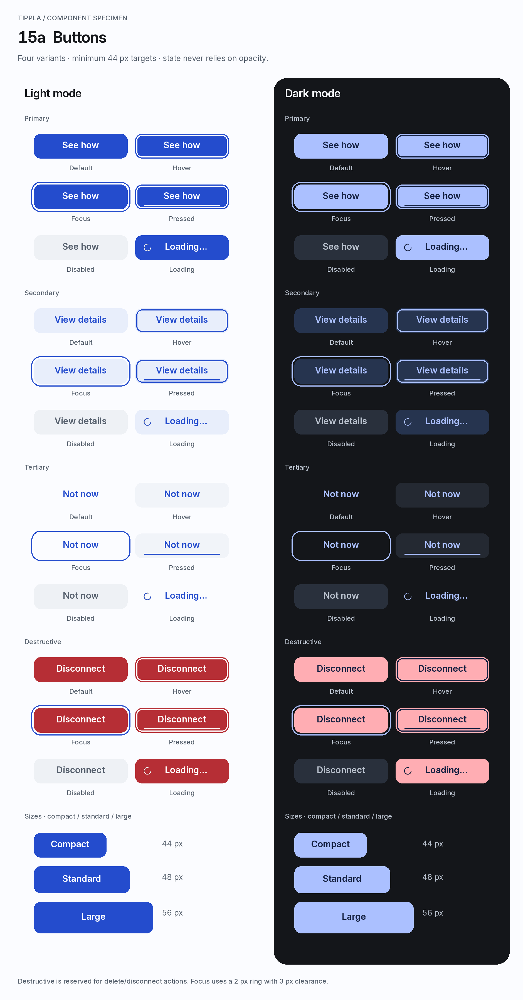

### Buttons

| Element / state | Anatomy, size and spacing | Typography | Colour — resolve in both themes | Interaction |
| --- | --- | --- | --- | --- |
| Sizes | Compact: 44 high, horizontal `space[3]`; standard: 48 high, horizontal `space[4]`; large: 56 high, horizontal `space[5]`. All min width 44; icon gap `space[2]`; `radius.sm`. Footer buttons normally full width. | All `type.bodyStrong`. | Variant tokens below. | Prior card buttons explicitly specified at 44 use compact. Size never changes semantic importance. At 200% text, wrap and grow; do not shrink labels to fit. |
| Primary | Optional leading icon 20; one dominant action per context. | `type.bodyStrong`. | `C.accent` background; text/icon `C.onAccent`. | Executes the named action on release. Use a native button for actions and anchor for navigation. |
| Secondary | Same geometry. | `type.bodyStrong`. | `C.accentSoft` background; text/icon `C.accent`. | Supporting action. Not a disabled primary. |
| Tertiary | Transparent base; same 44 px minimum target and horizontal spacing. | `type.bodyStrong`. | Label/icon `C.accent`. | Low-emphasis action. Never make a short text label's ink bounds the target. |
| Destructive | Same geometry; explicit verb such as “Disconnect”. | `type.bodyStrong`. | Background `C.destructive`; label/icon `C.textInverse`. | Only delete/disconnect or equivalent destructive actions. Confirm consequential disconnection in a sheet describing effects. Never use for a low score, overdue amount, no offers or a shortfall. |
| Hover | Filled variants retain fill and gain a 2 px inset outline in their foreground colour. Tertiary gains `C.surface2`. | Unchanged. | Foregrounds unchanged; no opacity fade. | Pointer-only enhancement; no action on hover. |
| Pressed | Hover treatment plus a 2 px inset bottom rule in foreground; no scaling or position shift. | Unchanged. | Same foreground/background. | Cancel activation when released outside. Tertiary keeps `C.surface2` and its foreground rule. |
| Keyboard focus | 2 px ring, offset 3, outside shape. | Unchanged. | `C.focus` against surrounding surface; fixed brand-gradient hosts use `color.light.onAccent`. | Focus-visible, not forced on every touch. Do not clip or obscure it. Focus can coexist with hover/loading. |
| Disabled | Preserve dimensions; remove hover/press feedback. | `type.bodyStrong`. | `C.neutralSoft` background; `C.textMuted` foreground. No global opacity. | Native disabled, or enforced `aria-disabled` if explanatory focus is needed. Disable only when action is truly unavailable; explain the reason nearby. |
| Loading | Maintain pre-load width/min-width; reserve 16 px Lucide `LoaderCircle`, gap `space[2]`. Show “Loading…” or a specific action-progress label. | `type.bodyStrong`. | Retain enabled variant colours. | Prevent duplicate requests and set busy state. Keep focus. Reduced motion leaves the icon static; text still communicates work. On error restore original action and show local retry context. |

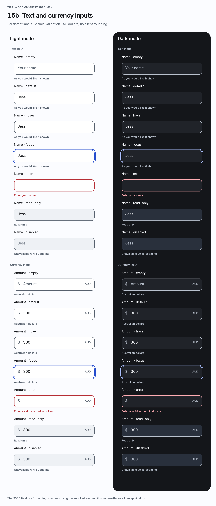

### TextInput and CurrencyInput

| Element / state | Anatomy, size and spacing | Typography | Colour — resolve in both themes | Interaction |
| --- | --- | --- | --- | --- |
| Field anatomy | Persistent label; gap `space[2]`; 52 px input, width fluid/350 reference, horizontal padding `space[4]`, `radius.sm`; helper below with `space[2]`. Label/field IDs explicitly associated. | Label `type.small`; value `type.body`; helper/error `type.caption`. | Label/value `C.text`; helper/placeholder `C.textMuted`; background `C.surface`; 1 px essential border `C.neutral`. | Placeholder is optional and never the only label. Frame suffixes such as “· focus” identify specimens and are not app copy. |
| Hover / focused | Hover border 2 px inset, no size change. Focus retains visible essential border plus shared focus ring. | Unchanged. | Hover `C.neutral`; focus border/ring `C.accent` / `C.focus`. | Full typing, selection, copy/paste and keyboard support. Do not select all text repeatedly or move the caret on each format update. |
| Text input | “Name” specimen with supplied `Jess`; empty placeholder “Your name”. | `type.body`. | `C.text`; placeholder `C.textMuted`. | Use appropriate autocomplete and input type for the actual field. Do not enforce a letters-only name regex. |
| Currency input | Fixed `$` prefix, editable numeric string, `AUD` suffix. Prefix gap `space[2]`; reserve suffix space; no overlap at large text. | Numeric value `type.body` + numeric font; prefix `type.body`; suffix `type.caption`. | Value `C.text`; prefix/suffix `C.textMuted`. | Decimal keyboard (`inputmode=decimal`), text-based input with explicit parsing. Accept pasted `$` and grouping commas; reject ambiguous/invalid formats. Store integer cents, not binary floating point. Preserve a partially typed value while editing; normalise on blur. |
| Currency precision / range | Up to two decimal places for AUD; min/max provided by the specific form, not this design system. | Same. | Same. | Do not silently round extra precision, clamp values, submit on blur, assume negatives are allowed, or treat empty as zero. If negatives are supported, their text remains neutral. `$300` is only a supplied-number formatting specimen. |
| Error | 2 px border and visible adjacent error text, with layout space reserved when practical. | Error `type.caption`. | Border/error `C.destructive`; value stays `C.text`; background stays `C.surface`. | Red is allowed for form validation. `aria-invalid` and described error. Validate after blur or attempted submit, then update as corrected; do not scold during initial typing. Submitted error summary links to fields. |
| Read-only | Same size; `C.neutralSoft` background; show “Read only” helper where not obvious. | Value `type.body`; helper `type.caption`. | Value `C.text`; border `C.neutral`; helper `C.textMuted`. | Use native readonly, preserve selection/copy. Not disabled; keyboard focus remains available. |
| Disabled | Same layout, helper explains why. | Value `type.body`; helper `type.caption`. | `C.neutralSoft`; border `C.neutral`; all text `C.textMuted`. | Native disabled; exclude from interactive navigation. Do not unexpectedly drop a needed submitted value solely because it is displayed disabled. |

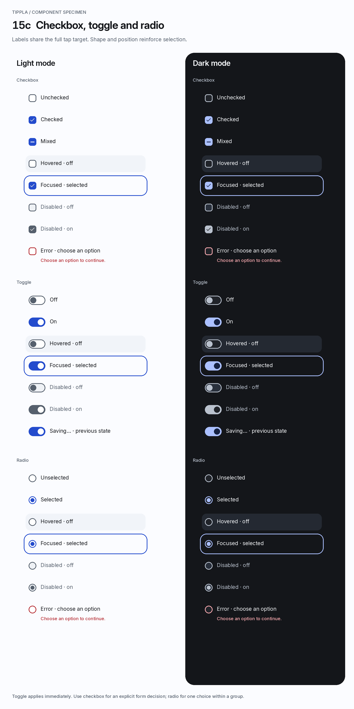

### Checkbox, Toggle and Radio

| Control / state | Anatomy, size and spacing | Typography | Colour — resolve in both themes | Interaction |
| --- | --- | --- | --- | --- |
| Shared label row | Entire label + indicator target min 44 high. Indicator/label gap `space[3]`. Wrap long label; use `space[2]` between independent rows. Focus surrounds full row with shared geometry. | Label `type.small` for compact forms or `type.body` for standalone settings; helper/error `type.caption`. | Text `C.text`; helper `C.textMuted`; focus `C.focus`. | Stable, explicit accessible label. Specimen words “Off”, “Focused”, etc. demonstrate state, not recommended labels. Hover adds `C.surface2` to the row; it never changes value. |
| Checkbox unchecked / checked | 20 × 20 box, `radius.xs`, 2 px outline. Check icon 16. | Shared label. | Off `C.surface`, outline `C.neutral`; on fill/border `C.accent`, check `C.onAccent`. | Native checkbox. Space toggles. Use for independent selections and explicit consent; never precheck borrowing/application consent. |
| Checkbox mixed | Same box; 10 × 2 horizontal mark. | Shared label. | Fill `C.accent`; mark `C.onAccent`. | Only for a parent controlling a partially selected set. Native indeterminate / equivalent mixed semantics; activating mixed selects all children, next activation clears them. Never use mixed for loading. |
| Toggle off / on | Track 44 × 24; `radius.pill`; thumb 16. Thumb centres 12 and 32 from left edge. Full target remains 44 high. | Shared label; adjacent state text may be added. | Off track `C.surface`, 2 px `C.neutral` border, thumb `C.neutral`; on track `C.accent`, thumb `C.onAccent`. | Switch semantics; Space changes state, Enter may also activate. Label remains stable as state changes. For immediately applied binary settings only, not a delayed form decision. |
| Toggle saving / failure | Keep prior committed thumb state while request is pending; text “Saving…” below row, temporarily prevent repeat activation. No third switch position. | Helper `type.caption`. | Helper `C.textMuted`; keep the appropriate on/off visual. | Busy is an orthogonal state. On success update state; on failure retain prior state and show inline info “Could not save this setting. Try again.” A connection failure is not a form error. |
| Radio unselected / selected | 20 px outer circle, 2 px outline; selected inner dot 10. | Shared label, fieldset legend `type.bodyStrong`. | Background `C.surface`; off outline `C.neutral`; selected outline/dot `C.accent`. | One choice per named group. Tab enters/exits group, arrows move and select, Space selects. Selection is not a graded “right answer”. No mixed state. |
| Disabled off / on | Retain check/dot/thumb position. Same geometry. | Label/helper `type.small` / `type.caption`. | Background `C.neutralSoft`; active fill/dot `C.neutral`; off border `C.neutral`; label `C.textMuted`; check/on-thumb `C.surface`. | Enforce disabled and explain when necessary. Do not erase selected values or make disabled controls resemble an empty group. |
| Validation error | Applies to required checkbox/radio choice or a group, not to a customer's income category. 2 px boundary plus error below. | Error `type.caption`. | Boundary/error `C.destructive`; normal label `C.text`. | Associate error with group/control and move focus on invalid submission. Selected state remains visible. Toggle save failures use info treatment instead. |

## 16. Toast, inline alert, EmptyState and Skeleton

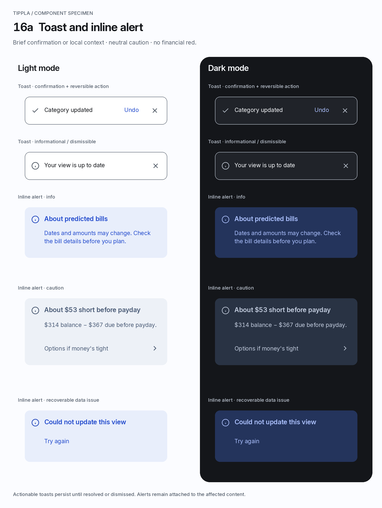

### Toast and InlineAlert

| Element / state | Anatomy, size and spacing | Typography | Colour — resolve in both themes | Interaction |
| --- | --- | --- | --- | --- |
| Toast container | Width 350/max available width minus gutters; min 68 high; `radius.sm`; padding `space[4]`; 20 px Lucide icon; icon/text gap `space[3]`; 1 px `C.neutral` border. Use `elevation[theme][2]` when floating. | Message `type.small`; action `type.small`. | `C.surface`; message `C.text`; icon `C.neutral`; action `C.accent`; close `C.textMuted`. | Place above the complete navigation stack, or inside the active modal. Never cover Hardship support, a focused field, or a sheet footer. One visible toast at a time; queue/deduplicate repeated events. |
| Confirmation / Undo | “Category updated”, Check icon; separate Undo and Close targets ≥44 each. If cramped, move actions below text. | As above. | Neutral confirmation; no mandatory green. | Polite live status, announced once; do not steal focus. Undo reverts the specific change and affected aggregates. Actionable toast persists until action/dismissal/view exit; maintain a persistent recovery route for preference/category changes. |
| Informational | Info icon, message and labelled X. | As above. | Same neutral palette. | Nonessential toast can dismiss after 6 seconds; pause on hover/focus, and never time out while an action needs the user's decision. Close restores focus only when focus was inside the disappearing toast. |
| Inline info | `radius.sm`; padding `space[4]`; 20 px Info with `space[3]` gap. Content column wraps; action min 44 when present. | Title `type.h3`; body/action `type.small`. | `C.infoSoft` background; icon/title/body/action `C.info`. | Attach to affected content. Predicted-bill explanation, data freshness or a recoverable fetch issue. “Try again” retries only the affected request. Routine info is not an interrupting alert. |
| Inline caution | Same geometry; use ordinary Info, not a warning triangle. | Title `type.h3`; body/action `type.small`. | `C.cautionSoft` background; all foreground `C.caution`. | Fixture “About $53 short before payday”, followed by `$314 balance − $367 due before payday.` Action “Options if money's tight” opens Hardship support. No red, urgency animation or forced loan offer. |
| Runtime announcement | Keep alerts in normal reading order. | Same. | Same. | Static inline messages are normal content. Newly changed async context uses polite status where useful. Reserve assertive error announcements for a blocked form submission, not a financial shortfall. |

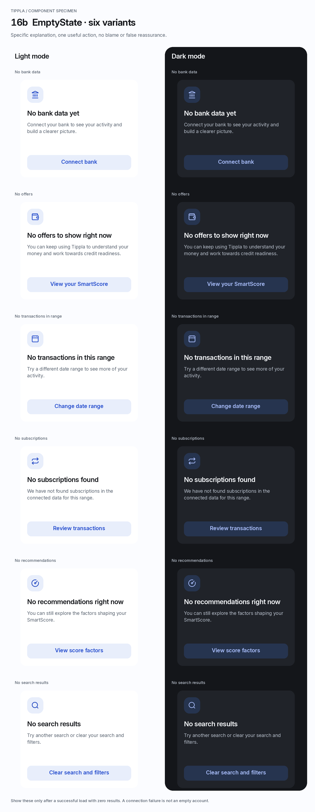

### EmptyState

Shared anatomy: full width 350, `radius.md`, `C.surface`, padding `space[5]`; 48 px icon tile with `radius.md`, `C.accentSoft`, 24 px Lucide icon in `C.accent`; title gap `space[6]`, copy gap `space[3]`, action gap `space[5]`. Title `type.h2`/`C.text`; body `type.small`/`C.textMuted`; secondary compact button uses `type.bodyStrong`, `C.accentSoft`/`C.accent`. Specimen height 290 is a reference, never a fixed clipping height. One action per state. This is the compact icon variant. A dedicated empty view uses the 160 × 120 SVG in `illustration-and-motion.md` instead of the icon tile, never both. Its height grows with content. No celebratory empty spending chart or fake zero total.

| Variant | Icon | Exact title | Exact body | Action / destination |
| --- | --- | --- | --- | --- |
| No bank data | `Landmark` | No bank data yet | Connect your bank to see your activity and build a clearer picture. | **Connect bank** → bank-connection explanation and consent flow, then TaleFin. If already connected and syncing, use loading instead; if connected successfully but no data, explain the actual connection state and offer connection details. |
| No offers | `Wallet` | No offers to show right now | You can keep using Tippla to understand your money and work towards credit readiness. | **View your SmartScore** → Score. Does not promise an offer or imply rejection. |
| No transactions in range | `CalendarDays` | No transactions in this range | Try a different date range to see more of your activity. | **Change date range** → period selector with current range retained until Apply. |
| No subscriptions | `Repeat` | No subscriptions found | We have not found subscriptions in the connected data for this range. | **Review transactions** → Spending transactions in the same range. Does not claim the person has no subscriptions outside connected data. |
| No recommendations | `CircleGauge` | No recommendations right now | You can still explore the factors shaping your SmartScore. | **View score factors** → Score factors. If scoring data is unavailable, use that source's missing-data explanation instead. |
| No search results | `Search` | No search results | Try another search or clear your search and filters. | **Clear search and filters** → clear query and non-period filters together, retain selected period, focus search and update results. Label accurately names the reset's scope. |

Only show a zero-result state after a successful response for the selected scope. A failed request, disconnected bank, pending sync or stale response must not masquerade as an empty dataset. Render the empty state in the affected region, retaining search/range controls and navigation. Announce the result count once without moving focus. No-offers copy does not replace a service failure or consent restriction.

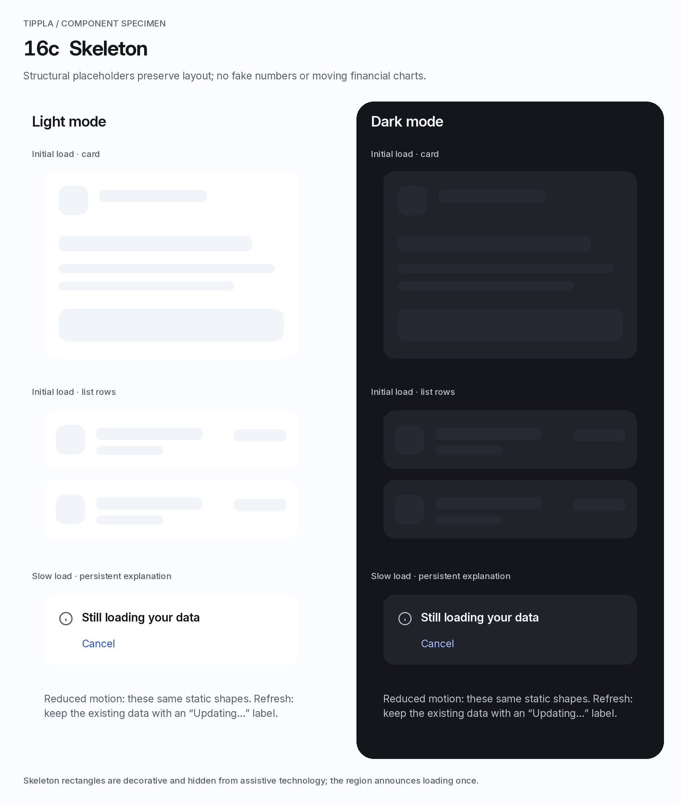

### Skeleton

| Element / state | Anatomy, size and spacing | Typography | Colour — resolve in both themes | Interaction |
| --- | --- | --- | --- | --- |
| Initial card / rows | Match the actual component's container width, padding, radius and approximate text/icon slots. Text bars 12–20 high, icon blocks 40, button block 44; `radius.xs` on text, component radius on larger shapes. | No fake text or numbers. | Neutral host `C.surface`; shapes `C.surface2`. | Skeletons are decorative, non-focusable and hidden from assistive technology. Parent region `aria-busy`; one polite “Loading…” status. Never use a moving score arc or randomly varying balance. |
| Motion | Static by default in both themes. | — | No gradient shimmer or alpha pulse. | Reduced motion uses the same static shapes. Avoid flickering through skeletons on fast refresh. |
| Slow load | After 8 seconds show “Still loading your data” and Cancel within the loading region. | Title `type.h3`; action `type.small`. | Text `C.text`; icon `C.neutral`; action `C.accent`. | Cancel aborts this view's request and retains the current navigation/context. A background bank connection is not silently disconnected. On an actual error, replace with inline info + Retry; never display loading indefinitely after a known failure. |
| Refresh with data | Keep existing content and its timestamp, add “Updating…”; reserve the same space for freshness text. | `type.caption`. | `C.textMuted`. | Mark stale context accurately; prevent stale response overwrite. Do not replace an interactive list under keyboard focus with skeletons. |
| Resolved / failed | Replace placeholders atomically with response content, correct EmptyState, or local error. | Destination tokens. | Destination tokens. | Clear busy state, announce outcome once; retain logical focus. Placeholder buttons never become accidental click targets. |

## 17. Bottom tab bar and desktop sidebar

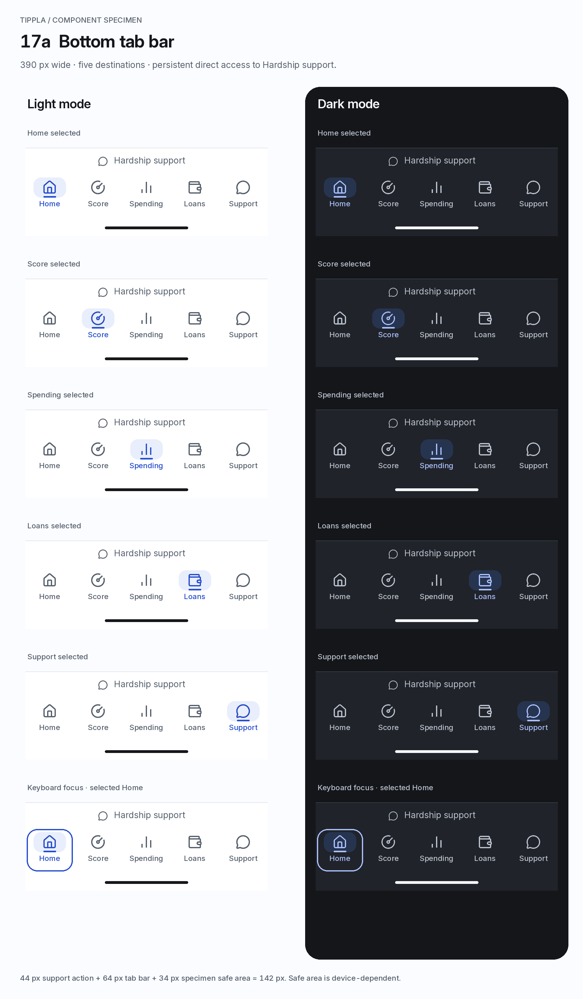

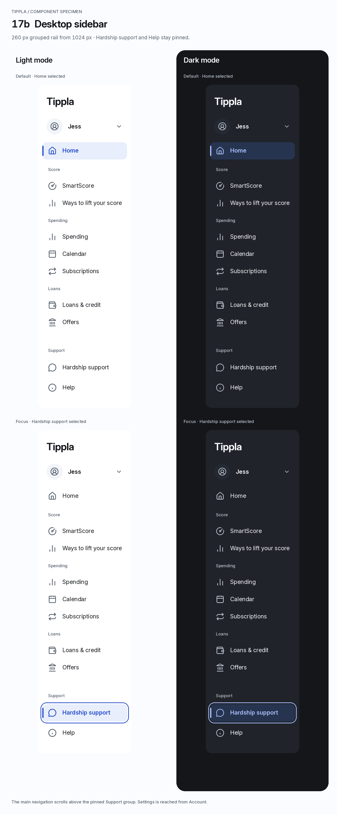

| Element / state | Anatomy, size and spacing | Typography | Colour — resolve in both themes | Interaction |
| --- | --- | --- | --- | --- |
| Mobile dock | Full viewport width 390. `layout.tabBarHeight` = 64, plus actual bottom safe area. A separate 44 px Hardship support row sits immediately above it. Total reserve = `44 + 64 + safeAreaBottom`; illustrated safe area 34 gives 142. | — | Dock `C.surface`; decorative top border `C.line`. | Fixed on every primary screen. Content bottom padding and scroll-padding reserve the full total, not just 64. Do not auto-hide on scrolling. Device home indicator belongs to the OS, not the app. |
| Tab items | Five equal widths: 78 at reference viewport. Target 78 × 64. Icon 24, label gap `space[1]`; selected icon container 52 × 32, `radius.sm`, with a 20 × 2 solid underline at its lower edge. | Label `type.caption`. | Default icon/label `C.textMuted`; selected `C.accent`, container `C.accentSoft`. | Home `House`; Score `CircleGauge`; Spending `ChartNoAxesColumn`; Loans `Wallet`; Support `MessageCircle`. Icons keep 2 px strokes. No notifications/score badges. |
| Active / focus / hover | Selected icon gets a filled soft container and a solid `C.accent` underline; keyboard focus uses shared outline around item without clipping. Hover/press adds `C.surface2` to unselected icon container. | Same label token; do not rely on colour alone. | Active `C.accentSoft` / `C.accent`; focus `C.focus`. | Navigation links in a labelled navigation landmark; active route `aria-current=page`, not ARIA tablist. Switch route on activation; preserve each tab's scroll/filter state. Re-tap active tab may scroll to top, never reset filters. |
| Mobile Hardship support | Whole 390 × 44 row is the hit area. Centre a 16 px `MessageCircle`, `space[2]` gap and visible “Hardship support” label. No filled banner or pill. | `type.small`. | `C.surface`, label/icon `C.textMuted`. | Accessible name is “Hardship support”. One tap opens Hardship support from every primary route, regardless of score, subscription plan, bank connection or offer availability. It is not a caution alert. It stays visible alongside the Support tab. |
| Modal / keyboard behaviour | Sheet/drawer follows component 09; foreground sheet has its own explicit close and relevant support action. | As sheet. | Underlying dock remains in the scrim layer. | A modal makes background navigation inert; do not punch an interactive hole through its focus trap. Relevant financial detail sheets include their own “Hardship support” action. While a text keyboard is open, keep support reachable in the active view and avoid positioning the dock over input; restore the dock immediately on keyboard dismissal. “Always visible” applies to all primary navigation views, not interactive content behind a modal/system keyboard. |
| Large text / narrow layout | Grow dock labels/targets and support row; measure actual combined height and update content inset. At 200% text, wrap support copy and labels rather than clip them. | Keep token font sizes relative to user scaling. | Same. | All five destinations remain visible. Do not replace Support with an overflow menu. Prefer label wrapping to horizontal navigation scrolling. |
| Desktop rail | `layout.desktopSidebar` = 260; available from `layout.breakpoints.desktop` = 1024. Full viewport-height column. Padding `space[3]`; nav rows min 48; row `radius.sm`. Group labels `type.caption` with `space[4]` separation. Brand gutter `space[6]`. | Brand `type.h1`; account `type.small`; item `type.body`; active item `type.bodyStrong`. | Rail `C.surface`; labels `C.text`, icons `C.textMuted`; account `C.textMuted`. | Groups: Home; Score (SmartScore, Ways to lift your score); Spending (Spending, Calendar, Subscriptions); Loans (Loans & credit, Offers); Support (Hardship support, Help). Hide mobile dock when rail is active; expose one navigation landmark. Tablet below 1024 retains mobile navigation. |
| Desktop selected / focused | Full-row soft fill; 3 px leading selection rule; icon 24, gap `space[4]`. | Active `type.bodyStrong`. | Active fill `C.accentSoft`, rule/icon/label `C.accent`; focus `C.focus`. | Native route links with current-page state. Keyboard Tab follows visible order; no arrow-only tablist behaviour. |
| Desktop support slot | Separate non-shrinking Support region: group label, Hardship support and Help, each link at least 48 px. Navigation above scrolls independently. Settings is reached from Account. | Group label `type.caption`; links `type.body`, active `type.bodyStrong`. | Ordinary link `C.text`, icon `C.textMuted`; active `C.accentSoft` / `C.accent`. | Hardship support is never below the scroll fold. At small heights, let the nav list scroll while retaining support; at 200% zoom responsive width may switch to mobile navigation. “Support” is the group heading; “Hardship support” and “Help” are separate routes. |
| Availability / data loading | Navigation does not disable because an individual panel is loading or empty. | Same. | Same enabled tokens. | A route can show its own loading/error/empty state. Support remains reachable. Closing a sheet restores the triggering route/control without losing filters. |

### Navigation and source notes

Frame 17 now matches the final screen designs. Generic background chrome in older modal examples is illustrative; implement this dock/rail. The plain persistent “Hardship support” row coexists with Jess's contextual money-tight banner. Marcus has only the supplied new-offer banner. Do not repeat the money-tight banner in the dock. Motion is governed by `illustration-and-motion.md`; its more specific open/close timings supersede earlier generic transition notes.

Accessibility implementation references: [WAI-ARIA grid pattern](https://www.w3.org/WAI/ARIA/apg/patterns/grid/), [checkbox pattern](https://www.w3.org/WAI/ARIA/apg/patterns/checkbox/), [switch pattern](https://www.w3.org/WAI/ARIA/apg/patterns/switch/), and [Lucide LoaderCircle](https://lucide.dev/icons/loader-circle). Use native controls where possible; the state sheets specify appearance, not a custom replacement for browser semantics.

## Handoff checks and implementation acceptance

| Check | Required result |
| --- | --- |
| State coverage | 23 sheets: 4 from components 01–04; 7 from 05–10; 12 from 11–17. All have both themes. Frame 15a covers all four button variants in six states and three sizes; 16b shows each of the six empty variants. Shared loading, failure, hover and focus rules compose with data states rather than generating a separate layout for every permutation. |
| Exact Jess arithmetic | Ring fraction `22/150`, next-stage distance `128`; `$314 − $367 = −$53`; `$52 + $315 = $367`; `$300 + $15 = $315`. No report-period income/spending total is substituted into the balance equation. |
| Evidence and estimates | Posted spend, scheduled due, predicted bill, confirmed balance and forecast balance remain distinct. Future dates do not make a prediction confirmed. Loan estimates are labelled per field. Unknown values never become zero. |
| Cost comparison | No invented rates or lender terms. Preserve field order and source definitions; clearly separate cost from principal-inclusive total repaid. No application submission from opening an offer. |
| Mobile targets | Test all controls at 390 px, all five navigation links, support row, text wrapping and safe-area reserve. 44 × 44 minimum hit areas, even when visible icons are 16 or 20 px. |
| Keyboard and screen reader | Check native form labels, radio/switch/checkbox semantics, calendar roving focus, route current state, disclosure expansion, busy/empty outcomes and focus restoration. Test the implemented DOM; static images cannot prove these behaviours. |
| Responsive and zoom | Verify 200% text, 320 px wide layouts, long lender names, multi-line fees, error text and sidebar height. Essential amounts and provenance never truncate. Grid can switch to the specified list alternative. |
| Destructive scope | Red is confined to destructive actions and form-validation errors. No shortfall, forecast, gambling, debt or no-offers message uses it. |
| Motion and async | Reduced motion removes optional movement. No spinning financial values, autonomous pager, flashing caution, duplicate requests or stale response overwrites. |
| Assets | All Markdown image links resolve to local PNGs in `components/`. Tokens and icon mapping are included in the zip; previous standalone editions are retained. |

### Computed colour checks for components 11–17

The table below reports the actual supplied colours, not rounded estimates of compliance. Text target is 4.5:1; essential strokes/fills target 3:1. Ratios are displayed to two decimals, with pass evaluated on unrounded values. Decorative separators, skeleton fills and empty tracks are exempt because they carry no unique state information. This palette check does not by itself establish WCAG 2.2 AA conformance of a future app.

| Pair | Light ratio | Dark ratio | Target | Result |
| --- | --- | --- | --- | --- |
| `text / bg` | 17.49:1 | 16.88:1 | 4.5:1 | Pass / Pass |
| `text / surface` | 17.94:1 | 14.67:1 | 4.5:1 | Pass / Pass |
| `text / surface2` | 16.28:1 | 13.60:1 | 4.5:1 | Pass / Pass |
| `text / neutralSoft` | 15.84:1 | 12.37:1 | 4.5:1 | Pass / Pass |
| `textMuted / bg` | 6.22:1 | 10.09:1 | 4.5:1 | Pass / Pass |
| `textMuted / surface` | 6.38:1 | 8.77:1 | 4.5:1 | Pass / Pass |
| `textMuted / surface2` | 5.79:1 | 8.13:1 | 4.5:1 | Pass / Pass |
| `textMuted / neutralSoft` | 5.63:1 | 7.39:1 | 4.5:1 | Pass / Pass |
| `accent / bg` | 6.85:1 | 10.10:1 | 4.5:1 | Pass / Pass |
| `accent / surface` | 7.02:1 | 8.78:1 | 4.5:1 | Pass / Pass |
| `accent / surface2` | 6.37:1 | 8.15:1 | 4.5:1 | Pass / Pass |
| `accent / neutralSoft` | 6.20:1 | 7.40:1 | 4.5:1 | Pass / Pass |
| `neutral / bg` | 6.22:1 | 10.09:1 | 3:1 | Pass / Pass |
| `neutral / surface` | 6.38:1 | 8.77:1 | 3:1 | Pass / Pass |
| `neutral / surface2` | 5.79:1 | 8.13:1 | 3:1 | Pass / Pass |
| `neutral / neutralSoft` | 5.63:1 | 7.39:1 | 3:1 | Pass / Pass |
| `focus / bg` | 6.85:1 | 10.10:1 | 3:1 | Pass / Pass |
| `focus / surface` | 7.02:1 | 8.78:1 | 3:1 | Pass / Pass |
| `focus / surface2` | 6.37:1 | 8.15:1 | 3:1 | Pass / Pass |
| `focus / neutralSoft` | 6.20:1 | 7.40:1 | 3:1 | Pass / Pass |
| `destructive / bg` | 5.97:1 | 10.25:1 | 4.5:1 | Pass / Pass |
| `destructive / surface` | 6.12:1 | 8.91:1 | 4.5:1 | Pass / Pass |
| `destructive / surface2` | 5.55:1 | 8.26:1 | 4.5:1 | Pass / Pass |
| `destructive / neutralSoft` | 5.40:1 | 7.51:1 | 4.5:1 | Pass / Pass |
| `onAccent / accent` | 7.02:1 | 8.82:1 | 4.5:1 | Pass / Pass |
| `textInverse / destructive` | 6.12:1 | 8.95:1 | 4.5:1 | Pass / Pass |
| `accent / accentSoft` | 6.04:1 | 6.95:1 | 4.5:1 | Pass / Pass |
| `text / accentSoft` | 15.43:1 | 11.60:1 | 4.5:1 | Pass / Pass |
| `textMuted / accentSoft` | 5.49:1 | 6.93:1 | 4.5:1 | Pass / Pass |
| `info / infoSoft` | 6.04:1 | 6.81:1 | 4.5:1 | Pass / Pass |
| `caution / cautionSoft` | 5.98:1 | 7.78:1 | 4.5:1 | Pass / Pass |
| `textMuted / neutralSoft` | 5.63:1 | 7.39:1 | 4.5:1 | Pass / Pass |
| `surface / neutral` | 6.38:1 | 8.77:1 | 3:1 | Pass / Pass |
| `text / surface2` | 16.28:1 | 13.60:1 | 4.5:1 | Pass / Pass |
| `chart.hatch / surface` | 6.38:1 | 8.77:1 | 3:1 | Pass / Pass |
| `chart.hatch / surface2` | 5.79:1 | 8.13:1 | 3:1 | Pass / Pass |
| `chart.hatch / neutralSoft` | 5.63:1 | 7.39:1 | 3:1 | Pass / Pass |
| `chart.hatch / accentSoft` | 5.49:1 | 6.93:1 | 3:1 | Pass / Pass |
| `chart.predicted / surface` | 4.61:1 | 6.92:1 | 3:1 | Pass / Pass |
| `chart.predicted / surface2` | 4.18:1 | 6.42:1 | 3:1 | Pass / Pass |
| `chart.predicted / neutralSoft` | 4.07:1 | 5.83:1 | 3:1 | Pass / Pass |
| `chart.predicted / accentSoft` | 3.96:1 | 5.47:1 | 3:1 | Pass / Pass |
| `category.housing / surface` | 5.92:1 | 7.16:1 | 3:1 | Pass / Pass |
| `category.housing / surface2` | 5.37:1 | 6.64:1 | 3:1 | Pass / Pass |
| `category.housing / accentSoft` | 5.09:1 | 5.66:1 | 3:1 | Pass / Pass |
| `category.groceries / surface` | 5.04:1 | 8.29:1 | 3:1 | Pass / Pass |
| `category.groceries / surface2` | 4.57:1 | 7.69:1 | 3:1 | Pass / Pass |
| `category.groceries / accentSoft` | 4.33:1 | 6.56:1 | 3:1 | Pass / Pass |
| `category.food / surface` | 4.84:1 | 6.98:1 | 3:1 | Pass / Pass |
| `category.food / surface2` | 4.39:1 | 6.47:1 | 3:1 | Pass / Pass |
| `category.food / accentSoft` | 4.16:1 | 5.52:1 | 3:1 | Pass / Pass |
| `category.transport / surface` | 5.03:1 | 7.73:1 | 3:1 | Pass / Pass |
| `category.transport / surface2` | 4.56:1 | 7.17:1 | 3:1 | Pass / Pass |
| `category.transport / accentSoft` | 4.33:1 | 6.11:1 | 3:1 | Pass / Pass |
| `category.bills / surface` | 5.94:1 | 6.95:1 | 3:1 | Pass / Pass |
| `category.bills / surface2` | 5.39:1 | 6.45:1 | 3:1 | Pass / Pass |
| `category.bills / accentSoft` | 5.11:1 | 5.50:1 | 3:1 | Pass / Pass |
| `category.subscriptions / surface` | 5.46:1 | 6.62:1 | 3:1 | Pass / Pass |
| `category.subscriptions / surface2` | 4.96:1 | 6.14:1 | 3:1 | Pass / Pass |
| `category.subscriptions / accentSoft` | 4.70:1 | 5.23:1 | 3:1 | Pass / Pass |
| `category.entertainment / surface` | 5.12:1 | 7.33:1 | 3:1 | Pass / Pass |
| `category.entertainment / surface2` | 4.64:1 | 6.80:1 | 3:1 | Pass / Pass |
| `category.entertainment / accentSoft` | 4.40:1 | 5.80:1 | 3:1 | Pass / Pass |
| `category.alcohol / surface` | 5.71:1 | 6.06:1 | 3:1 | Pass / Pass |
| `category.alcohol / surface2` | 5.18:1 | 5.62:1 | 3:1 | Pass / Pass |
| `category.alcohol / accentSoft` | 4.91:1 | 4.79:1 | 3:1 | Pass / Pass |
| `category.gambling / surface` | 4.28:1 | 8.06:1 | 3:1 | Pass / Pass |
| `category.gambling / surface2` | 3.88:1 | 7.47:1 | 3:1 | Pass / Pass |
| `category.gambling / accentSoft` | 3.68:1 | 6.37:1 | 3:1 | Pass / Pass |
| `category.health / surface` | 4.77:1 | 7.94:1 | 3:1 | Pass / Pass |
| `category.health / surface2` | 4.32:1 | 7.37:1 | 3:1 | Pass / Pass |
| `category.health / accentSoft` | 4.10:1 | 6.28:1 | 3:1 | Pass / Pass |
| `category.shopping / surface` | 5.83:1 | 6.57:1 | 3:1 | Pass / Pass |
| `category.shopping / surface2` | 5.29:1 | 6.10:1 | 3:1 | Pass / Pass |
| `category.shopping / accentSoft` | 5.01:1 | 5.20:1 | 3:1 | Pass / Pass |
| `category.loan_repayment / surface` | 10.94:1 | 5.27:1 | 3:1 | Pass / Pass |
| `category.loan_repayment / surface2` | 9.92:1 | 4.89:1 | 3:1 | Pass / Pass |
| `category.loan_repayment / accentSoft` | 9.40:1 | 4.17:1 | 3:1 | Pass / Pass |
| `category.bnpl / surface` | 5.26:1 | 6.95:1 | 3:1 | Pass / Pass |
| `category.bnpl / surface2` | 4.77:1 | 6.45:1 | 3:1 | Pass / Pass |
| `category.bnpl / accentSoft` | 4.52:1 | 5.50:1 | 3:1 | Pass / Pass |
| `category.wage_advance / surface` | 5.23:1 | 6.40:1 | 3:1 | Pass / Pass |
| `category.wage_advance / surface2` | 4.75:1 | 5.93:1 | 3:1 | Pass / Pass |
| `category.wage_advance / accentSoft` | 4.50:1 | 5.06:1 | 3:1 | Pass / Pass |
| `category.cash / surface` | 5.14:1 | 8.86:1 | 3:1 | Pass / Pass |
| `category.cash / surface2` | 4.67:1 | 8.22:1 | 3:1 | Pass / Pass |
| `category.cash / accentSoft` | 4.42:1 | 7.01:1 | 3:1 | Pass / Pass |
| `category.fees / surface` | 4.69:1 | 6.99:1 | 3:1 | Pass / Pass |
| `category.fees / surface2` | 4.25:1 | 6.48:1 | 3:1 | Pass / Pass |
| `category.fees / accentSoft` | 4.03:1 | 5.53:1 | 3:1 | Pass / Pass |
| `category.income / surface` | 5.32:1 | 7.85:1 | 3:1 | Pass / Pass |
| `category.income / surface2` | 4.83:1 | 7.28:1 | 3:1 | Pass / Pass |
| `category.income / accentSoft` | 4.58:1 | 6.21:1 | 3:1 | Pass / Pass |
| `category.centrelink / surface` | 5.37:1 | 7.82:1 | 3:1 | Pass / Pass |
| `category.centrelink / surface2` | 4.87:1 | 7.25:1 | 3:1 | Pass / Pass |
| `category.centrelink / accentSoft` | 4.62:1 | 6.18:1 | 3:1 | Pass / Pass |
| `category.uncategorised / surface` | 4.64:1 | 5.93:1 | 3:1 | Pass / Pass |
| `category.uncategorised / surface2` | 4.21:1 | 5.50:1 | 3:1 | Pass / Pass |
| `category.uncategorised / accentSoft` | 3.99:1 | 4.69:1 | 3:1 | Pass / Pass |
| `stage.building / surface` | 4.47:1 | 4.51:1 | 3:1 | Pass / Pass |
| `stage.building / surface2` | 4.05:1 | 4.18:1 | 3:1 | Pass / Pass |
| `stage.steadying / surface` | 5.73:1 | 6.44:1 | 3:1 | Pass / Pass |
| `stage.steadying / surface2` | 5.19:1 | 5.98:1 | 3:1 | Pass / Pass |
| `stage.healthy / surface` | 7.45:1 | 8.63:1 | 3:1 | Pass / Pass |
| `stage.healthy / surface2` | 6.75:1 | 8.00:1 | 3:1 | Pass / Pass |
| `stage.thriving / surface` | 9.56:1 | 10.89:1 | 3:1 | Pass / Pass |
| `stage.thriving / surface2` | 8.67:1 | 10.10:1 | 3:1 | Pass / Pass |

All 214 checked foreground/background combinations pass their stated target. Minimum tested text contrast: 5.40:1; minimum tested essential graphic contrast: 3.68:1. Earlier donut dimming retains the contrast-safe recipe in component 07.
