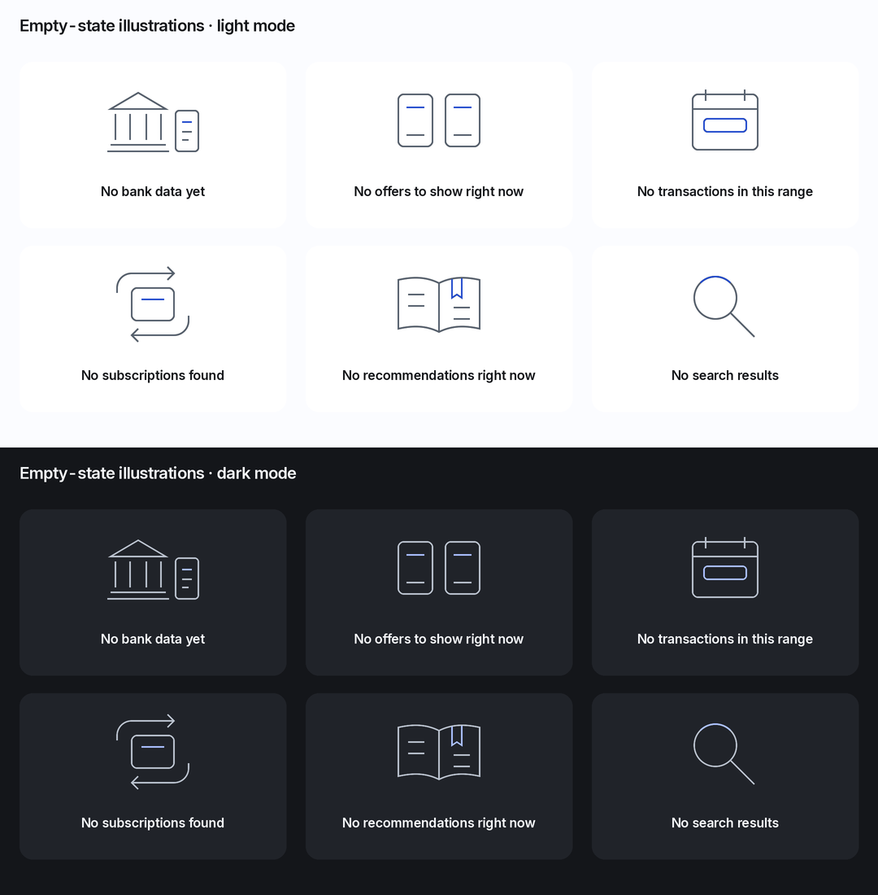

# Tippla — illustration and motion

Decision: **yes, but only as small, static object drawings in dedicated empty views.** The banking interface remains typography, data and controls. Empty-state art gives a quiet visual anchor without implying that the customer has failed or that more borrowing is the goal.

This handoff uses the current Banking Clarity tokens and Inter from Google Fonts, with the existing system fallbacks. It does not change any sample customer data. All six SVGs are theme-independent source assets; their colours come from the host theme.

## Illustration rules

- One ordinary object or a simple pair: bank/statement, comparable documents, calendar, recurring card, reference book, search lens. Straight geometry and purposeful arcs, generous empty space, no perspective or decorative background.
- Exactly `viewBox="0 0 160 120"`, intrinsic 160 × 120, 2 px strokes, round caps and joins. No embedded text, raster image, filters, shadows, gradients, opacity, clip paths or external dependencies. These are illustrations, not enlarged replacement UI icons; interactive UI keeps the Lucide family.
- Neutral structural strokes use `currentColor`, inherited from `C.neutral`. One optional colour is allowed: `C.accent`, through `var(--color-accent, currentColor)`. A small header, range, bookmark or arc uses it; there is no filled colour field. All remaining fill is `none`. In forced-colour/monochrome rendering, both colours may resolve to the same system text colour without losing meaning.
- No people, handshakes, mascots, wellness squiggles, plants, coins, approval stamps, trophies, shields implying security guarantees, confetti, badges, streaks or percentile comparisons. No empty-wallet motif. Empty offers and subscriptions are neutral results, not failures or achievements.
- No illustration on a low-score reveal, a shortfall, gambling category, hardship message, form error, loading state or dense list. Never animate the SVG, even when reduced motion is off. One illustration per dedicated empty region; none repeated inside every dashboard card.

### Placement and accessible rendering

This is a narrow amendment to component 16's earlier icon-only EmptyState: in a **dedicated full-width empty view**, replace the 48 px icon tile with this 160 × 120 drawing. Do not show both. Compact inline empty regions keep the earlier icon/text treatment, or text alone when space is tight. Retain the existing exact title, body and action below.

Use a 350 px host at the 390 px reference width: `radius.md`, `C.surface`, `space[5]` padding. Centre the drawing; leave `space[6]` before the title, `space[3]` before body copy and `space[5]` before the action. Title is `type.h2` / `C.text`; body is `type.small` / `C.textMuted`. The single CTA is a compact secondary button, at least 44 px high, `C.accentSoft` / `C.accent`. Text remains left-aligned for scanning. Height is content-driven; the older 290 px specimen height is not a clipping limit. At high text scaling, hide the decorative drawing if useful to preserve space, never the copy or action.

Inline the SVG (or import it as an SVG component) so `currentColor` and the CSS variable inherit. An external `` does not reliably inherit page colour/custom properties; do not ship a black fallback into dark mode. Keep `aria-hidden="true"`, `focusable="false"` and no SVG click handler. The adjacent title/copy conveys the complete state. Announce a newly resolved result once at the content-region level, without reading the drawing or repeating all copy in a toast.

```css
.tippla-empty-illustration {
  width: 160px;
  height: 120px;
  display: block;
  margin-inline: auto;
  color: var(--color-neutral);
  pointer-events: none;
}
/* --color-accent and --color-neutral resolve from color[theme]. */
@media (forced-colors: active) {
  .tippla-empty-illustration {
    color: CanvasText;
    --color-accent: CanvasText;
  }
}
```

Only show the no-result variant after a successful response for the stated scope. A failed sync, pending connection, stale data, revoked matching consent or service outage is not an empty result. Keep the current period/search controls and an appropriate recovery action. Do not invent $0, transaction counts, a lender, an offer or a missing score.

## Six empty states

| Asset | Exact title | Exact body | Action and destination |
| --- | --- | --- | --- |
| `empty-states/no-bank-data.svg` | No bank data yet | Connect your bank to see your activity and build a clearer picture. | **Connect bank** → Bank-connection explanation → consent flow → TaleFin. If connected but syncing, show loading; if connected with no usable data, explain that state and offer connection details. |
| `empty-states/no-offers.svg` | No offers to show right now | You can keep using Tippla to understand your money and work towards credit readiness. | **View your SmartScore** → Score. No approval promise or implication that an application was declined. Use only when matching is permitted and a successful response contains no offers. |
| `empty-states/no-transactions-in-range.svg` | No transactions in this range | Try a different date range to see more of your activity. | **Change date range** → Period selector, retaining the current period until Apply. |
| `empty-states/no-subscriptions.svg` | No subscriptions found | We have not found subscriptions in the connected data for this range. | **Review transactions** → Spending transactions in the same range. |
| `empty-states/no-recommendations.svg` | No recommendations right now | You can still explore the factors shaping your SmartScore. | **View score factors** → Score factors. If scoring data is unavailable, show its missing-data explanation. |
| `empty-states/no-search-results.svg` | No search results | Try another search or clear your search and filters. | **Clear search and filters** → Clear query and non-period filters together, retain the period and focus search. |

## SVG source

Each block is the exact content of its matching file. All use the same two theme bindings; the monochrome fallback is intentional.

### no-bank-data.svg

Bank facade and statement outline; no broken connection, warning or balance.

```svg
<svg xmlns="http://www.w3.org/2000/svg" width="160" height="120" viewBox="0 0 160 120" fill="none" stroke="currentColor" stroke-width="2" stroke-linecap="round" stroke-linejoin="round" aria-hidden="true" focusable="false">
  <path d="M28 46 62 26 96 46H28Z"/>
  <path d="M34 52v32m18-32v32m20-32v32m18-32v32M28 90h68M24 98h76"/>
  <rect x="108" y="48" width="28" height="50" rx="4"/>
  <path d="M116 74h12m-12 10h8"/>
  <path d="M116 62h12" stroke="var(--color-accent, currentColor)"/>
</svg>
```

### no-offers.svg

Two equal document outlines: comparison without a favoured lender. They are an illustration, not two offer placeholders.

```svg
<svg xmlns="http://www.w3.org/2000/svg" width="160" height="120" viewBox="0 0 160 120" fill="none" stroke="currentColor" stroke-width="2" stroke-linecap="round" stroke-linejoin="round" aria-hidden="true" focusable="false">
  <rect x="30" y="28" width="42" height="64" rx="6"/>
  <rect x="88" y="28" width="42" height="64" rx="6"/>
  <path d="M40 78h22m36 0h22"/>
  <path d="M40 44h22m36 0h22" stroke="var(--color-accent, currentColor)"/>
</svg>
```

### no-transactions-in-range.svg

Calendar with one range outline. No date, spending dot or fabricated amount.

```svg
<svg xmlns="http://www.w3.org/2000/svg" width="160" height="120" viewBox="0 0 160 120" fill="none" stroke="currentColor" stroke-width="2" stroke-linecap="round" stroke-linejoin="round" aria-hidden="true" focusable="false">
  <rect x="40" y="28" width="80" height="68" rx="6"/>
  <path d="M56 22v14m48-14v14M40 46h80"/>
  <rect x="54" y="58" width="52" height="16" rx="4" stroke="var(--color-accent, currentColor)"/>
</svg>
```

### no-subscriptions.svg

Recurring arrows around a plain card. Static; does not imply charges have been cancelled.

```svg
<svg xmlns="http://www.w3.org/2000/svg" width="160" height="120" viewBox="0 0 160 120" fill="none" stroke="currentColor" stroke-width="2" stroke-linecap="round" stroke-linejoin="round" aria-hidden="true" focusable="false">
  <rect x="54" y="40" width="52" height="40" rx="6"/>
  <path d="M36 46V40c0-10 8-18 18-18h52m-8-8 8 8-8 8"/>
  <path d="M124 74v6c0 10-8 18-18 18H54m8-8-8 8 8 8"/>
  <path d="M66 54h28" stroke="var(--color-accent, currentColor)"/>
</svg>
```

### no-recommendations.svg

Open reference book with a bookmark. Guidance remains available; no completed-task tick.

```svg
<svg xmlns="http://www.w3.org/2000/svg" width="160" height="120" viewBox="0 0 160 120" fill="none" stroke="currentColor" stroke-width="2" stroke-linecap="round" stroke-linejoin="round" aria-hidden="true" focusable="false">
  <path d="M80 34c-16-8-32-8-50-4v60c18-4 34-4 50 4 16-8 32-8 50-4V30c-18-4-34-4-50 4Z"/>
  <path d="M80 34v60M42 48h20m-20 14h20m36 2h20m-20 14h20"/>
  <path d="M96 29v23l6-4 6 4V28" stroke="var(--color-accent, currentColor)"/>
</svg>
```

### no-search-results.svg

Empty search lens. No crossed-out person, red cross or failure symbol.

```svg
<svg xmlns="http://www.w3.org/2000/svg" width="160" height="120" viewBox="0 0 160 120" fill="none" stroke="currentColor" stroke-width="2" stroke-linecap="round" stroke-linejoin="round" aria-hidden="true" focusable="false">
  <circle cx="68" cy="52" r="26"/>
  <path d="m87 71 29 29"/>
  <path d="M49.615 33.615a26 26 0 0 1 36.77 0" stroke="var(--color-accent, currentColor)"/>
</svg>
```

## Motion contract

Use the current tokens: `motion.fast = 120`, `motion.base = 180`, `motion.slow = 260` milliseconds and `motion.easing = cubic-bezier(0.22, 1, 0.36, 1)`. No additional spring, overshoot or custom easing is introduced. A specified 0 ms is an intentional no-animation exception, not a replacement token. Data/focus/ARIA state changes must not wait for animation to finish unless removal of the modal itself requires it.

| Interaction | Duration | Easing | Standard motion and state timing | Reduced motion |
| --- | --- | --- | --- | --- |
| Sheet open | Panel `motion.slow` = 260 ms; scrim `motion.base` = 180 ms, concurrent. | `motion.easing` | Translate panel from below the viewport to its resting position; desktop drawer enters from the right. Keep panel opaque. Scrim moves from transparent to the theme's exact `C.scrim`; no blur, scale, bounce or overshoot. Mount/focus the dialog and make background inert at open, not after the animation. | Show final panel and scrim immediately, 0 ms; identical focus/inert behaviour. |
| Sheet close | `motion.base` = 180 ms for panel and scrim, concurrent. Handle-drag snap settling retains `motion.slow` = 260 ms. | `motion.easing` | Reverse the entry translation; scrim returns to transparent. Keep the background inert during exit, then unmount and restore trigger focus. A replacement sheet changes content within one shell rather than stacking scrims. | Remove immediately, 0 ms, and restore focus. Handle/tap/keyboard alternatives remain available; no animated snap. |
| Tab change | `motion.fast` = 120 ms, selected-control colours only. Route/content change is immediate. | `motion.easing` | Change destination and selected state on activation. Interpolate only the active icon/container colours; the position marker appears immediately. No sliding pages, route crossfade or delayed navigation. Preserve each route's scroll/filter state. | Selection and destination appear immediately, 0 ms. |
| Donut selection | `motion.base` = 180 ms, non-selected fill colours only. | `motion.easing` | Commit selection, centre label/value, filter and selection outline immediately. Interpolate other fills to the component 07 contrast-safe dimmed colours. Keep true angles/radii; no rotation, exploded slice, full-chart opacity, animated percentages or changing denominator. | All final fills, outline, labels and filters update immediately, 0 ms. |
| List expand/collapse | `motion.base` = 180 ms. | `motion.easing` | Animate disclosure height between zero and measured content height; rotate its chevron through 180°. No staggered row arrivals or spring. Update expanded semantics on activation. Before collapsing a region containing focus, return focus to its disclosure button; hidden children are inert. Keep the trigger in view. | Height and chevron change immediately, 0 ms; same focus and expanded state. |
| Number change on score refresh | Score, stage, ring and distance: **0 ms**. Only removal of the “Updating…” indicator may use `motion.fast` = 120 ms. | `motion.easing` for that indicator only; none for values. | Keep the last known score and timestamp while fetching. Commit the complete new score snapshot atomically. No count-up/down, rolling digits, tweened score, ring sweep or step through a stage boundary. Use tabular numerals; the same neutral delta styling for increases and decreases. Do not apply numeric tweening to other financial values either. | Commit the same snapshot immediately; remove the status immediately, 0 ms. No information is omitted. |
| Toast | `motion.fast` = 120 ms in and 120 ms out. | `motion.easing` | Opacity only; no slide, pop or haptic. Mount the actual message once. Informational dwell remains 6 seconds, paused on hover/focus. Actionable/Undo toasts persist until action, dismissal or view exit, with the persistent recovery route from component 16. Transition duration is not the reading-time budget. | Appear/disappear immediately, 0 ms; same dwell, pause, persistence, actions and announcement. |

Respect `prefers-reduced-motion: reduce` for every interaction. If the preference changes mid-transition, settle to the final state immediately. The zero-duration path must explicitly run cleanup/focus restoration; do not rely solely on a `transitionend` event that may not fire. Do not tween focus rings, temporarily reduce text contrast, use shimmer, pulse the score or play an arrival animation when simply revisiting a route. Interrupt/reverse from the current visual position on rapid repeated actions; do not queue old animations after the current state changes. One successful refresh produces one polite status announcement, not separate announcements for each digit, arc and factor.

Donut dimming continues to use the contrast-safe opaque-colour recipe in component 07. Selection is also expressed by the outline, centre name and filter chip. Essential graphic contrast must remain at least 3:1 against surface and surface2 throughout a colour transition, not only on its endpoints. Financial text remains fully opaque; only explicitly decorative layers/status wrappers may fade. The toast and new-card entrance are short visibility transitions, never low-opacity resting states.

## One restrained positive moment: a verified loan payoff

**Where:** Loans → Overview, after the first successfully refreshed, verified payoff. One compact in-flow acknowledgement accompanies the updated loan record; it does not open a modal, change route or promote an offer. This is about one obligation ending, even if the rest of the customer's finances remain difficult.

**Trigger:** the service confirms that a previously open loan has been fully repaid, with no remaining balance or repayment obligation. A loan disappearing from transaction detection, a disconnected account, missing data, write-off, refinance, transferred loan, or elapsed predicted end date does **not** qualify. If Tippla has only bank-derived estimates and cannot verify payoff, omit this moment. Do not mark any of Jess's supplied open loans paid off to demonstrate it. `{lender}` below is a real verified event binding, not invented fixture data.

**Copy:**

```text
{lender} is paid off.
One less repayment to plan around.

See updated repayments
```

Use a plain `C.surface` card, `radius.md`, `space[4]` padding; heading `type.h3` / `C.text`, body `type.small` / `C.textMuted`. A 20 px Lucide `Check` in `C.accent` is an inline completion icon, without a badge, coloured disc or reward symbol. The action is secondary, at least 44 px, opening the updated repayment overview and the paid-off loan's retained history. Provide a separate labelled 44 px close target. Do not imply a specific saving, score increase, new approval or that all money worries have ended. Keep the current hardship access and financial summary visible.

**Motion:** commit the verified record, remaining-loan list and accurate totals together. If the user is idle on Loans, reveal the acknowledgement with a single opacity entrance using `motion.base` (180 ms), `motion.easing`. No count-down, disappearing-loan trick, moving debt token, list cascade, sound or haptic. Keep the paid-off record available in loan history. If the refresh would disturb an active gesture or a focused row, wait until the interaction finishes or the next natural visit; do not move focus to the acknowledgement.

**Reduced motion:** show the exact same static card and updated record instantly (0 ms), with the same action, close control and one polite announcement. The positive feeling comes from the factual wording and the reduced obligation, not the animation.

The card stays until the customer closes it or follows its action; it is not an auto-expiring toast. Persist a stable payoff-event ID plus seen/dismissed state so a later sync, device or route visit does not replay the moment. Show this special acknowledgement only for the first eligible payoff; subsequent paid-off loans receive the ordinary factual status. If authoritative data later corrects the event, remove the outdated acknowledgement and explain the correction neutrally, without a reverse celebration or negative animation.

## Preview and verification

The preview sheet shows all six illustration frames: **light mode above, dark mode below**. It is a visual inspection aid, not another app screen or a source of customer data.



All six SVGs parse as XML and use the exact 160 × 120 viewBox, 2 px round strokes and no colours outside currentColor plus the single accent token. Both inks were checked against bg, surface and surface2 in both themes: all 12 pairs pass 3:1; lowest ratio 5.79:1. Preview rendering resolves the same current tokens. The illustrations are decorative and carry no exclusive meaning.
