# Tippla screen specifications — mobile and desktop

Approved direction: **Banking Clarity**, using `tokens.json` v1.0.1 and `components.md`. Snapshot date: **Fri 25/09/2026**. Palette, Inter typography and Lucide icon family are unchanged. Mobile PNGs are exactly **390 × 844 pixels**. The desktop dashboard and its drawer frame are exactly **1440 × 900 pixels**. These are viewport captures, not stretched full-page images.

The 26 requested opening frames are named `<name>-<theme>.png` under `screens/`. Screens 1–12 have both themes; onboarding consents and the desktop dashboard use the requested light-only option. Forty-five supporting captures show scroll positions, detail sheets/drawers, consent states, the lender-message template and support destinations. They complete the supplied data without shrinking text or pretending an entire dashboard fits above the fold. The light/dark variants use identical geometry and data. No score count-up, celebratory gain styling, urgency banner, green spending increase or red financial state is introduced.

`C`, `K`, `S` and `CH` mean `color[theme]`, `color.category[theme]`, `color.stage[theme]` and `color.chart[theme]`. Spacing indices remain zero-based. All measurements below are CSS px at 100% text scaling. The files are static reference images; interactions described here are the implementation contract for Claude Code.

## 1. score-reveal — Jess

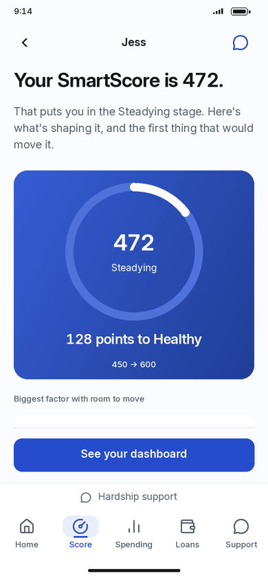

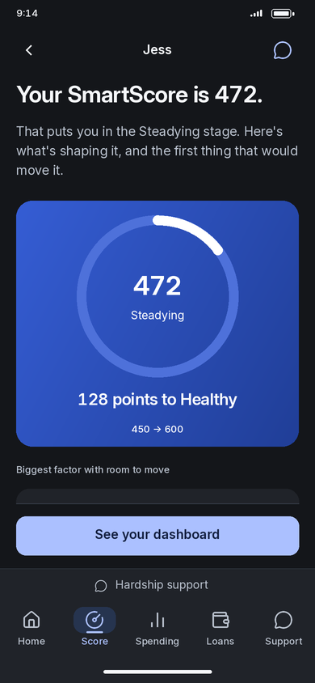

The exact reveal headline and introduction sit above the 200 px hero ScoreRing. The fixed cobalt gradient uses `color.stage.light.steadying` → `color.stage.light.thriving` in both themes, and white foregrounds. The ring covers **22/150 = 14.666…%** of the current stage, with no minimum visual fill. “128 points to Healthy” and “450 → 600” make the path explicit.

The factor and first action continue below the fold. The supplemental capture shows “Current borrowing · 2.9 / 10”, “you have 3 loans open.” and the complete Beforepay explanation. The primary “See your dashboard” button stays visible while scrolling. Intentional line breaks in the action title balance the text without changing its words.

- [Frame score-reveal-details — light](screens/score-reveal-details-light.png)
- [Frame score-reveal-details — dark](screens/score-reveal-details-dark.png)

FactorTile opens Current borrowing details. “See how” opens the corresponding InsightSheet with the supplied evidence and optional support actions. “See your dashboard” opens Jess's Home dashboard. The back control returns to the previous onboarding step without disconnecting the bank; the header support icon opens Support. The Score tab is active.

## 2. score-reveal-thinfile — Priya

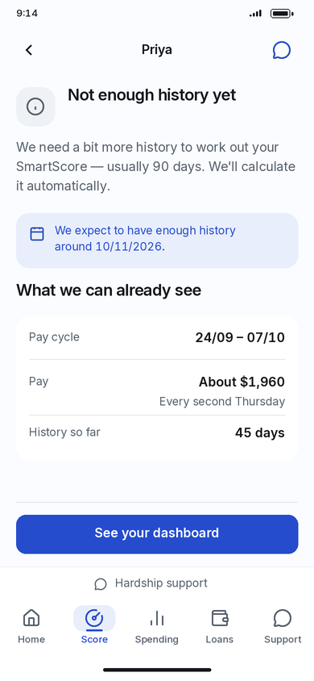

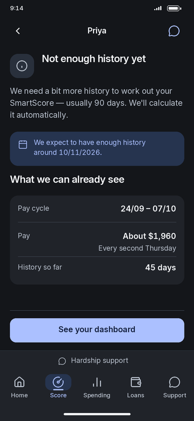

This is an insufficient-history state, not a zero or low score. There is **no score number, stage, ring, progress fraction or stage scale**. A neutral Info icon and “Not enough history yet” introduce the supplied message. The 90-day reference remains prose, not a deadline or a 45/90 progress graphic.

The exact expected-history message includes **10/11/2026**. It is kept as supplied rather than recalculated from 45 days of history. “What we can already see” has three ordinary rows: the pay-cycle dates, about $1,960 every second Thursday, and 45 days of history. “Pay” does not infer wages versus Centrelink. All supplied content fits in the opening capture. “See your dashboard” opens Priya's Home dashboard with a null SmartScore and independently available bank data.

## 3. dashboard — Jess

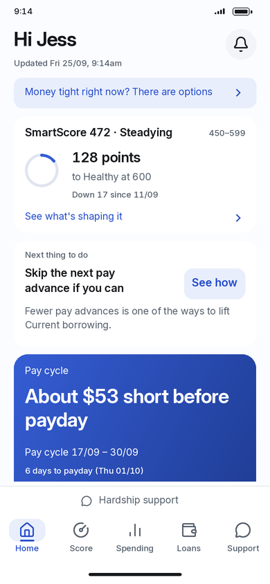

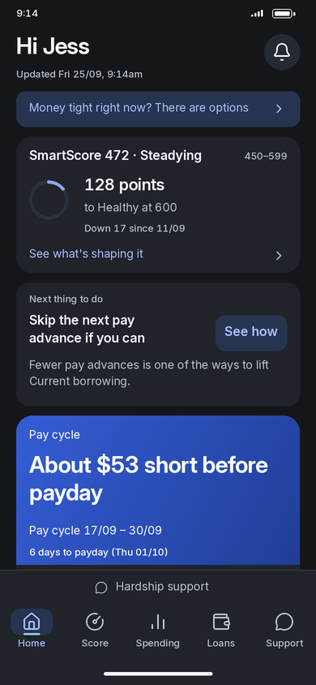

The opening view follows the requested order: update timestamp, gentle hardship banner, compact score path, next step, and pay-cycle summary. The score drop is plain `type.caption` in `C.textMuted`, with no arrow, risk colour or negative badge. The payday countdown remains six days relative to the supplied snapshot.

- [Frame dashboard-pay-cycle — light](screens/dashboard-pay-cycle-light.png)
- [Frame dashboard-pay-cycle — dark](screens/dashboard-pay-cycle-dark.png)
- [Frame dashboard-spending — light](screens/dashboard-spending-light.png)
- [Frame dashboard-spending — dark](screens/dashboard-spending-dark.png)
- [Frame dashboard-due — light](screens/dashboard-due-light.png)
- [Frame dashboard-due — dark](screens/dashboard-due-dark.png)

The pay-cycle continuation shows the exact historical totals and the forecast equation. The covered strip is **314/367**; the neutral hatched short portion is **53/367**. Paid-in/spent totals are not used as the forecast balance. The $300 advance, $315 repayment, $15 fee and 30/09 due date remain explicit. The next-bill row is Telstra, Sat 26/09, $52, predicted. The six-month chart preserves all six values and marks September as partial.

“See what's due” opens the supplied due sheet: Telstra $52 (Sat 26/09, predicted) and Beforepay $315 (Wed 30/09). Beforepay is predicted, as explicitly supplied in the later calendar fixture; both due rows use the predicted outline and label. “Options if money's tight” and the top banner open Hardship support. The advance disclosure opens Beforepay details. Spent and paid-in totals open separately filtered transactions for the same cycle. The Home tab is active.

## 4. dashboard-improving — Marcus

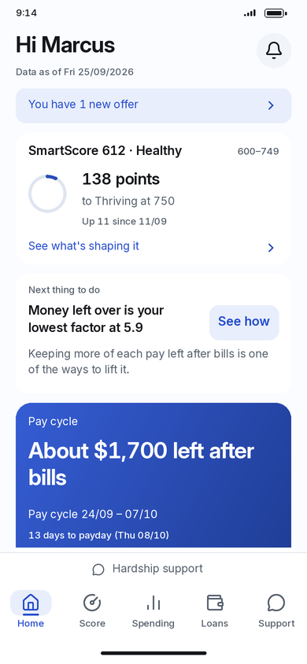

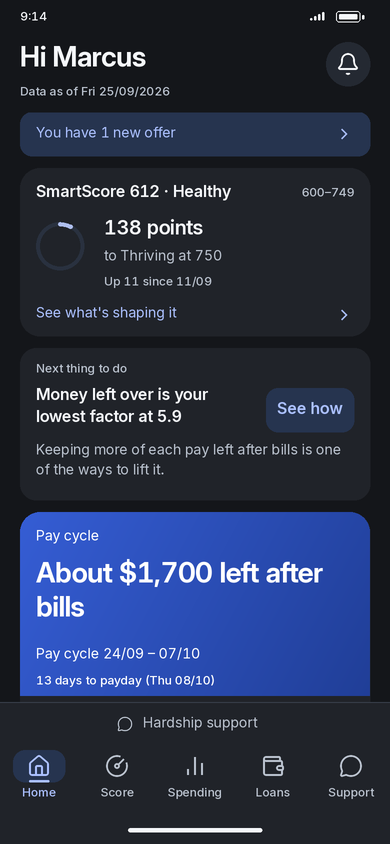

The **only contextual banner** is “You have 1 new offer →”, reflecting matching being on. There is no money-tight banner. The persistent plain Hardship support navigation link remains available. The score card displays 612, Healthy, the 600–749 range, and 138 points to Thriving at 750. Its ring is **12/150 = 8%**, and “Up 11 since 11/09” uses exactly the same typography and neutral colour as Jess's drop.

- [Frame dashboard-improving-pay-cycle — light](screens/dashboard-improving-pay-cycle-light.png)
- [Frame dashboard-improving-pay-cycle — dark](screens/dashboard-improving-pay-cycle-dark.png)
- [Frame dashboard-improving-spending — light](screens/dashboard-improving-spending-light.png)
- [Frame dashboard-improving-spending — dark](screens/dashboard-improving-spending-dark.png)
- [Frame dashboard-improving-due — light](screens/dashboard-improving-due-light.png)
- [Frame dashboard-improving-due — dark](screens/dashboard-improving-due-dark.png)

The action preserves the supplied Money left over title and rationale. The cycle is 24/09–07/10, with 13 days to payday on Thu 08/10; $221 spent and $1,335 paid in. The forecast headline is exactly “About $1,700 left after bills”. **No current balance was supplied**, so there is no invented balance or coverage ratio. The supplied forecast can be shown independently of that missing input.

The due sheet lists Qld Housing Rent $560 (Sat 26/09), Telstra $52 (Sat 26/09), Afterpay $32 (Thu 01/10) and Netflix $18.99 (Tue 06/10). Their precise sum is $662.99; the supplied **$663** headline is retained, with a quiet rounding note. Qld Housing Rent is labelled predicted, as explicitly supplied in the next-bill fixture. The other three have no invented prediction status. All historical bars use the same cobalt treatment; July and August increases are not green.

The offer banner opens Loans → Offers for Marcus, not an application. The supplied Harbour Lending sample in screen 10 provides Marcus's offer; no additional lender, rate or offer terms are invented. “See how” opens the Money left over explanation sheet. Home is active.

## 5. smartscore — Jess

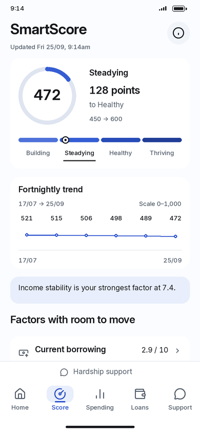

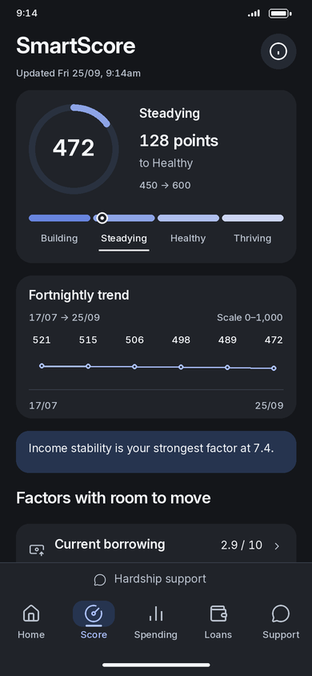

A 112 px ScoreRing and the next-stage distance sit in one compact summary. The StageScale is embedded below rather than repeating its standalone card heading and next-stage row. Its four bands remain equal-width ordinal stages; it is not a linear score axis. Jess's position is exactly 22/150 into Steadying.

The trend shows **521 → 515 → 506 → 498 → 489 → 472**. Its y-axis is fixed at **0–1,000** so a 49-point change is not visually exaggerated. Every value is labelled. The fortnightly dates are 17/07, 31/07, 14/08, 28/08, 11/09 and 25/09 in 2026. Tapping a point opens that date/value's detail; do not replace the series with a smooth invented curve.

The precise strength is visible in the opening view: “Income stability is your strongest factor at 7.4.” This is an ordinary factual note, not a badge or reward. The top three factors retain the supplied order. Gambling & alcohol spending uses ordinary neutral Layers treatment, the same row layout and no warning icon.

- [Frame smartscore-factors — light](screens/smartscore-factors-light.png)
- [Frame smartscore-factors — dark](screens/smartscore-factors-dark.png)
- [Frame smartscore-more-factors — light](screens/smartscore-more-factors-light.png)
- [Frame smartscore-more-factors — dark](screens/smartscore-more-factors-dark.png)

The continuation contains all **eight supplied factors**. No ninth factor, missing-factor score, name or weight is invented. The service's eventual nine-factor schema must provide the missing factor before a ninth row is added. Every row opens its own factor sheet; the range is out of 10 and values such as 5.0 retain one decimal place. Score is active.

## 6. factor-sheet — Jess

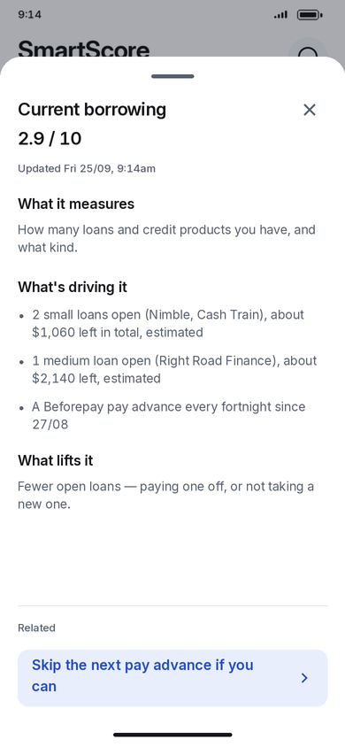

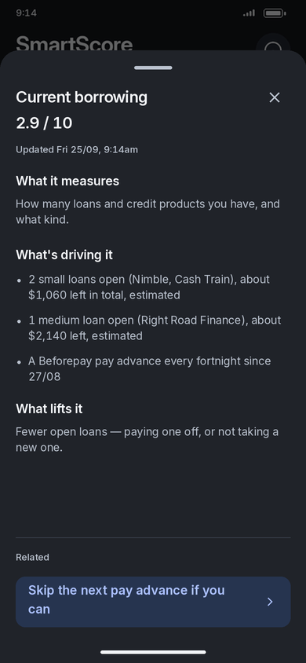

Current borrowing opens at the expanded 780 px sheet detent over the existing SmartScore screen. The title and `2.9 / 10` are two visual lines, with one accessible heading: “Current borrowing · 2.9 / 10”. The full supplied text fits without scrolling at the reference text size. The updated timestamp belongs to the factor, not the phone clock.

The three driving facts are ordinary neutral bullets. The estimate wording remains attached to each loan total; the advance observation is its own fact. The three open loans here are the two small loans and one medium loan. This does not count every BNPL product or advance as another open loan. “What lifts it” makes no point-gain or approval promise. The related card opens the existing Beforepay InsightSheet; it does not cancel an advance. A sheet-to-sheet transition replaces the current sheet and provides Back, keeping the underlying Score scroll position.

Geometry: sheet top y=64, handle y=84, title y=116, factor value y=149, timestamp y=186, body y=224. Body headings use `type.h3`, factual paragraphs `type.small` and `C.textMuted`, with `space[6]` between sections. Bullets are `C.neutral`. The related footer starts with a divider at y=684; its 64 px action uses `C.accentSoft`, `C.accent`, `radius.sm`. Padding is `space[5]`. The close icon has a 44 px target. At increased text sizes the body scrolls and the footer must not cover content.

## 7. spending-overview — Jess

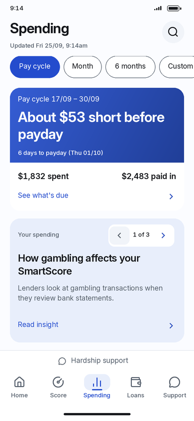

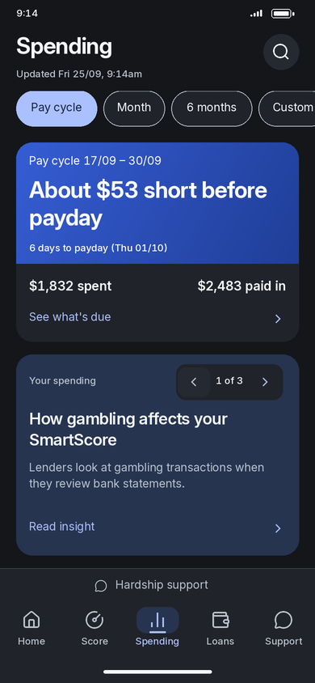

The opening view follows the requested sequence: period chips, the pay-cycle summary, then the supplied “1 of 3” insight. The donut and all 11 rounded CategoryRows continue below the fold. Each category uses the same 88 px minimum row, `radius.md`, 40 px icon tile, 24 px Lucide icon, typography and disclosure chevron. There is no extra gambling chip, warning treatment or lifestyle inference.

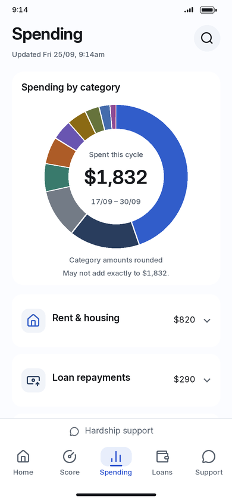

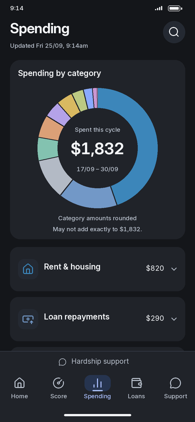

- [Frame spending-overview-categories — light](screens/spending-overview-categories-light.png)
- [Frame spending-overview-categories — dark](screens/spending-overview-categories-dark.png)
- [Frame spending-overview-more-categories — light](screens/spending-overview-more-categories-light.png)
- [Frame spending-overview-more-categories — dark](screens/spending-overview-more-categories-dark.png)

**Rounding is explicit.** The supplied category rows sum to $1,830; the supplied period total is $1,832. Both remain unchanged. The chart is an approximate composition from the explicitly rounded category amounts, with no percentage labels and the visible note “Category amounts rounded / May not add exactly to $1,832.” The specimen angles are `roundedCategoryAmount / 1830 × 360`; the centre is the supplied $1,832 total. No residual category or transaction is fabricated. Production should use reconciled unrounded category totals for exact angles and shares, while retaining the supplied display rounding. Until those values exist, retain the approximation label and suppress precise shares. An unexplained mismatch in unrounded production data remains the unavailable-data case from component 07; this narrow rounded-display exception does not permit silent normalisation of arbitrary mismatches.

The donut is 240 px with a 160 px hole. Categories start at 12 o'clock, clockwise, in the supplied order. Separators normally use 2 px `C.surface`. For the very small Subscriptions slice, cap a separator at one quarter of the smaller adjoining arc length at the inner radius; raster rendering uses a 0.5 px floor. This preserves a visible sliver without inflating its angle. The full-sized rows remain the precise-access alternative. All fills use `K[category]`, including neutral-slate `K.gambling`; labels/amounts use `C.text`, not category colours.

Tap a slice to select that category, update the centre to its name and amount, and filter the associated transaction view while retaining the period denominator. Apply component 07's contrast-safe dimming, outline and dismissible selection chip. Do not show an exact percentage with these rounded-only fixtures. Tapping again or removing the filter clears only the category selection. Category summaries independently expand merchants; “View transactions” in the expanded region opens the category-filtered list. No merchant names, counts or transactions were supplied, so none are invented in these captures. Search opens searchable transactions with the current period carried forward. Transactions remain recategorisable through component 08.

Period chips are mutually exclusive, 44 px high, with `space[2]` gaps. They form one horizontally scrollable, labelled group; the partially visible Custom chip indicates overflow. Keyboard focus scrolls the selected/focused option fully into view. Custom opens a date-range sheet. A period change updates hero, insight applicability, chart and rows together; stale data is not relabelled as the new period.

The compact PayCycleHero is 246 px high: a 150 px fixed cobalt brand header, historical totals and a 44 px “See what's due” action. The shortfall is stated plainly with the same brand colour as other pay-cycle states. The totals are $1,832 spent and $2,483 paid in; paid in is not relabelled income. Spent/paid-in each have separate non-overlapping targets opening their own transaction direction. The due action reuses `dashboard-due` and the full pay-cycle details: $314 balance, $367 due, $53 short, the $300 advance and $315 repayment including its $15 fee. No new arithmetic or forecast is inferred. Optional support stays reachable in the persistent navigation row.

The insight uses the ordinary InsightCard treatment: `C.accentSoft` container, `C.text` title, `C.textMuted` explanation, manual pager and “Read insight” link. That link opens screen 8. “1 of 3” is preserved as supplied; the other two insight contents require the service data and are not fabricated here. Do not autoplay, assign a fabricated point gain, or repeatedly reopen a dismissed sheet.

## 8. spending-sheet — Jess

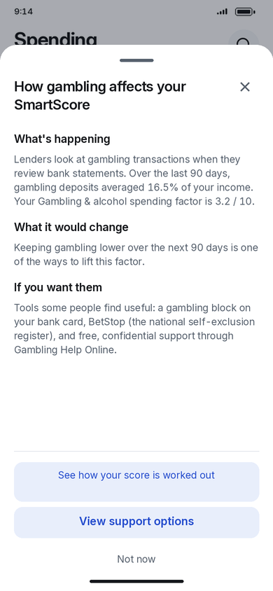

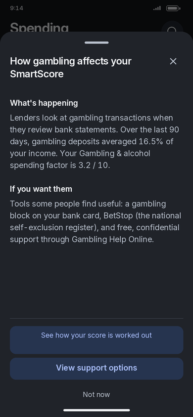

The gambling insight opens as an ordinary neutral sheet over Spending. The title is `type.h2`; the supplied paragraphs are `type.body` in `C.textMuted`. The 16.5% and 3.2 / 10 are inline facts, with no risk badge, warning icon, red treatment or giant percentage. Blocks are “What's happening” and “If you want them”. The optional “What it would change” block is omitted because no outcome copy was supplied; no score uplift is invented.

The footer has the exact three actions in the supplied order. “See how your score is worked out” opens the score-method explanation with this factor in context. It does not open an application. “View support options” replaces the insight with the same optional support content captured in `hardship-gambling-support`, with Back returning to the insight. “Not now”, close, Escape and scrim dismissal close without changing a relevance preference or deleting data. This is deliberately different from component 05's “Not relevant to me” action.

Footer divider y=644; first action y=660, height 56; support action y=724, height 44; Not now target y=776–820. The title begins at y=116; body at y=202. First and second actions use `C.accentSoft` / `C.accent`, avoiding a pushy hierarchy between learning and optional support. The dismiss label uses `type.small` / `C.textMuted`. At larger text sizes, allow the whole action area to participate in scrolling when needed.

## 9. loans — Jess

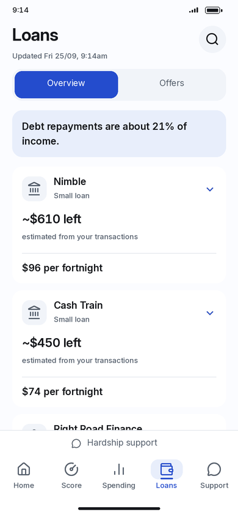

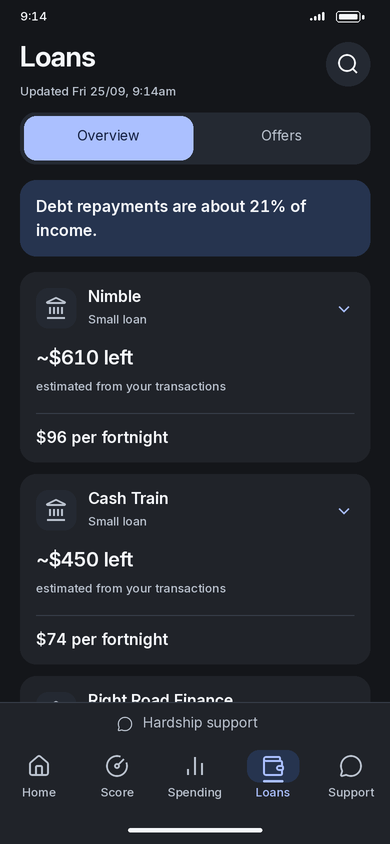

The Overview tab leads with the supplied fact “Debt repayments are about 21% of income.” It is not calculated from the $2,483 paid-in total, which includes a pay advance. The three instalment-loan cards come first; BNPL and the pay advance follow as separate product groups. All three estimated loan balances are explicitly labelled “estimated from your transactions”, including the approximately $2,140 Right Road Finance balance.

- [Frame loans-more — light](screens/loans-more-light.png)
- [Frame loans-more — dark](screens/loans-more-dark.png)
- [Frame loans-pay-advance — light](screens/loans-pay-advance-light.png)
- [Frame loans-pay-advance — dark](screens/loans-pay-advance-dark.png)

This introduces a compact LoanCard layout for a multi-product overview: 350 × 190, `radius.md`, `space[4]` padding, 40 px neutral icon tile, lender `type.h3`, product type and estimate provenance `type.caption`, balance `type.h2`, repayment `type.bodyStrong`. The source contract is unchanged; the card grows for long names or text scaling. A header button ≥64 high owns disclosure, including its 44 px chevron target. Expanding reveals the independently available facts and “View repayments”; missing original amounts, terms and rates stay unavailable rather than being guessed.

Afterpay and Zip cards are 108 px minimum because no balance was supplied. They display “Balance not available” alongside the independently known repayment. $45 remains per fortnight; $40 remains per month. Do not convert either frequency, show a zero balance, or treat the repayment as the amount owed. Beforepay separates $300 received on 24/09 from $315 due back Wed 30/09 and the ($300 + $15 fee) breakdown. Its source qualification remains visible. “View repayments” opens a visible, removable Beforepay transaction filter; it does not initiate a payment.

Overview/Offers uses component 10's actual tab-panel semantics, not a filter radio group: 52 px track, two 44 px targets, `radius.md` / `radius.sm`. Search opens connected loan-related transactions. Switching to Offers uses the current user's matching data and preferences. These Jess screens must never load Marcus's sample offer merely because both examples are in the handoff.

## 10. offers — Marcus

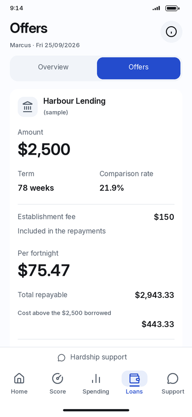

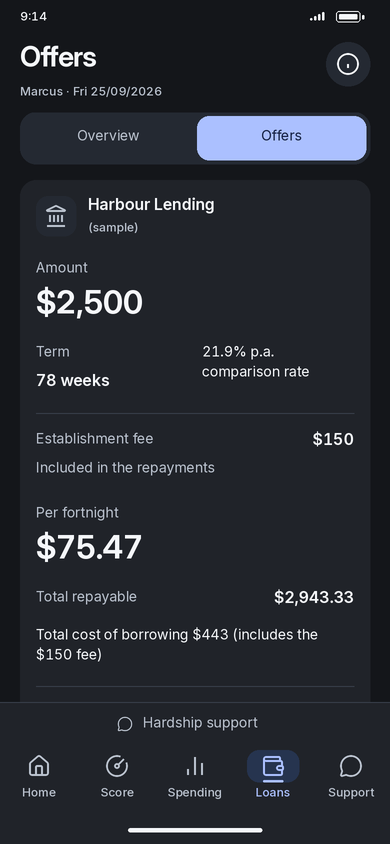

The single neutral OfferCard shows Harbour Lending with “(sample)” directly beneath its name. It has the same comparison-field order used for any lender: amount, term, comparison rate, establishment fee, repayment frequency and amount, total repayable, cost above the amount borrowed, then matching reasons. The sample is not an approval and has no urgency, countdown, exclusive colour, ranking or selected-lender state.

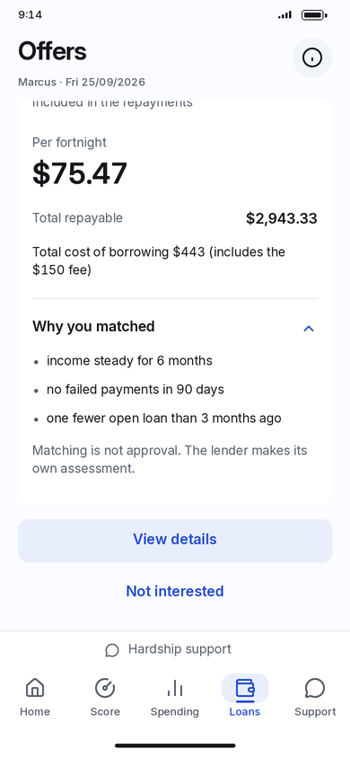

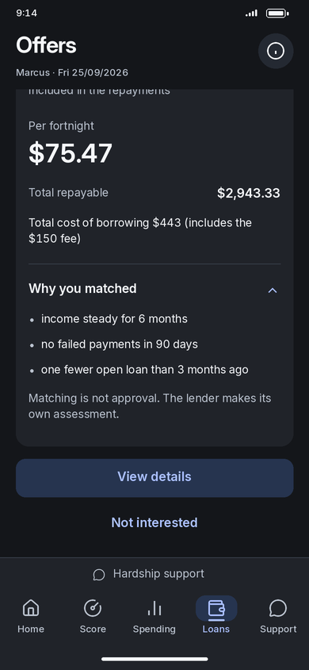

All supplied terms are preserved. The extra **$443.33** cost line is a labelled arithmetic derivative, not a new lender quote: `$2,943.33 − $2,500`. It excludes principal and does not add the included $150 fee again. The supplied schedule also reconciles exactly: `78 weeks / 2 = 39` fortnightly payments and `$75.47 × 39 = $2,943.33`. This arithmetic does not validate the comparison rate. The fixture supplies `21.9%` without a calculation basis or annual-unit disclosure; the mock-up retains that exact value. Component 13's live comparison-rate basis and `p.a.` disclosure must be sourced with real offer terms before enabling a live lender handoff, not fabricated for this sample.

The card is 350 × 736 at reference size, with `space[4]` padding and `radius.md`. Amount and fortnightly repayment use `type.figureL`; comparison fields `type.small` labels plus `type.h3` values; total repayable `type.h3`; derived cost `type.bodyStrong`. All values use `C.text`. Labels and qualifications use `C.textMuted`; dividers are decorative `C.line`. Matching reasons are open in this capture, ordinary bullets rather than ticks or badges, followed by the component's “Matching is not approval. The lender makes its own assessment.” The disclosure row toggles only this region.

“View details” is a 48 px secondary button; “Not interested” is a 44 px tertiary button. The former opens a Tippla offer-details sheet, retaining the displayed comparison terms and identifying any unavailable source disclosures in this sample. A real handoff requires full terms and an explicitly named lender destination; no application is submitted by opening details. The latter hides this offer ID after preference save, offers Undo, and does not turn off all matching. On failure keep the offer and show a neutral retry. The information icon opens the matching explanation and preference controls. Marcus's matching is on as supplied by the prior dashboard fixture; do not infer consent for Jess.

## 11. hardship

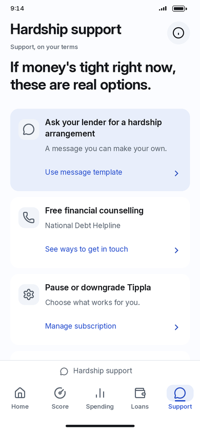

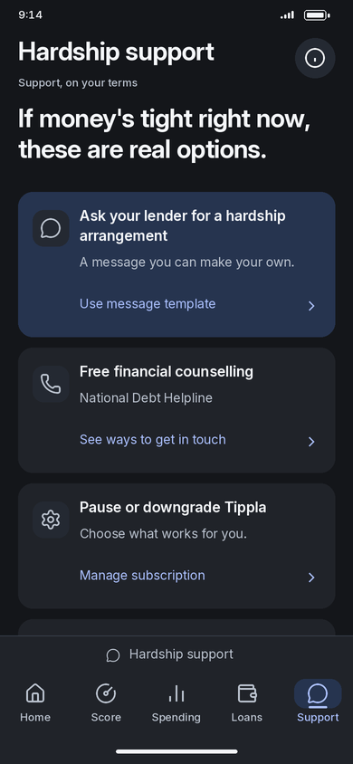

The exact opening sentence leads into four human-scale choices. The lender-message card gets the ordinary soft accent, not an alert. Counselling, changing Tippla and gambling support remain equally readable, with clear verbs, ordinary Lucide icons and no retention offer or credit application. A second capture exposes the full fourth card without reducing text size.

- [Frame hardship-options — light](screens/hardship-options-light.png)
- [Frame hardship-options — dark](screens/hardship-options-dark.png)
- [Frame hardship-template — light](screens/hardship-template-light.png)
- [Frame hardship-template — dark](screens/hardship-template-dark.png)
- [Frame hardship-counselling — light](screens/hardship-counselling-light.png)
- [Frame hardship-counselling — dark](screens/hardship-counselling-dark.png)
- [Frame hardship-gambling-support — light](screens/hardship-gambling-support-light.png)
- [Frame hardship-gambling-support — dark](screens/hardship-gambling-support-dark.png)

The cards use `radius.md`, `space[4]` horizontal padding, a 40 px `C.surface2` icon tile with a 24 px `C.neutral` icon, `type.h3` titles and `type.small` descriptions. Text wraps and card heights grow. Each action is one full-width labelled button ≥44 high. Do not make the parent card another nested interactive target. Headline uses `type.h1`. Support navigation remains selected; the persistent Hardship support link returns to the top of this page rather than opening a duplicate route. The information icon explains available Tippla support and contact choices.

“Use message template” opens the provided editable text area. The message asks what arrangements and information the lender needs; it makes no promise of acceptance. Copy message writes only the edited text to the clipboard and shows a non-blocking “Message copied” toast. It never sends a message, chooses a lender, populates a recipient or submits a request. Placeholder brackets remain visibly editable. Keep edits in memory when the keyboard changes size; explicit Cancel discards this draft. If clipboard permission fails, retain the selectable text and offer manual copy. Do not require a separate permission confirmation inside the product before ordinary copying.

“See ways to get in touch” opens the National Debt Helpline sheet. Call uses `tel:1800007007`; Visit opens `https://ndh.org.au/` with a visible external-link cue. The mock-up quotes the official site's weekday telephone hours but does not show an unverified “Open now” state. Keep current hours and service availability in maintained service configuration; offer the website when the user arrives outside call hours.

“Manage subscription” opens the customer's subscription controls with pause and downgrade choices where supported. The fixture does not provide Jess's plan, eligibility, timing, refund policy or resulting access, so none is invented in a screenshot. The implementation must show the actual billing/access effect and effective date before the final change action. Do not imply that opening this card has paused billing, hide cancellation, require hardship disclosure, or add a lender offer to this path.

“View support options” opens the supplied neutral optional-support sheet. Gambling Help Online and BetStop are labelled external destinations. BetStop's scope is licensed Australian online and phone wagering providers, not a universal block on every gambling venue or transaction. The bank-card block paragraph tells the customer to ask their own bank about availability and coverage; it does not promise that TaleFin can activate a bank setting. Not now closes the sheet. Entering this support path does not change a score or notify a lender.

## 12. calendar — Jess

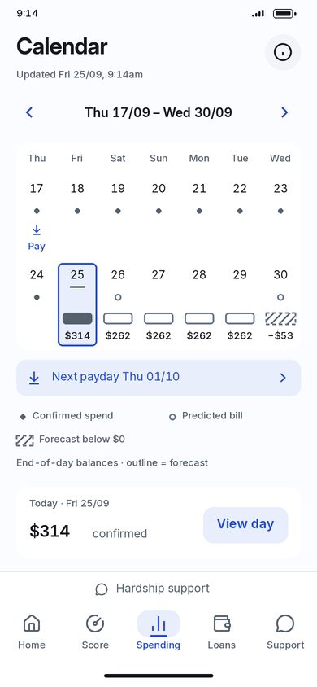

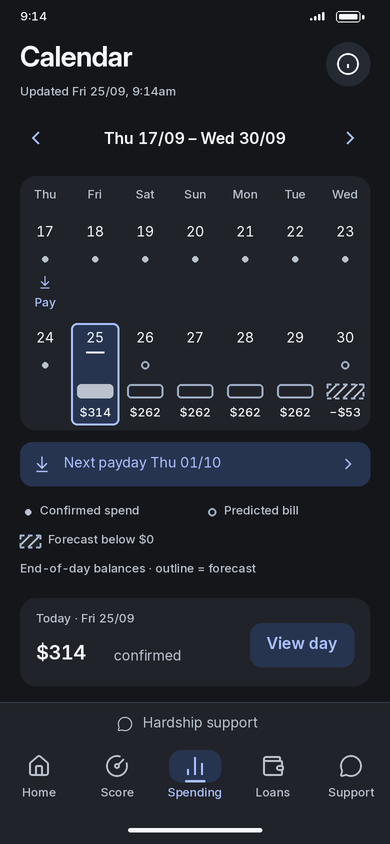

The grid has exactly 14 dates in two rows of seven, with fixed column order **Thu, Fri, Sat, Sun, Mon, Tue, Wed**. It begins Thu 17/09/2026 and ends Wed 30/09/2026. Today and the initial selected date are both Fri 25/09/2026. Today uses the date underline; selection independently uses the outline and soft fill. No date, status or countdown is calculated from the device's current date in these fixtures.

The stated payday on 17/09 uses `ArrowDownToLine` and “Pay”, in a separate lane below confirmed-spend presence. “Next payday Thu 01/10” is the separate full-width edge marker immediately after the last row. It is **not a fifteenth cell** and does not enter this fortnight's totals. Neither marker invents a deposit amount or turns a scheduled payday into a confirmed income receipt. Wages and Centrelink share the same treatment.

Days 17–24 each have one solid neutral dot to indicate the supplied confirmed-spending presence. This is an aggregate day marker, **not a count of one transaction** or an invented category. There are no individual historical transaction amounts, categories or counts in the fixture, so a fetched day ledger must provide those details. Today's spend-event list is unspecified and receives no invented marker. Only 26/09 and 30/09 have hollow predicted-bill markers; 27–29 have no bill dots. A forecast balance is not itself a bill.

Known end-of-day balances appear beneath their dates: confirmed $314 on 25/09; forecast $262 on each of 26–29/09; forecast −$53 on 30/09. No historical balance is guessed. The only negative **day** strip is 30/09, using the predicted hatch from component 11: neutral 2 px diagonal strokes at 10 px pitch, surface background and dashed predicted outline. No confirmed negative strip appears. The legend's separate pattern swatch is a key, not another day.

The small 36 × 14 strips encode balance **status**, not magnitude: confirmed positive is solid `C.neutral`, forecast non-negative is a hollow `CH.predicted` outline, forecast negative is the specified open hatch. Their equal widths must not be described as a quantitative bar chart. Exact dollar labels carry the amount. They use `type.caption` / `C.text`; unknown historical balances have no strip or amount, rather than $0. This extends CalendarCell with explicit non-negative balance and aggregate-spend-presence variants without changing its negative-state semantics.

At 390 px the 350 px grid uses 50 px columns and 106 px reference-height cells. The taller cells accommodate independent event/payday/balance lanes. The grid's card has no horizontal inner padding. Weekday headings are `type.caption`; dates `type.small`; date range `type.h3`. The edge marker is 44 high with `radius.sm`, `C.accentSoft` and `C.accent`. The separate selected-day summary is 88 high, with a 44 px “View day” control. Selection does not change the meaning of event colours or balances.

- [Frame calendar-telstra — light](screens/calendar-telstra-light.png)
- [Frame calendar-telstra — dark](screens/calendar-telstra-dark.png)
- [Frame calendar-forecast — light](screens/calendar-forecast-light.png)
- [Frame calendar-forecast — dark](screens/calendar-forecast-dark.png)

Selecting a date opens its day sheet and restores focus to that date on close. The Telstra sheet retains $52 and the forecast $262 closing balance. The 30/09 sheet retains Beforepay $315, the $300 + $15 fee breakdown, and the −$53 forecast. Their equations are transparent arithmetic from supplied values: $314 − $52 = $262; $262 − $315 = −$53. They do not imply either debit has posted. “See what is included” opens the dated projection inputs and source transactions, replacing the sheet content with Back. Missing inputs remain unavailable; no synthetic ledger rows. The hardship action opens the same optional support path as other financial details.

The latest calendar fixture explicitly classifies **Beforepay on 30/09 as predicted**. This resolves the previously unspecified prediction flag in the earlier due-item fixture; these calendar sheets and the new desktop drawer use that explicit status. The earlier mobile due sheets and implementation fixture now use the same predicted classification; all views are consistent.

The range arrows move by one fortnight, retaining Thu–Wed order. The edge marker opens the fortnight containing 01/10 and focuses that payday. Unknown next-period amounts are fetched, not inferred. The information control explains confirmed/predicted markers and data freshness. Use the component 11 keyboard grid behaviour, full accessible dates including 2026, current-date semantics and a labelled list alternative when seven 44 px columns cannot fit. Do not expose event dots or strips as tiny separate buttons.

## 13. consents — onboarding, light mode

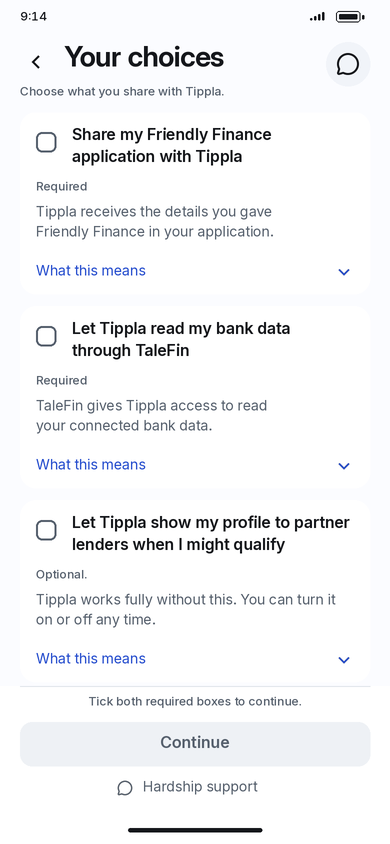

Three independent native checkboxes start **unchecked**. The first two are labelled Required. The third is labelled Optional and has the exact supplied explanation: “Optional. Tippla works fully without this. You can turn it on or off any time.” The word “Optional.” is visually separated as the status line; it remains part of the same accessible description. Every title uses the same `type.h3`, every explanation uses `type.small`, and every row has the same 182 px reference height, surface, border treatment, spacing and 20 px checkbox. There is no recommended state, persuasive benefit, all-in-one permission, different-sized optional control or preselected lender matching.

The added two-line explanations for the required consents are neutral product copy:

- Application: “Tippla receives the details you gave Friendly Finance in your application.”
- Bank: “TaleFin gives Tippla access to read your connected bank data.”

Each “What this means” expander is a separate native button, with `aria-expanded` and `aria-controls`. It does not toggle the checkbox. Multiple expanders may be open; opening one does not close another, alter selection or enable Continue. Expanded content stays inside its own card and increases its height. Full copy for all three expanders is provided in the fixture block below. No unspecified retention period, field inventory, lender list, deletion policy or TaleFin authorisation capability is invented.

- [Frame consents-ready — light](screens/consents-ready-light.png)
- [Frame consents-optional-details — light](screens/consents-optional-details-light.png)

The ready state shows only the two required boxes ticked: Continue is enabled and the third box remains off. This is a state **after explicit user actions**, not the initial default. The enablement rule is `application && bank && !isSubmitting`; matching has no role in that expression. Unticking either required box disables Continue again without changing any other selection. The disabled button retains legible `C.textMuted` on `C.neutralSoft`, plus the explanatory line “Tick both required boxes to continue.” No red validation is needed on the untouched form. Loading/error behaviour follows component 15, preserving choices after recoverable failures.

On Continue, submit three separately named choices, purpose/text versions and the actual consent-recording event to the service. Record which optional choice was made; do not infer true from continuing, bank connection or an offer view. This advances to bank connection after a successful save, not to a loan application or partner handoff. Reading bank data still depends on completing the provider's authorisation. Partner-profile sharing must check the committed optional choice before each sharing operation. The user can later change it under Account → Privacy & consents; the product/service must apply that choice rather than treating onboarding as irrevocable. Do not invent retrospective deletion behaviour for data already shared.

This introduces an onboarding shell: Back and Support in the header, a scrolling permission form, then a fixed Continue footer with the visible Hardship support link. The primary app tabs are omitted before setup so they do not become dead or consent-bypassing routes. This exception is limited to onboarding; all authenticated primary mobile screens retain the five-tab bar. Back returns to the prior onboarding step and preserves local choices; Support and Hardship support remain usable without ticking any box.

Reference geometry: header 112; form y=112–686; footer y=686–844. Cards are 350 wide, `radius.md`, `space[4]` padding, `space[3]` vertical gaps. Checkboxes use component 15's 20 px box and 2 px `C.neutral` outline; selected fill `C.accent` with `C.onAccent` check. Label hit regions are at least 44 high and do not overlap their expanders. The expander occupies the bottom 44 px of each collapsed card. Continue is 44 high at y=722. Hardship support has a separate 44 px target y=766–810, followed by the 34 px illustrated safe area. At increased text size, grow cards and scroll content; do not pin a partially clipped checkbox under the footer.

## 14. dashboard-desktop — Jess, light mode

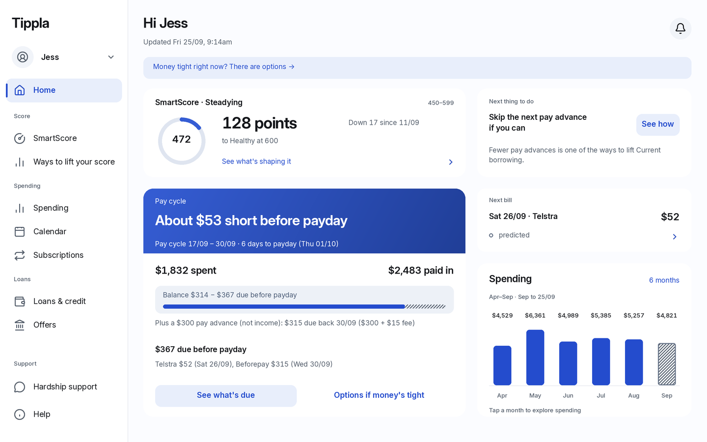

All supplied Prompt 2 dashboard content fits in the 1440 × 900 reference viewport. The score and next step form the first content row; the pay-cycle card occupies the main column, with the next bill and six-month spending in the adjacent column. The reading order remains score → next action → pay cycle → next bill → spending. The only contextual banner is the supplied gentle money-tight prompt. No desktop-only financial summary, additional balance, forecast income or new KPI has been invented.

The SmartScore remains 472 / Steadying, with “Down 17 since 11/09” in neutral text, a 22/150 stage-progress arc, and “128 points to Healthy at 600”. The path remains larger than the score number. The action preserves the exact title, rationale and “See how” button. Pay cycle preserves the shortfall $53, $314 balance, $367 due, dates and six-day countdown, $1,832 spent, $2,483 paid in, the $300 advance and $315 due including its $15 fee. The full Telstra/Beforepay due summary is visible. Next bill is Sat 26/09 · Telstra · $52 · predicted. Monthly values remain $4,529, $6,361, $4,989, $5,385, $5,257 and $4,821, with September clearly partial to 25/09. The bars share a 0–7,000 scale and never turn green when spending rises.

**Desktop width:** `layout.desktopSidebar` is **260 px** in tokens v1.0.1, matching this screen and component 17. No local width override is needed. The 420 px drawer remains exactly `layout.drawerWidth`.

The main content begins at x=292: 260 px rail plus `space[7]` = 32 px gutter. The right outer gutter is also 32. Main/side columns are 656 and 436 px with `space[6]` = 24 px between them. Top cards are y=180–360; lower cards y=384–848. Content is never scaled as a larger screenshot of the mobile page. Typography and colours remain the shared tokens; only layout and information placement change. The fixed cobalt pay-cycle gradient is the same brand treatment used on mobile.

The rail has the exact requested groups and visible order: Home; Score → SmartScore, Ways to lift your score; Spending → Spending, Calendar, Subscriptions; Loans → Loans & credit, Offers; Support → Hardship support, Help. Group labels are ordinary non-interactive headings, not expandable menus. Route rows are 48 px high with 24 px Lucide icons; Home has the shared soft selection and 3 px leading rule. The Profile/Jess control opens Account. Bell opens notifications. Navigation links use `aria-current=page`, not tablist semantics.

Keep the 164 px Support region pinned at the rail bottom. The account/brand region does not shrink, and the middle navigation region can scroll at short window heights. Hardship support and Help never depend on scrolling that middle region. At the reference viewport, everything fits without a sidebar scrollbar. Below the desktop breakpoint use the mobile shell and five tabs; at intermediate desktop widths stack content when the 656/436 columns no longer fit while retaining readable font sizes and targets.

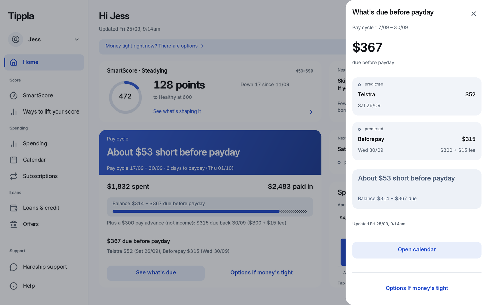

“See what's due” opens the 420 px drawer at x=1020–1440, height 900. It has `radius.xl` left corners, `space[5]` inner padding, no drag handle, and the shared scrim over the entire underlying app. It shows $367 due, Telstra $52 and Beforepay $315 as predicted, the Beforepay fee breakdown, and the same $53 shortfall arithmetic. The latest calendar fixture supplies Beforepay's predicted status. The timestamp stays attached to the data, and the support action remains inside the active modal.

The drawer body scrolls if needed; the support footer is pinned below y=804 in this reference. Close is a 44 px target, Escape closes, focus is contained and restored, and background navigation is inert even though the sidebar remains visible through the scrim. “Open calendar” closes the drawer and navigates to the same Jess fortnight. “Options if money's tight” opens Hardship support. Do not stack another scrim or retain hidden interactive content behind a replacement drawer. Other mobile details, including factors and insights, use this same right-side drawer shell on desktop.

The hardship banner/sidebar link/pay-cycle support action converge on Hardship support. “See what's shaping it” opens SmartScore; “See how” opens the Beforepay insight; the next-bill card opens 26/09 calendar details. Spent/paid-in totals open their corresponding period-filtered transaction lists, and a month bar opens that month's spending. The six-month control opens the period selector. Preserve these as separate targets rather than making an entire card a button containing nested controls.

## New and refined patterns

### Mobile viewport and navigation

The app content is 350 px wide using `layout.gutter = 20`, and the viewport is 390 × 844. Standard pages have 112 px of status/header chrome; reveals have 96. The fixed navigation stack begins at y=702: plain support row 44, tab bar 64, illustrated bottom safe area 34. Actual implementations use the device safe-area inset, not a hard-coded 34.

This introduces a **plain support-row variant** for component 17: transparent `C.surface` background, 16 px `MessageCircle` and `type.small` label in `C.textMuted`, whole row target ≥44. It makes Hardship support continuously visible without adding a second contextual banner to Marcus's dashboard. The five tabs retain their selected soft container plus solid underline. The contextual money-tight/offer banners remain independent components near the top of Home.

Reveals add an 80 px fixed CTA area above the dock: a 48 px primary button with 16 px top/bottom space. Their scrollable region is y=96–622. Other pages scroll in y=112–702. App content, including all factor rows and chart hit targets, receives bottom padding so it can be scrolled fully clear of the dock. Supplemental captures show genuine scroll positions; partial cards at the top or bottom are viewport crops, not truncated component content.

While a modal is open, the scrim makes underlying navigation inert. The due sheet provides its own support action. The OS home indicator is reference chrome, not an app-drawn control. The OS time 9:14 is illustrative chrome matching Jess's supplied update time; Marcus is only given a date, so his data timestamp does not acquire an invented update time.

### Compact SmartScoreCard

New composition from ScoreRing small + explicit stage text: 350 × 168, `radius.lg`, `C.surface`, 16 px inner padding. Header is `type.h3`/`C.text`; the current range is `type.caption`/`C.textMuted`. Ring is 48 × 48 with 4 px stroke, actual stage progress and no centre number. The distance is `type.h2`, target label `type.small`, delta `type.caption`; the next-stage path is more prominent than the score number. The bottom link is a 44 px target opening Score. All states use the same layout and colours. No positive/negative delta variant is created.

### Compact next-step card

RecommendationCard gains a dense Home composition: 350 wide, `radius.md`, `C.surface`, inner `space[4]`. Context label is `type.caption`; title `type.h3`; rationale `type.small`/`C.textMuted`. “See how” is an 88 × 44 secondary button beside the title. Title gets 218 px; body gets the full 318 px. At larger text sizes move the button below the copy and grow the card; never truncate advice or shrink its type. This is still one recommendation, with only one action in the compact view.

### Embedded stage path and compact factor rows

The SmartScore summary embeds StageScale in a 216 px card. Its inner strip width is 318: `(318 − 3×4)/4 = 76.5` px per band, 8 px high. Marker position from the strip's left is `76.5 + 4 + 76.5×22/150 = 91.72` px. The stage colours and 14 px marker match the component contract; labels use `type.caption`. Each stage remains a 44 px information target and never acts as a draggable slider.

FactorTile gains a list-density variant: width 350, `radius.md`, padding `space[4]`, 80 px minimum height, 20 px Lucide icon, `type.h3` name and `type.small` numeric value. Current borrowing is 100 px because its supplied explanation adds a line. Gap is `space[2]`. A two-line factor name fits without changing emphasis; at 200% text the row grows and the value may move below the name. No factor-value bar or colour-coded risk scale is introduced. All eight rows are equally interactive.

### PayCycleHero with a supplied forecast but no balance

Jess uses the existing shortfall equation and bill-coverage strip. Marcus uses the same branded header and neutral historical totals but omits the coverage strip because a balance denominator was not supplied. The $1,700 figure is a supplied forecast, not a value reconstructed from paid-in minus spent. Future discretionary spending is not silently assumed to be zero in any additional calculation.

Due items sit one tap down in a 390 px BottomSheet. Main copy uses `type.h2`, `type.h1`, `type.h3` and `type.small` as shown; rows are 80 high with `space[3]` gaps and `radius.sm`. Predicted rows have the complete dashed `CH.predicted` outline and the visible word “predicted”. Unknown prediction status is not the same as confirmed. The footer is a 48 px secondary support action with safe-area space. Closing restores focus to “See what's due”.

### Six-month spending as a control

The chart card is 350 × 244, `radius.lg`, with `type.h2` title, `type.caption` month/value labels and a 44 px period-selector target. Apr–Aug bars use `C.accent` in both themes for both people; Sep uses neutral hatch plus a `CH.predicted` outline and the explicit “Sep to 25/09” caption. Hatch here means an incomplete period, not predicted spending. Actual September amounts remain actual supplied totals to date.

Both charts share a zero baseline and a 0–$7,000 height domain. Each bar is 24 px wide within a ≥44 px month target. Exact values above the bars keep the amounts readable without estimating bar heights. Tapping a month opens Spending with that month selected and filters categories/transactions together. September ends at the snapshot date, not 30/09. “6 months” opens the period selector; it is not decorative text. The chart does not label increasing spending as good or a partial September decline as improvement.

### Trend controls and reading order

The trend's six equally spaced points have non-overlapping ≥44 px hit zones. The line is `C.accent`, 2 px, with 6 px hollow points; value/date labels are `type.caption` in text tokens. A semantic date/value list exposes all six readings to assistive technology. Selection uses a value/date detail sheet and an outline, not a red/green change badge. Header Info opens “About SmartScore”; dashboard Bell opens notifications without a fabricated unread count.

### Responsive and accessibility rules

Keep native links/buttons, clear accessible names and visible focus from `focusRing`. Static screenshots do not demonstrate focus, keyboard operation, hit-area behaviour or 200% text support; those require implementation testing. At larger text, stack dense two-column content, grow fixed regions and recalculate the scroll inset. Remove nonessential movement under reduced motion. Do not expose braced placeholders or unavailable financial values as zero.

No token values are changed. Every display/caption contrast pair is checked at the normal-text 4.5:1 target; stage/category graphics, hatching and essential outlines use 3:1. Decorative dividers and empty ring tracks do not carry unique state information. Future production accessibility testing remains necessary.

## Fixture data — screens 1–5

The following data is the implementation fixture, not new scoring logic. `predicted: null` means the prompt did not provide prediction status. Priya's missing score and Marcus's missing current balance are deliberately null.

```json
{
  "asOf": "25/09/2026",
  "jess": {
    "name": "Jess",
    "updated": "Updated Fri 25/09, 9:14am",
    "smartScore": 472,
    "stage": "Steadying",
    "stageRange": [
      450,
      599
    ],
    "nextStage": "Healthy",
    "nextStageAt": 600,
    "pointsToGo": 128,
    "delta": "Down 17 since 11/09",
    "revealHeadline": "Your SmartScore is 472.",
    "revealLine": "That puts you in the Steadying stage. Here's what's shaping it, and the first thing that would move it.",
    "biggestFactor": "Current borrowing · 2.9 / 10 — you have 3 loans open.",
    "actionTitle": "Skip the next pay advance if you can",
    "actionBody": "You've taken a $300 Beforepay advance every fortnight since 27/08. Each costs $15 and comes out the day before payday.",
    "actionRationale": "Fewer pay advances is one of the ways to lift Current borrowing.",
    "hardshipBanner": "Money tight right now? There are options →",
    "cycle": "Pay cycle 17/09 – 30/09",
    "countdown": "6 days to payday (Thu 01/10)",
    "forecastHeadline": "About $53 short before payday",
    "balance": "$314",
    "dueBeforePayday": "$367",
    "spent": "$1,832",
    "paidIn": "$2,483",
    "advanceDisclosure": "Includes a $300 pay advance, $315 due back 30/09 ($300 + $15 fee)",
    "dueItems": [
      {
        "name": "Telstra",
        "amount": "$52",
        "date": "Sat 26/09",
        "predicted": true
      },
      {
        "name": "Beforepay",
        "amount": "$315",
        "date": "Wed 30/09",
        "predicted": true
      }
    ],
    "nextBill": "Sat 26/09 · Telstra · $52 · predicted",
    "spendingMonths": [
      "Apr",
      "May",
      "Jun",
      "Jul",
      "Aug",
      "Sep"
    ],
    "monthlySpending": [
      4529,
      6361,
      4989,
      5385,
      5257,
      4821
    ],
    "partialMonth": "Sep to 25/09",
    "trend": [
      {
        "date": "17/07/2026",
        "score": 521
      },
      {
        "date": "31/07/2026",
        "score": 515
      },
      {
        "date": "14/08/2026",
        "score": 506
      },
      {
        "date": "28/08/2026",
        "score": 498
      },
      {
        "date": "11/09/2026",
        "score": 489
      },
      {
        "date": "25/09/2026",
        "score": 472
      }
    ],
    "factors": [
      {
        "name": "Current borrowing",
        "value": 2.9
      },
      {
        "name": "Gambling & alcohol spending",
        "value": 3.2
      },
      {
        "name": "Money left over",
        "value": 3.4
      },
      {
        "name": "Payments on time",
        "value": 5.6
      },
      {
        "name": "Spending mix",
        "value": 5.0
      },
      {
        "name": "Cash use",
        "value": 6.1
      },
      {
        "name": "Payment track record",
        "value": 6.8
      },
      {
        "name": "Income stability",
        "value": 7.4
      }
    ],
    "strength": "Income stability is your strongest factor at 7.4."
  },
  "priya": {
    "name": "Priya",
    "smartScore": null,
    "stage": null,
    "message": "We need a bit more history to work out your SmartScore — usually 90 days. We'll calculate it automatically.",
    "expectation": "We expect to have enough history around 10/11/2026.",
    "sectionTitle": "What we can already see",
    "payCycle": "24/09 – 07/10",
    "pay": "about $1,960",
    "cadence": "every second Thursday",
    "historyDays": 45,
    "usualHistoryDays": 90,
    "estimatedReadyDate": "10/11/2026"
  },
  "marcus": {
    "name": "Marcus",
    "lenderMatching": true,
    "offerBanner": "You have 1 new offer →",
    "smartScore": 612,
    "stage": "Healthy",
    "stageRange": [
      600,
      749
    ],
    "nextStage": "Thriving",
    "nextStageAt": 750,
    "pointsToGo": 138,
    "delta": "Up 11 since 11/09",
    "actionTitle": "Money left over is your lowest factor at 5.9",
    "actionBody": "Keeping more of each pay left after bills is one of the ways to lift it.",
    "cycle": "Pay cycle 24/09 – 07/10",
    "countdown": "13 days to payday (Thu 08/10)",
    "spent": "$221",
    "paidIn": "$1,335",
    "dueBeforePayday": "$663",
    "dueItems": [
      {
        "name": "Qld Housing Rent",
        "amount": "$560",
        "date": "Sat 26/09",
        "predicted": true
      },
      {
        "name": "Telstra",
        "amount": "$52",
        "date": "Sat 26/09",
        "predicted": null
      },
      {
        "name": "Afterpay",
        "amount": "$32",
        "date": "Thu 01/10",
        "predicted": null
      },
      {
        "name": "Netflix",
        "amount": "$18.99",
        "date": "Tue 06/10",
        "predicted": null
      }
    ],
    "forecastHeadline": "About $1,700 left after bills",
    "currentBalance": null,
    "nextBill": "Sat 26/09 · Qld Housing Rent · $560 · predicted",
    "spendingMonths": [
      "Apr",
      "May",
      "Jun",
      "Jul",
      "Aug",
      "Sep"
    ],
    "monthlySpending": [
      3526,
      3094,
      3373,
      3979,
      4433,
      2249
    ],
    "partialMonth": "Sep to 25/09"
  }
}
```

## Capture manifest — screens 1–5

Scroll positions are measured from the beginning of each screen’s scrollable content, not the full viewport. Overlay captures inherit the background scroll position.

```json
[
  {
    "file": "score-reveal-light.png",
    "theme": "light",
    "person": "Jess",
    "tab": "Score",
    "scrollY": 0,
    "contentHeight": 900,
    "viewportContentTop": 96,
    "viewportContentBottom": 622,
    "overlay": false
  },
  {
    "file": "score-reveal-details-light.png",
    "theme": "light",
    "person": "Jess",
    "tab": "Score",
    "scrollY": 374,
    "contentHeight": 900,
    "viewportContentTop": 96,
    "viewportContentBottom": 622,
    "overlay": false
  },
  {
    "file": "score-reveal-thinfile-light.png",
    "theme": "light",
    "person": "Priya",
    "tab": "Score",
    "scrollY": 0,
    "contentHeight": 490,
    "viewportContentTop": 96,
    "viewportContentBottom": 622,
    "overlay": false
  },
  {
    "file": "dashboard-light.png",
    "theme": "light",
    "person": "Jess",
    "tab": "Home",
    "scrollY": 0,
    "contentHeight": 1316,
    "viewportContentTop": 112,
    "viewportContentBottom": 702,
    "overlay": false
  },
  {
    "file": "dashboard-pay-cycle-light.png",
    "theme": "light",
    "person": "Jess",
    "tab": "Home",
    "scrollY": 400,
    "contentHeight": 1316,
    "viewportContentTop": 112,
    "viewportContentBottom": 702,
    "overlay": false
  },
  {
    "file": "dashboard-spending-light.png",
    "theme": "light",
    "person": "Jess",
    "tab": "Home",
    "scrollY": 726,
    "contentHeight": 1316,
    "viewportContentTop": 112,
    "viewportContentBottom": 702,
    "overlay": false
  },
  {
    "file": "dashboard-due-light.png",
    "theme": "light",
    "person": "Jess",
    "tab": "Home",
    "scrollY": 400,
    "contentHeight": 1316,
    "viewportContentTop": 112,
    "viewportContentBottom": 702,
    "overlay": true
  },
  {
    "file": "dashboard-improving-light.png",
    "theme": "light",
    "person": "Marcus",
    "tab": "Home",
    "scrollY": 0,
    "contentHeight": 1148,
    "viewportContentTop": 112,
    "viewportContentBottom": 702,
    "overlay": false
  },
  {
    "file": "dashboard-improving-pay-cycle-light.png",
    "theme": "light",
    "person": "Marcus",
    "tab": "Home",
    "scrollY": 400,
    "contentHeight": 1148,
    "viewportContentTop": 112,
    "viewportContentBottom": 702,
    "overlay": false
  },
  {
    "file": "dashboard-improving-spending-light.png",
    "theme": "light",
    "person": "Marcus",
    "tab": "Home",
    "scrollY": 558,
    "contentHeight": 1148,
    "viewportContentTop": 112,
    "viewportContentBottom": 702,
    "overlay": false
  },
  {
    "file": "dashboard-improving-due-light.png",
    "theme": "light",
    "person": "Marcus",
    "tab": "Home",
    "scrollY": 400,
    "contentHeight": 1148,
    "viewportContentTop": 112,
    "viewportContentBottom": 702,
    "overlay": true
  },
  {
    "file": "smartscore-light.png",
    "theme": "light",
    "person": "Jess",
    "tab": "Score",
    "scrollY": 0,
    "contentHeight": 1338,
    "viewportContentTop": 112,
    "viewportContentBottom": 702,
    "overlay": false
  },
  {
    "file": "smartscore-factors-light.png",
    "theme": "light",
    "person": "Jess",
    "tab": "Score",
    "scrollY": 502,
    "contentHeight": 1338,
    "viewportContentTop": 112,
    "viewportContentBottom": 702,
    "overlay": false
  },
  {
    "file": "smartscore-more-factors-light.png",
    "theme": "light",
    "person": "Jess",
    "tab": "Score",
    "scrollY": 748,
    "contentHeight": 1338,
    "viewportContentTop": 112,
    "viewportContentBottom": 702,
    "overlay": false
  },
  {
    "file": "score-reveal-dark.png",
    "theme": "dark",
    "person": "Jess",
    "tab": "Score",
    "scrollY": 0,
    "contentHeight": 900,
    "viewportContentTop": 96,
    "viewportContentBottom": 622,
    "overlay": false
  },
  {
    "file": "score-reveal-details-dark.png",
    "theme": "dark",
    "person": "Jess",
    "tab": "Score",
    "scrollY": 374,
    "contentHeight": 900,
    "viewportContentTop": 96,
    "viewportContentBottom": 622,
    "overlay": false
  },
  {
    "file": "score-reveal-thinfile-dark.png",
    "theme": "dark",
    "person": "Priya",
    "tab": "Score",
    "scrollY": 0,
    "contentHeight": 490,
    "viewportContentTop": 96,
    "viewportContentBottom": 622,
    "overlay": false
  },
  {
    "file": "dashboard-dark.png",
    "theme": "dark",
    "person": "Jess",
    "tab": "Home",
    "scrollY": 0,
    "contentHeight": 1316,
    "viewportContentTop": 112,
    "viewportContentBottom": 702,
    "overlay": false
  },
  {
    "file": "dashboard-pay-cycle-dark.png",
    "theme": "dark",
    "person": "Jess",
    "tab": "Home",
    "scrollY": 400,
    "contentHeight": 1316,
    "viewportContentTop": 112,
    "viewportContentBottom": 702,
    "overlay": false
  },
  {
    "file": "dashboard-spending-dark.png",
    "theme": "dark",
    "person": "Jess",
    "tab": "Home",
    "scrollY": 726,
    "contentHeight": 1316,
    "viewportContentTop": 112,
    "viewportContentBottom": 702,
    "overlay": false
  },
  {
    "file": "dashboard-due-dark.png",
    "theme": "dark",
    "person": "Jess",
    "tab": "Home",
    "scrollY": 400,
    "contentHeight": 1316,
    "viewportContentTop": 112,
    "viewportContentBottom": 702,
    "overlay": true
  },
  {
    "file": "dashboard-improving-dark.png",
    "theme": "dark",
    "person": "Marcus",
    "tab": "Home",
    "scrollY": 0,
    "contentHeight": 1148,
    "viewportContentTop": 112,
    "viewportContentBottom": 702,
    "overlay": false
  },
  {
    "file": "dashboard-improving-pay-cycle-dark.png",
    "theme": "dark",
    "person": "Marcus",
    "tab": "Home",
    "scrollY": 400,
    "contentHeight": 1148,
    "viewportContentTop": 112,
    "viewportContentBottom": 702,
    "overlay": false
  },
  {
    "file": "dashboard-improving-spending-dark.png",
    "theme": "dark",
    "person": "Marcus",
    "tab": "Home",
    "scrollY": 558,
    "contentHeight": 1148,
    "viewportContentTop": 112,
    "viewportContentBottom": 702,
    "overlay": false
  },
  {
    "file": "dashboard-improving-due-dark.png",
    "theme": "dark",
    "person": "Marcus",
    "tab": "Home",
    "scrollY": 400,
    "contentHeight": 1148,
    "viewportContentTop": 112,
    "viewportContentBottom": 702,
    "overlay": true
  },
  {
    "file": "smartscore-dark.png",
    "theme": "dark",
    "person": "Jess",
    "tab": "Score",
    "scrollY": 0,
    "contentHeight": 1338,
    "viewportContentTop": 112,
    "viewportContentBottom": 702,
    "overlay": false
  },
  {
    "file": "smartscore-factors-dark.png",
    "theme": "dark",
    "person": "Jess",
    "tab": "Score",
    "scrollY": 502,
    "contentHeight": 1338,
    "viewportContentTop": 112,
    "viewportContentBottom": 702,
    "overlay": false
  },
  {
    "file": "smartscore-more-factors-dark.png",
    "theme": "dark",
    "person": "Jess",
    "tab": "Score",
    "scrollY": 748,
    "contentHeight": 1338,
    "viewportContentTop": 112,
    "viewportContentBottom": 702,
    "overlay": false
  }
]
```

## Validation result — screens 1–5

All 28 mobile PNGs passed exact-size and PNG-integrity checks. All local image links resolve, and the scroll captures collectively expose the full content of each screen. Fixture strings, monthly values, factor values and the two stage-progress fractions were checked against the supplied data.

All 61 screen colour pairs passed their stated target. Lowest checked text contrast: 5.49:1; lowest checked essential graphic contrast: 3.88:1. These checks are for the rendered design palette, not a certification of a future implementation.

## Additional handoff rules — screens 6–11

These screens refine composition without changing `tokens.json` or the icon mapping. Use the new screen-level measurements when a compact variant is specified; all shared component state, focus, semantics and source-provenance requirements remain in force. Fixed screenshots show one reading position, not hard-coded content heights. Never shrink type to fit all cards into 844 px. Respect the dynamic safe area and 200% text scaling.

The status/header region is y=0–112; scroll content y=112–702. The existing support row (44), five tabs (64), and bottom safe area (34 in the specimen) remain fixed. Modal sheets cover the full navigation stack and apply exactly `C.scrim`; underlying content is inert. Focus the sheet heading, trap focus, support Escape, and restore the trigger and scroll position on closing. Background tab navigation is not available through the scrim. A support sheet reached from another sheet replaces its contents with a Back affordance rather than stacking dialogs.

Unselected period chips retain essential `C.neutral` borders; selected chips use `C.accent` / `C.onAccent`. All controls, including close, pager arrows, disclosure headings, search, support and offer dismissal, have non-overlapping targets at least 44 × 44. Decorative icons and text-only facts are not false tap affordances. Charts have labelled alternatives and never depend solely on colour. Keep the supplied date snapshot stable across these examples; do not recalculate the six-day countdown using the date the design file is opened.

### Verified support destinations

Checked against official service pages on 30/09/2026; customer financial data remains the 25/09/2026 fixture. These sources support service/contact copy only, not the sample scoring model or lender terms.

- [National Debt Helpline](https://ndh.org.au/): financial counselling, 1800 007 007, weekday phone hours shown on its site. Website is the fallback for contact options/current hours.
- [Gambling Help Online](https://www.gamblinghelponline.org.au/): free online support across Australia, available 24/7.
- [BetStop](https://www.betstop.gov.au/): national self-exclusion service for licensed Australian online and phone wagering providers.

### Lender-message draft

The following text is original product copy, supplied for the requested template. It is a draft to edit and copy; not an automatically sent communication.

```text
Hi [lender],

I'm having trouble keeping up with my repayments. I'd like to ask about a hardship arrangement.

Could you let me know what options are available and what information you need from me?

Please contact me by [preferred contact method].

Thank you,
[name]
```

## Fixture data — screens 6–11

```json
{
  "asOf": "2026-09-25",
  "factorSheet": {
    "person": "Jess",
    "title": "Current borrowing · 2.9 / 10",
    "whatItMeasures": "How many loans and credit products you have, and what kind.",
    "whatsDrivingIt": [
      "2 small loans open (Nimble, Cash Train), about $1,060 left in total, estimated",
      "1 medium loan open (Right Road Finance), about $2,140 left, estimated",
      "A Beforepay pay advance every fortnight since 27/08"
    ],
    "whatLiftsIt": "Fewer open loans — paying one off, or not taking a new one.",
    "related": "Skip the next pay advance if you can",
    "updated": "Updated Fri 25/09, 9:14am"
  },
  "spendingOverview": {
    "person": "Jess",
    "period": "17/09 – 30/09",
    "total": 1832,
    "roundedCategorySum": 1830,
    "categories": [
      {
        "id": "housing",
        "label": "Rent & housing",
        "roundedAmount": 820,
        "icon": "house"
      },
      {
        "id": "loan_repayment",
        "label": "Loan repayments",
        "roundedAmount": 290,
        "icon": "banknote-arrow-up"
      },
      {
        "id": "gambling",
        "label": "Gambling",
        "roundedAmount": 200,
        "icon": "layers"
      },
      {
        "id": "transport",
        "label": "Transport",
        "roundedAmount": 115,
        "icon": "car-front"
      },
      {
        "id": "food",
        "label": "Food & dining",
        "roundedAmount": 112,
        "icon": "utensils"
      },
      {
        "id": "bills",
        "label": "Bills & utilities",
        "roundedAmount": 82,
        "icon": "plug"
      },
      {
        "id": "groceries",
        "label": "Groceries",
        "roundedAmount": 82,
        "icon": "shopping-basket"
      },
      {
        "id": "cash",
        "label": "Cash withdrawals",
        "roundedAmount": 59,
        "icon": "banknote"
      },
      {
        "id": "bnpl",
        "label": "Buy now, pay later",
        "roundedAmount": 45,
        "icon": "calendar-clock"
      },
      {
        "id": "shopping",
        "label": "Shopping",
        "roundedAmount": 21,
        "icon": "shopping-bag"
      },
      {
        "id": "subscriptions",
        "label": "Subscriptions",
        "roundedAmount": 4,
        "icon": "repeat"
      }
    ],
    "donutSpecimenDenominator": 1830,
    "exactUnroundedAmounts": null,
    "insightPager": "1 of 3",
    "insightTitle": "How gambling affects your SmartScore",
    "insightLine": "Lenders look at gambling transactions when they review bank statements."
  },
  "spendingSheet": {
    "whatsHappening": "Lenders look at gambling transactions when they review bank statements. Over the last 90 days, gambling deposits averaged 16.5% of your income. Your Gambling & alcohol spending factor is 3.2 / 10.",
    "ifYouWantThem": "Tools some people find useful: a gambling block on your bank card, BetStop (the national self-exclusion register), and free, confidential support through Gambling Help Online.",
    "actions": [
      "See how your score is worked out",
      "View support options",
      "Not now"
    ]
  },
  "loans": {
    "person": "Jess",
    "debtRepaymentsShareOfIncome": "about 21%",
    "balanceSourceLabel": "estimated from your transactions",
    "products": [
      {
        "name": "Nimble",
        "type": "small loan",
        "estimatedBalance": 610,
        "repayment": 96,
        "frequency": "fortnight"
      },
      {
        "name": "Cash Train",
        "type": "small loan",
        "estimatedBalance": 450,
        "repayment": 74,
        "frequency": "fortnight"
      },
      {
        "name": "Right Road Finance",
        "type": "medium loan",
        "estimatedBalance": 2140,
        "repayment": 120,
        "frequency": "fortnight"
      },
      {
        "name": "Afterpay",
        "balance": null,
        "repayment": 45,
        "frequency": "fortnight"
      },
      {
        "name": "Zip Pay",
        "balance": null,
        "repayment": 40,
        "frequency": "month"
      },
      {
        "name": "Beforepay",
        "type": "pay advance",
        "received": 300,
        "receivedDate": "2026-09-24",
        "dueBack": 315,
        "dueDate": "2026-09-30",
        "fee": 15
      }
    ]
  },
  "offer": {
    "person": "Marcus",
    "lender": "Harbour Lending (sample)",
    "amount": 2500,
    "termWeeks": 78,
    "comparisonRateDisplay": "21.9%",
    "comparisonRateBasis": null,
    "establishmentFee": 150,
    "feeIncludedInRepayments": true,
    "repaymentPerFortnight": 75.47,
    "totalRepayable": 2943.33,
    "derivedCostAbovePrincipal": 443.33,
    "derivedPaymentCount": 39,
    "whyYouMatched": [
      "income steady for 6 months",
      "no failed payments in 90 days",
      "one fewer open loan than 3 months ago"
    ],
    "actions": [
      "View details",
      "Not interested"
    ],
    "isSample": true
  },
  "hardship": {
    "headline": "If money's tight right now, these are real options.",
    "messageTemplate": "Hi [lender],\n\nI'm having trouble keeping up with my repayments. I'd like to ask about a hardship arrangement.\n\nCould you let me know what options are available and what information you need from me?\n\nPlease contact me by [preferred contact method].\n\nThank you,\n[name]",
    "currentTipplaPlan": null,
    "pausePolicy": null,
    "downgradePolicy": null
  }
}
```

## Capture manifest — screens 6–11

```json
[
  {
    "file": "factor-sheet-light.png",
    "group": "factor-sheet",
    "theme": "light",
    "scrollY": 0,
    "contentHeight": 844,
    "modal": true,
    "viewportContentTop": 112,
    "viewportContentBottom": 702
  },
  {
    "file": "spending-overview-light.png",
    "group": "spending-overview",
    "theme": "light",
    "scrollY": 0,
    "contentHeight": 2080,
    "modal": false,
    "viewportContentTop": 112,
    "viewportContentBottom": 702
  },
  {
    "file": "spending-overview-breakdown-light.png",
    "group": "spending-overview",
    "theme": "light",
    "scrollY": 590,
    "contentHeight": 2080,
    "modal": false,
    "viewportContentTop": 112,
    "viewportContentBottom": 702
  },
  {
    "file": "spending-overview-categories-light.png",
    "group": "spending-overview",
    "theme": "light",
    "scrollY": 1072,
    "contentHeight": 2080,
    "modal": false,
    "viewportContentTop": 112,
    "viewportContentBottom": 702
  },
  {
    "file": "spending-overview-more-categories-light.png",
    "group": "spending-overview",
    "theme": "light",
    "scrollY": 1490,
    "contentHeight": 2080,
    "modal": false,
    "viewportContentTop": 112,
    "viewportContentBottom": 702
  },
  {
    "file": "spending-sheet-light.png",
    "group": "spending-sheet",
    "theme": "light",
    "scrollY": 0,
    "contentHeight": 844,
    "modal": true,
    "viewportContentTop": 112,
    "viewportContentBottom": 702
  },
  {
    "file": "loans-light.png",
    "group": "loans",
    "theme": "light",
    "scrollY": 0,
    "contentHeight": 1366,
    "modal": false,
    "viewportContentTop": 112,
    "viewportContentBottom": 702
  },
  {
    "file": "loans-more-light.png",
    "group": "loans",
    "theme": "light",
    "scrollY": 460,
    "contentHeight": 1366,
    "modal": false,
    "viewportContentTop": 112,
    "viewportContentBottom": 702
  },
  {
    "file": "loans-pay-advance-light.png",
    "group": "loans",
    "theme": "light",
    "scrollY": 776,
    "contentHeight": 1366,
    "modal": false,
    "viewportContentTop": 112,
    "viewportContentBottom": 702
  },
  {
    "file": "offers-light.png",
    "group": "offers",
    "theme": "light",
    "scrollY": 0,
    "contentHeight": 944,
    "modal": false,
    "viewportContentTop": 112,
    "viewportContentBottom": 702
  },
  {
    "file": "offers-why-matched-light.png",
    "group": "offers",
    "theme": "light",
    "scrollY": 354,
    "contentHeight": 944,
    "modal": false,
    "viewportContentTop": 112,
    "viewportContentBottom": 702
  },
  {
    "file": "hardship-light.png",
    "group": "hardship",
    "theme": "light",
    "scrollY": 0,
    "contentHeight": 730,
    "modal": false,
    "viewportContentTop": 112,
    "viewportContentBottom": 702
  },
  {
    "file": "hardship-options-light.png",
    "group": "hardship",
    "theme": "light",
    "scrollY": 140,
    "contentHeight": 730,
    "modal": false,
    "viewportContentTop": 112,
    "viewportContentBottom": 702
  },
  {
    "file": "hardship-template-light.png",
    "group": "hardship-template",
    "theme": "light",
    "scrollY": 0,
    "contentHeight": 844,
    "modal": true,
    "viewportContentTop": 112,
    "viewportContentBottom": 702
  },
  {
    "file": "hardship-counselling-light.png",
    "group": "hardship-counselling",
    "theme": "light",
    "scrollY": 0,
    "contentHeight": 844,
    "modal": true,
    "viewportContentTop": 112,
    "viewportContentBottom": 702
  },
  {
    "file": "hardship-gambling-support-light.png",
    "group": "hardship-gambling-support",
    "theme": "light",
    "scrollY": 0,
    "contentHeight": 844,
    "modal": true,
    "viewportContentTop": 112,
    "viewportContentBottom": 702
  },
  {
    "file": "factor-sheet-dark.png",
    "group": "factor-sheet",
    "theme": "dark",
    "scrollY": 0,
    "contentHeight": 844,
    "modal": true,
    "viewportContentTop": 112,
    "viewportContentBottom": 702
  },
  {
    "file": "spending-overview-dark.png",
    "group": "spending-overview",
    "theme": "dark",
    "scrollY": 0,
    "contentHeight": 2080,
    "modal": false,
    "viewportContentTop": 112,
    "viewportContentBottom": 702
  },
  {
    "file": "spending-overview-breakdown-dark.png",
    "group": "spending-overview",
    "theme": "dark",
    "scrollY": 590,
    "contentHeight": 2080,
    "modal": false,
    "viewportContentTop": 112,
    "viewportContentBottom": 702
  },
  {
    "file": "spending-overview-categories-dark.png",
    "group": "spending-overview",
    "theme": "dark",
    "scrollY": 1072,
    "contentHeight": 2080,
    "modal": false,
    "viewportContentTop": 112,
    "viewportContentBottom": 702
  },
  {
    "file": "spending-overview-more-categories-dark.png",
    "group": "spending-overview",
    "theme": "dark",
    "scrollY": 1490,
    "contentHeight": 2080,
    "modal": false,
    "viewportContentTop": 112,
    "viewportContentBottom": 702
  },
  {
    "file": "spending-sheet-dark.png",
    "group": "spending-sheet",
    "theme": "dark",
    "scrollY": 0,
    "contentHeight": 844,
    "modal": true,
    "viewportContentTop": 112,
    "viewportContentBottom": 702
  },
  {
    "file": "loans-dark.png",
    "group": "loans",
    "theme": "dark",
    "scrollY": 0,
    "contentHeight": 1366,
    "modal": false,
    "viewportContentTop": 112,
    "viewportContentBottom": 702
  },
  {
    "file": "loans-more-dark.png",
    "group": "loans",
    "theme": "dark",
    "scrollY": 460,
    "contentHeight": 1366,
    "modal": false,
    "viewportContentTop": 112,
    "viewportContentBottom": 702
  },
  {
    "file": "loans-pay-advance-dark.png",
    "group": "loans",
    "theme": "dark",
    "scrollY": 776,
    "contentHeight": 1366,
    "modal": false,
    "viewportContentTop": 112,
    "viewportContentBottom": 702
  },
  {
    "file": "offers-dark.png",
    "group": "offers",
    "theme": "dark",
    "scrollY": 0,
    "contentHeight": 944,
    "modal": false,
    "viewportContentTop": 112,
    "viewportContentBottom": 702
  },
  {
    "file": "offers-why-matched-dark.png",
    "group": "offers",
    "theme": "dark",
    "scrollY": 354,
    "contentHeight": 944,
    "modal": false,
    "viewportContentTop": 112,
    "viewportContentBottom": 702
  },
  {
    "file": "hardship-dark.png",
    "group": "hardship",
    "theme": "dark",
    "scrollY": 0,
    "contentHeight": 730,
    "modal": false,
    "viewportContentTop": 112,
    "viewportContentBottom": 702
  },
  {
    "file": "hardship-options-dark.png",
    "group": "hardship",
    "theme": "dark",
    "scrollY": 140,
    "contentHeight": 730,
    "modal": false,
    "viewportContentTop": 112,
    "viewportContentBottom": 702
  },
  {
    "file": "hardship-template-dark.png",
    "group": "hardship-template",
    "theme": "dark",
    "scrollY": 0,
    "contentHeight": 844,
    "modal": true,
    "viewportContentTop": 112,
    "viewportContentBottom": 702
  },
  {
    "file": "hardship-counselling-dark.png",
    "group": "hardship-counselling",
    "theme": "dark",
    "scrollY": 0,
    "contentHeight": 844,
    "modal": true,
    "viewportContentTop": 112,
    "viewportContentBottom": 702
  },
  {
    "file": "hardship-gambling-support-dark.png",
    "group": "hardship-gambling-support",
    "theme": "dark",
    "scrollY": 0,
    "contentHeight": 844,
    "modal": true,
    "viewportContentTop": 112,
    "viewportContentBottom": 702
  }
]
```

## Validation result — screens 6–11

All 32 new PNGs passed integrity and exact 390 × 844 dimension checks: 12 requested opening frames plus 20 scroll/support captures. Light and dark use the same data and geometry. Every supplied category, loan, offer and factor string was checked in the render data. Non-modal scroll captures cover each full page with no gap. All referenced local images resolve; screens 1–5 remain present. The package now contains 60 mobile screen PNGs.

All 108 checked new-screen colour pairs passed their targets. Lowest text contrast: 5.49:1; lowest checked essential-graphic contrast: 3.88:1. Category fills were checked on both surface and surface2. These are palette checks for the designs, not a certification of a future app. The rounded category sum, sample repayment schedule and derived offer cost were also checked; their qualifications are documented above.

## Fixture data — screens 12–14

```json
{
  "asOf": "2026-09-25",
  "calendar": {
    "person": "Jess",
    "start": "2026-09-17",
    "end": "2026-09-30",
    "columnOrder": [
      "Thu",
      "Fri",
      "Sat",
      "Sun",
      "Mon",
      "Tue",
      "Wed"
    ],
    "today": "2026-09-25",
    "initialSelection": "2026-09-25",
    "paydays": [
      "2026-09-17"
    ],
    "edgeMarker": "Next payday Thu 01/10",
    "nextPayday": "2026-10-01",
    "confirmedSpendingPresenceDates": [
      "2026-09-17",
      "2026-09-18",
      "2026-09-19",
      "2026-09-20",
      "2026-09-21",
      "2026-09-22",
      "2026-09-23",
      "2026-09-24"
    ],
    "historicalTransactionCounts": null,
    "historicalTransactionCategories": null,
    "todaySpendEvents": null,
    "predictedBills": [
      {
        "date": "2026-09-26",
        "name": "Telstra",
        "amount": 52
      },
      {
        "date": "2026-09-30",
        "name": "Beforepay",
        "amount": 315,
        "advance": 300,
        "fee": 15
      }
    ],
    "closingBalances": [
      {
        "date": "2026-09-25",
        "amount": 314,
        "state": "confirmed"
      },
      {
        "date": "2026-09-26",
        "amount": 262,
        "state": "predicted"
      },
      {
        "date": "2026-09-27",
        "amount": 262,
        "state": "predicted"
      },
      {
        "date": "2026-09-28",
        "amount": 262,
        "state": "predicted"
      },
      {
        "date": "2026-09-29",
        "amount": 262,
        "state": "predicted"
      },
      {
        "date": "2026-09-30",
        "amount": -53,
        "state": "predicted"
      }
    ],
    "confirmedBelowZeroDates": [],
    "predictedBelowZeroDates": [
      "2026-09-30"
    ],
    "unknownHistoricalBalances": null
  },
  "consents": {
    "theme": "light",
    "initialValues": {
      "application": false,
      "bank": false,
      "matching": false
    },
    "items": [
      {
        "id": "application",
        "title": "Share my Friendly Finance application with Tippla",
        "required": true,
        "explanation": "Tippla receives the details you gave\nFriendly Finance in your application.",
        "detail": "This shares your completed Friendly Finance application with Tippla. This permission is needed to continue."
      },
      {
        "id": "bank",
        "title": "Let Tippla read my bank data through TaleFin",
        "required": true,
        "explanation": "TaleFin gives Tippla access to read\nyour connected bank data.",
        "detail": "This lets Tippla read bank data through TaleFin for your SmartScore and spending view. This permission is needed to continue."
      },
      {
        "id": "matching",
        "title": "Let Tippla show my profile to partner lenders when I might qualify",
        "required": false,
        "explanation": "Tippla works fully without this. You can turn it on or off any time.",
        "detail": "If you choose this, Tippla can show your profile to partner lenders when you might qualify. Leave it unticked to use Tippla without lender matching."
      }
    ],
    "optionalDescriptionExact": "Optional. Tippla works fully without this. You can turn it on or off any time.",
    "readyFrameValues": {
      "application": true,
      "bank": true,
      "matching": false
    },
    "continuePredicate": "application && bank && !isSubmitting"
  },
  "desktop": {
    "theme": "light",
    "width": 1440,
    "height": 900,
    "sidebarWidth": 260,
    "existingSidebarToken": 260,
    "sidebarWidthIsScreenOverride": false,
    "drawerWidth": 420,
    "mainGutter": 32,
    "columnGap": 24,
    "mainColumn": 656,
    "sideColumn": 436,
    "sidebarGroups": [
      {
        "label": "Home",
        "route": "Home"
      },
      {
        "label": "Score",
        "children": [
          "SmartScore",
          "Ways to lift your score"
        ]
      },
      {
        "label": "Spending",
        "children": [
          "Spending",
          "Calendar",
          "Subscriptions"
        ]
      },
      {
        "label": "Loans",
        "children": [
          "Loans & credit",
          "Offers"
        ]
      },
      {
        "label": "Support",
        "children": [
          "Hardship support",
          "Help"
        ]
      }
    ],
    "person": "Jess",
    "updated": "Updated Fri 25/09, 9:14am",
    "balance": 314,
    "due": 367,
    "forecastShortfall": 53,
    "payAdvance": 300,
    "advanceDue": 315,
    "advanceFee": 15,
    "dashboardData": {
      "score": 472,
      "stage": "Steadying",
      "start": 450,
      "next": 600,
      "nextName": "Healthy",
      "distance": 128,
      "delta": "Down 17 since 11/09",
      "title": "Skip the next pay advance if you can",
      "copy": "Fewer pay advances is one of the ways to lift Current borrowing.",
      "cycle": "Pay cycle 17/09 – 30/09",
      "countdown": "6 days to payday (Thu 01/10)",
      "headline": "About $53 short before payday",
      "spent": "$1,832",
      "paid": "$2,483",
      "due": "$367",
      "nextBill": "Telstra",
      "billAmount": "$52",
      "bars": [
        4529,
        6361,
        4989,
        5385,
        5257,
        4821
      ],
      "bills": [
        [
          "Telstra",
          "$52",
          "Sat 26/09",
          true
        ],
        [
          "Beforepay",
          "$315",
          "Wed 30/09",
          true
        ]
      ]
    }
  }
}
```

## Capture manifest — screens 12–14

```json
[
  {
    "file": "calendar-light.png",
    "group": "calendar",
    "theme": "light",
    "width": 390,
    "height": 844,
    "scrollY": 0,
    "contentHeight": null,
    "modal": false
  },
  {
    "file": "calendar-telstra-light.png",
    "group": "calendar",
    "theme": "light",
    "width": 390,
    "height": 844,
    "scrollY": 0,
    "contentHeight": null,
    "modal": true
  },
  {
    "file": "calendar-forecast-light.png",
    "group": "calendar",
    "theme": "light",
    "width": 390,
    "height": 844,
    "scrollY": 0,
    "contentHeight": null,
    "modal": true
  },
  {
    "file": "calendar-dark.png",
    "group": "calendar",
    "theme": "dark",
    "width": 390,
    "height": 844,
    "scrollY": 0,
    "contentHeight": null,
    "modal": false
  },
  {
    "file": "calendar-telstra-dark.png",
    "group": "calendar",
    "theme": "dark",
    "width": 390,
    "height": 844,
    "scrollY": 0,
    "contentHeight": null,
    "modal": true
  },
  {
    "file": "calendar-forecast-dark.png",
    "group": "calendar",
    "theme": "dark",
    "width": 390,
    "height": 844,
    "scrollY": 0,
    "contentHeight": null,
    "modal": true
  },
  {
    "file": "consents-light.png",
    "group": "consents",
    "theme": "light",
    "width": 390,
    "height": 844,
    "scrollY": 0,
    "contentHeight": 574,
    "modal": false
  },
  {
    "file": "consents-ready-light.png",
    "group": "consents",
    "theme": "light",
    "width": 390,
    "height": 844,
    "scrollY": 0,
    "contentHeight": 574,
    "modal": false
  },
  {
    "file": "consents-optional-details-light.png",
    "group": "consents",
    "theme": "light",
    "width": 390,
    "height": 844,
    "scrollY": 104,
    "contentHeight": 678,
    "modal": false
  },
  {
    "file": "dashboard-desktop-light.png",
    "group": "dashboard-desktop",
    "theme": "light",
    "width": 1440,
    "height": 900,
    "scrollY": 0,
    "contentHeight": null,
    "modal": false
  },
  {
    "file": "dashboard-desktop-drawer-light.png",
    "group": "dashboard-desktop",
    "theme": "light",
    "width": 1440,
    "height": 900,
    "scrollY": 0,
    "contentHeight": null,
    "modal": true
  }
]
```

## Validation result — screens 12–14

All 11 new PNGs passed integrity and exact-size checks: nine mobile images at 390 × 844 and two desktop images at 1440 × 900. The four requested opening frames and seven supporting states preserve the supplied copy, numbers and dates. The calendar has 14 dates in the requested weekday order, the correct outside-range payday, four $262 forecasts, and only one negative day, explicitly predicted. Neither calendar theme shows a confirmed negative day. The consent fixtures verify all-off initial state and required-only enabled state, with matching remaining off. The desktop rail/drawer are exactly 260/420 px. All supplied desktop figures and sidebar destinations are present.

All 56 tested colour pairs meet their targets. Lowest checked text contrast is 5.49:1; lowest checked essential graphic contrast is 3.96:1. Neutral hatch, predicted outlines, checkbox/disabled text and gradient text were included. These checks cover the static reference palette, not runtime accessibility certification. Screens 1–11 and their support captures remain in the package.
